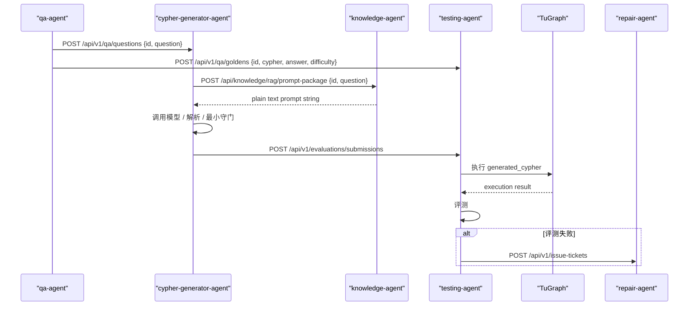

# Workflow Design

## 当前生效的系统工作流

系统按 `id` 这一主键串联三个内部服务与两个外部角色：

- `cypher-generator-agent`
- `testing-agent`
- `repair-agent`
- `qa-agent`（外部）
- `knowledge-agent`（外部）

## 角色分工

### cypher-generator-agent

输入：
- 外部服务发送的 `id + question`

负责：
- 接收问题并落盘
- 向 `knowledge-agent` 主动获取 `generation_prompt`
- 调用模型生成 Cypher
- 解析输出并做最小守门
- 保留 `input_prompt_snapshot` 与 `raw_output_snapshot`
- 向 `testing-agent` 提交生成结果
- 接收修复计划回执

不负责：
- 设计 Prompt
- 执行 TuGraph
- 判断业务是否答对

### testing-agent

输入：
- `id + cypher + answer + difficulty` 的 Golden Answer
- `cypher-generator-agent` 提交的 `generated_cypher + generation evidence`

负责：
  - 存储 Golden Answer
  - 存储生成结果
  - 执行 TuGraph
  - 做四维评测
  - 失败时创建 `IssueTicket`
  - 持久化供 repair-agent 展示的 prompt snapshot 输入事实
  - 向 `repair-agent` 提交问题单

### repair-agent

输入：
- `testing-agent` 提交的 `IssueTicket`
- `testing-agent` 持久化的 `KRSSAnalysisRecord`（其中包含 prompt snapshot）

负责：
- 根因分析
- 必要的对照实验
- 生成 `RepairPlan`
- 分发修复计划

## 核心数据流

### 数据流 A：问题输入

- qa-agent -> cypher-generator-agent
- `POST /api/v1/qa/questions`
- 请求体：

```json
{
  "id": "qa-001",
  "question": "查询网络设备及其端口信息"
}
```

### 数据流 B：提示词获取

- cypher-generator-agent -> knowledge-agent
- `POST /api/knowledge/rag/prompt-package`
- 请求体：

```json
{
  "id": "qa-001",
  "question": "查询网络设备及其端口信息"
}
```

- 响应体：

```text
请只返回 cypher 字段
```

说明：

- `prompt-package` 的正式返回规格是纯文本提示词字符串
- 不存在 JSON `prompt` 包装格式
- 如果返回 JSON，对 cypher-generator-agent 来说应视为契约违规

### 数据流 C：Golden Answer

- qa-agent -> testing-agent
- `POST /api/v1/qa/goldens`

### 数据流 D：生成结果提交

- cypher-generator-agent -> testing-agent
- `POST /api/v1/evaluations/submissions`
- 请求体：

```json
{
  "id": "qa-001",
  "question": "查询网络设备及其端口信息",
  "generation_run_id": "run-001",
  "generated_cypher": "MATCH (ne:NetworkElement)-[:HAS_PORT]->(p:Port) RETURN ne.name, p.name LIMIT 10",
  "parse_summary": "parsed_json",
  "guardrail_summary": "accepted",
  "raw_output_snapshot": "",
  "input_prompt_snapshot": "请只返回 cypher 字段"
}
```

### 数据流 E：问题单提交

- testing-agent -> repair-agent
- `POST /api/v1/issue-tickets`

### 数据流 F：repair-agent 诊断持久化

- repair-agent -> testing-agent / 修复存储
- `KRSSAnalysisRecord`
- 说明：`repair-agent` 诊断结果与 prompt snapshot 一起持久化在 `repair-agent` 记录中，控制台展示时以 `testing-agent` / 修复存储的快照为准，不假设 `repair-agent` 再去 `cypher-generator-agent` 回查

## 时序图



## 当前状态语义

### cypher-generator-agent

`cypher-generator-agent` 只维护“生成阶段处理状态”：

- `received`
- `prompt_fetch_failed`
- `prompt_ready`
- `model_invocation_failed`
- `output_parsing_failed`
- `guardrail_rejected`
- `submitted_to_testing`
- `failed`

说明：
- `submitted_to_testing` 不等于业务通过
- 最终业务通过/失败由 `testing-agent` 给出

### testing-agent

- `received_golden_only`
- `waiting_for_golden`
- `ready_to_evaluate`
- `passed`
- `issue_ticket_created`

## 说明

如果需要更细的 `cypher-generator-agent` 边界、字段定义和接口示例，请以
[Cypher_Generation_Service_Design.md](/Users/mangowmac/Desktop/code/NL2Cypher/services/query_generator_agent/docs/Cypher_Generation_Service_Design.md)
为准。
