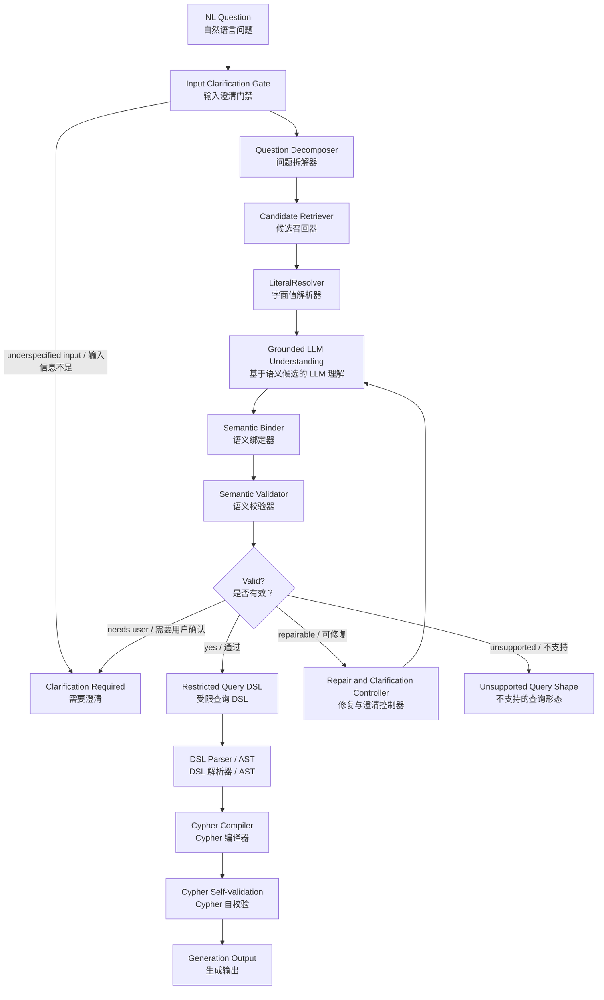

# Graph Semantic Model 驱动的 Cypher 生成总体架构设计

> 日期：2026-05-27
> 状态：设计 v1
> 适用分支：`cypher-generation-osi`

## 1. 目标

本设计定义 cypher-generator-agent 后续如何基于 `Graph Semantic Model Specification v1`，从自然语言问题生成可校验、可追踪、可编译的 Cypher。

核心目标：

- 不让 LLM 直接自由生成 Cypher。
- 让 LLM 只承担语言拆解、候选判断、结构化补全等非确定性工作。
- 让 graph semantic model 承担 vertex、edge、property、metric、path_pattern、valid_values、value_synonyms、direction_semantics 和 anti_patterns 的事实来源。
- 让受限 DSL 和编译器承担 Cypher 生成，从而把语法正确性、schema 合法性和产品边界前置。
- 对每次生成保留完整 trace，能定位失败发生在哪一层。

非目标：

- v1 不追求表达任意 Cypher。
- v1 不允许在 DSL 无法表达时回退到 LLM 直接生成 Cypher。
- v1 不承担数据建模工具职责；graph semantic model 由外部或上游流程维护。
- v1 不连接 TuGraph，不执行生成的 Cypher。

## 2. Graph Semantic Model 在本系统中的角色

`Graph Semantic Model Specification v1` 是本系统的单一权威语义定义。全链路使用图原生术语，不维护旧版双层模型字段映射。

核心对象：

- `semantic_model`：语义模型容器。
- `vertices`：图顶点定义，`name` 必须等于 Cypher label。
- `edges`：图边定义，`name` 必须等于 Cypher edge type。
- `properties`：vertex 或 edge 上的属性，`name` 必须等于 Cypher property name。
- `path_patterns`：命名路径模板，可包含完整 Cypher 模板和参数。
- `metrics`：指标定义，支持 `pattern + expression` 或 `full_cypher`。
- `ai_context`：面向 LLM 和检索的 instructions、synonyms、examples。

语义模型 validator 必须补充校验：

- `vertices[].name`、`edges[].name`、`path_patterns[].name`、`metrics[].name` 在模型内唯一。
- edge 的 `from` 和 `to` 必须引用已定义 vertex。
- vertex 的 `id_property` 必须存在于该 vertex 的 `properties`。
- property 的 `value_synonyms` key 必须全部出现在 `valid_values`。
- edge 的 `cardinality` 必须是允许枚举值。
- metric 的 `pattern + expression` 与 `full_cypher` 互斥。
- path pattern 和 metric `full_cypher` 通过 openCypher 弱解析。

## 3. 端到端流水线



各层职责：

| 层级 | 输入 | 输出 | 主要职责 |
| --- | --- | --- | --- |
| Input Clarification Gate | 原始问题 + Decomposer 失败信号 | 继续/澄清 | 在问题本身明显缺少指代对象或 Decomposer 无法产出有效结构时，前置反问用户 |
| Question Decomposer | 原始问题 | 领域无关问题结构 | 拆出实质词、概念候选、关系动词、字面值、时间词、语气词、输出形态 |
| Candidate Retriever | 问题结构 + graph semantic index | 候选集合 | 按 vertex、edge、property、metric、path_pattern 召回候选，并携带证据和置信度 |
| LiteralResolver | 字面值 + 期望 vertex/property | 解析值或 alternatives | 精确匹配、同义词、模糊匹配、预构建 value index lookup |
| Grounded LLM Understanding | 问题结构 + 候选 | 结构化理解 JSON | 在受限候选范围内选择绑定，不允许发明语义对象 |
| Semantic Binder | 结构化理解 | 绑定计划 | 把 LLM 输出转换成稳定 vertex、edge、property、metric、operator、value |
| Semantic Validator | 绑定计划 | 通过/错误列表 | 校验类型、方向、覆盖、歧义、path_pattern、DSL 支持度 |
| Repair/Clarification Controller | 错误列表 + 历史状态 | repair 输入或用户澄清 | 决定静默修复、反问、拒绝或终止震荡循环 |
| Restricted DSL Builder | 通过校验的绑定计划 | DSL 文档 | 生成受限、可解析、可编译的查询描述 |
| DSL Parser / AST | DSL 文档 | AST | schema 校验、结构规范化、稳定编译输入 |
| Cypher Compiler | AST + graph semantic model | Cypher | 模板化生成目标 TuGraph Cypher |
| Cypher Self-Validation | Cypher + AST + graph semantic model | 生成输出或非成功输出 | 做语法、只读、schema-aware、DSL/AST 一致性和目标方言静态校验；不连接数据库、不执行 Cypher |

cypher-generator-agent 的边界到 `Generation Output` 为止。它不连接 TuGraph，不执行 `EXPLAIN`、dry-run、probe query 或正式查询；真实执行、结果对比、空结果和超大结果分析属于 testing-agent、runtime service 或其他下游服务。

## 4. Question Decomposer 结构化输出

第一步不直接引用 graph semantic model 对象。它只做语言学拆解，避免把“问题有没有读懂”和“语义有没有映射对”揉在一起。

输出 JSON Schema 形态：

```json
{
  "schema_version": "question_decomposition_v1",
  "intent_type": "lookup | list | count | aggregate | top_n | path | compare | unknown",
  "target_concepts": ["服务", "隧道"],
  "relation_phrases": ["使用", "经过"],
  "literal_candidates": [
    {
      "text": "Gold",
      "kind_hint": "enum_or_name",
      "attached_to": "服务"
    }
  ],
  "filter_phrases": ["Gold 级别限定服务"],
  "time_terms": [],
  "modality_terms": [],
  "substantive_terms": ["Gold", "服务", "隧道", "使用"],
  "stopword_terms": ["麻烦", "帮我", "查一下"],
  "unparsed_terms": [],
  "output_shape": "rows | scalar | grouped_rows | path | unknown"
}
```

覆盖硬约束只作用于会改变查询语义的词，包括 vertex/edge/property/metric/path_pattern、过滤值、时间范围、排序、数量词和聚合意图。礼貌用语和口语引导不触发覆盖失败。

## 5. 结构化 LLM 输出要求

所有 LLM 调用必须使用结构化输出 schema。违反 schema 的处理策略：

1. 同一输入最多重试 2 次，重试 prompt 只包含 schema violation 和最小必要上下文。
2. Question Decomposer 连续 schema 失败时，先进入 Input Clarification Gate 判断是否属于输入本身不可解析。
3. 如果问题是“那个东西怎么样了”这类缺少指代对象的输入，返回 `clarification_required`，由 Input Clarification Gate 构造澄清问题。
4. 如果输入正常但 LLM 仍连续输出非法结构，返回 `generation_failed`，reason 为 `question_decomposer_schema_invalid` 或对应 stage 的 `llm_structured_output_invalid`。
5. 不允许把非 JSON 文本用正则“猜”成可用结果。

schema 演进策略：

- 每个 LLM 输出必须带 `schema_version`。
- parser 只接受当前版本和显式兼容的旧版本。
- 新增字段必须可选；删除或改名字段需要新增 schema version。
- trace 中必须保留原始输出和 schema 校验错误。

## 6. 校验与反馈决策矩阵

| 情况 | 处理 |
| --- | --- |
| edge 端点类型错误、方向错误、metric/property 误用 | 进入 repair loop，不打扰用户 |
| fuzzy match 且首选高置信 | 可继续，但必须返回用户可见的 `assumption_notice` |
| 多个候选分数接近 | 反问用户，最多列 3 个选项 |
| substantive_terms 未覆盖 | 必须反问或告知缺失，不允许静默生成 |
| time_terms 未覆盖 | 若能映射为明确时间过滤则继续，否则反问 |
| modality_terms 未落地 | 可 warning-only，例如“这里的‘应该’没有被解释为约束” |
| DSL 不支持该查询形态 | 返回 `unsupported_query_shape`，必要时给可改写建议 |
| 编译后 shape 与计划不一致 | 视为 compiler bug，严重告警，不自动重试 |

## 7. 先行子设计

本总体设计依赖以下必须先落地的设计：

- [Graph Semantic Model Specification v1](./2026-05-27-graph-semantic-model-spec-v1.md)
- [Graph-native Terminology](./2026-05-27-graph-terminology-design.md)
- [Restricted Query DSL v1](./2026-05-27-restricted-query-dsl-v1-design.md)
- [LiteralResolver v1](./2026-05-27-literal-resolver-v1-design.md)
- [Repair and Clarification Controller v1](./2026-05-27-repair-clarification-controller-v1-design.md)
- [Observability v1](./2026-05-27-observability-v1-design.md)

## 8. 产品边界

v1 明确不支持以下能力：

- 任意 Cypher 片段注入。
- DSL 无法表达时让 LLM 绕过 DSL 直接生成 Cypher。
- 写操作、schema mutation、procedure call。
- 未注册图算法，例如 shortest path、connected components、PageRank。
- 未在 graph semantic model 中声明的 path_pattern。

这些问题进入 `unsupported_query_shape`。如果能拆成 v1 支持的多个查询，Clarification Controller 可以给出改写建议；如果不能，则明确拒绝。

## 9. 成功标准

设计进入实现前应满足：

- Graph Semantic Model v1 可被加载为 graph semantic registry。
- 术语表已固化到代码命名约定，不存在旧版双层模型字段。
- Question Decomposer 能稳定区分 substantive、stopword、modality、time、unparsed。
- LiteralResolver 对枚举值、ID、名称的解析路径独立可测。
- Restricted DSL 能覆盖单跳、变长路径、命名 path_pattern、聚合、Top-N、两步聚合的 v1 子集。
- repair loop 有最大轮次、状态指纹、震荡检测和降级策略。
- 每次查询都有完整 trace，能复盘候选、绑定、语义校验、编译和自校验。
