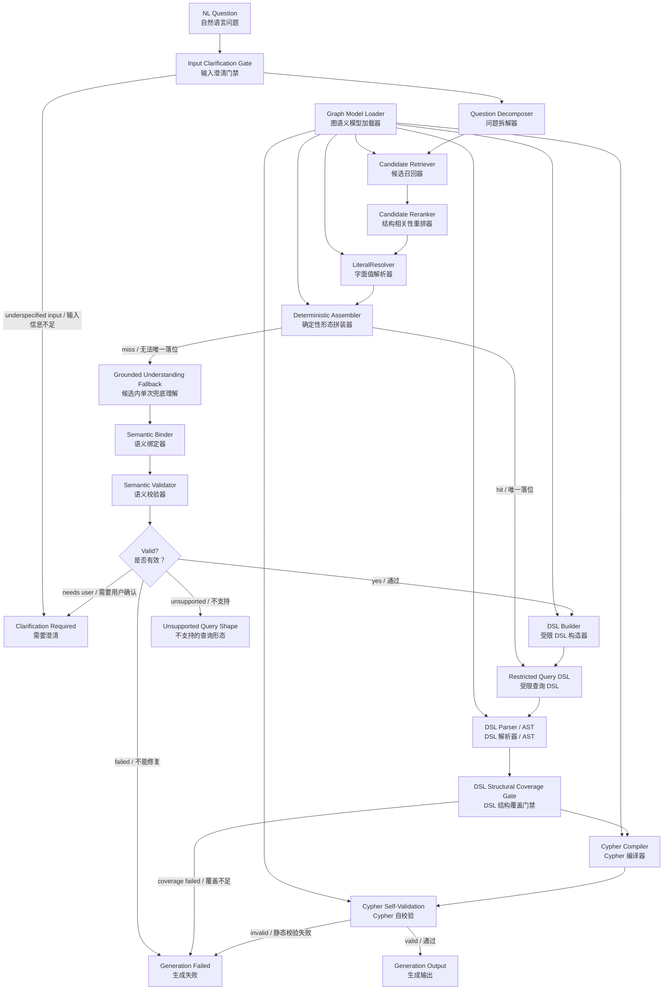

# Graph Semantic Model 驱动的 Cypher 生成总体架构设计

> 日期：2026-05-27
> 当前代码对照更新：2026-06-02
> 状态：整体架构设计，已按当前代码主链路修订
> 适用范围：`services/cypher_generator_agent` graph-native Cypher generation pipeline

## 1. 目标

本设计定义 cypher-generator-agent 当前如何基于 `Graph Semantic Model Specification v1`，从自然语言问题生成可校验、可追踪、可编译的 Cypher。本文只维护整体架构和组件边界；具体 MIR 进展、远端回归和后续修改项由独立 IR 文档维护。

核心目标：

- 不让 LLM 直接自由生成 Cypher。
- 让 LLM 主要承担自然语言拆解和 fallback 场景下的候选内选择；最终字段绑定、路径约束、coverage 校验、DSL 生成、编译和自校验由工程链路负责。
- 让 graph semantic model 承担 vertex、edge、property、metric、path_pattern、valid_values、value_synonyms、direction_semantics 和 anti_patterns 的事实来源。
- 让受限 DSL 和编译器承担 Cypher 生成，从而把语法正确性、schema 合法性和产品边界前置。
- 对每次生成保留完整 trace，能定位失败发生在哪一层。

非目标：

- v1 不追求表达任意 Cypher。
- v1 不允许在 DSL 无法表达时回退到 LLM 直接生成 Cypher。
- v1 不承担数据建模工具职责；graph semantic model 由外部或上游流程维护。
- v1 不连接 TuGraph，不执行生成的 Cypher。

当前实现的架构结论是：LLM 是 surface-slot filler，不是查询结构的最终裁决者。常规路径优先走确定性形态拼装；只有确定性路径无法唯一落位时，才进入受限候选内的 single-shot grounded understanding fallback。

## 2. Graph Semantic Model 在本系统中的角色

`Graph Semantic Model Specification v1` 是本系统的单一权威语义定义。全链路使用图原生术语，不维护旧版双层模型字段映射。

核心对象：

- `semantic_model`：语义模型容器。
- `vertices`：图顶点定义，`name` 必须等于 Cypher label。
- `edges`：图边定义，`name` 必须等于 Cypher edge type。
- `properties`：vertex 或 edge 上的属性，`name` 必须等于 Cypher property name。
- `path_patterns`：命名路径模板，可包含完整 Cypher 模板和参数。
- `metrics`：指标定义，支持 `pattern + expression` 或 `full_cypher`。
- `ai_context`：面向 LLM 和检索的 instructions、synonyms、examples。

语义模型 validator 必须补充校验：

- `vertices[].name`、`edges[].name`、`path_patterns[].name`、`metrics[].name` 在模型内唯一。
- edge 的 `from` 和 `to` 必须引用已定义 vertex。
- vertex 的 `id_property` 必须存在于该 vertex 的 `properties`。
- property 的 `value_synonyms` key 必须全部出现在 `valid_values`。
- edge 的 `cardinality` 必须是允许枚举值。
- metric 的 `pattern + expression` 与 `full_cypher` 互斥。
- path pattern 和 metric `full_cypher` 必须调用 Cypher Self-Validation 的 `validate_model_artifact`，在模型加载期完成 syntax、readonly、schema reference 和 target dialect 静态校验。

Graph Model Loader 是流水线前置依赖，不等待用户问题触发。它加载模型、构建 graph semantic registry、构建检索索引、校验 path_pattern/metric Cypher 模板，并把通过校验的模板结果按模型 checksum 缓存。加载失败时，cypher-generator-agent 不应接受该模型的生成请求。

## 3. 端到端流水线



各层职责：

| 层级 | 输入 | 输出 | 主要职责 |
| --- | --- | --- | --- |
| Input Clarification Gate | 原始问题 + Decomposer 失败信号 | 继续/澄清 | 在问题本身明显缺少指代对象或 Decomposer 无法产出有效结构时，前置反问用户 |
| Question Decomposer | 原始问题 | slot 化问题结构 | 拆出实义词、slot、可选 attachment、字面值候选、时间词、语气词、输出形态；不输出 graph label、edge type 或 property name |
| Candidate Retriever | 问题结构 + graph semantic index | 候选集合 | 按 vertex、edge、property、metric、path_pattern 召回候选，并携带证据和置信度 |
| Candidate Reranker | 候选集合 + 结构需求 | 重排后的候选集合 | 按 path、projection、aggregate、limit 等结构信号做相关性重排；只收窄排序，不直接裁决最终结构 |
| LiteralResolver | 字面值 + 期望 vertex/property | 解析值或 alternatives | 精确匹配、同义词、模糊匹配、静态 value index lookup；结构控制词不进入 literal resolver |
| Deterministic Assembler | slot 化问题结构 + 候选 + literal 解析结果 | DSL 或 fallback reason | 按 query shape taxonomy 进行确定性拼装。候选、方向、路径或形态不能唯一确定时不得猜测，必须 fallback、澄清或失败 |
| Grounded Understanding Fallback | 问题结构 + 候选 + literal 解析结果 | 受限结构化理解 JSON | 只在确定性拼装 miss 后触发，在候选范围内做 single-shot 选择，不允许发明语义对象或直接生成 Cypher |
| Semantic Binder | 结构化理解 | 绑定计划 | 把 LLM 输出转换成稳定 vertex、edge、property、metric、operator、value |
| Semantic Validator | 绑定计划 | 通过/错误列表 | 校验类型、方向、覆盖、歧义、path_pattern、DSL 支持度 |
| Repair/Clarification Controller | 错误列表 + 当前状态 | 用户澄清、unsupported 或 generation_failed | 对无法继续的错误做输出决策；旧式多轮 deterministic/LLM repair loop 不再是主控制流 |
| DSL Builder | 通过校验的绑定计划 | DSL 文档 | 在 fallback 路径中生成受限、可解析、可编译的查询描述 |
| DSL Parser / AST | DSL 文档 | AST | schema 校验、结构规范化、稳定编译输入 |
| DSL Structural Coverage Gate | 结构需求 + DSL | 通过或 coverage failure | 校验 aggregate、group_by、order_by、limit、path hop、projection 等用户需求是否落入 DSL，不允许生成“可运行但少结构”的 Cypher |
| Cypher Compiler | AST + graph semantic model | Cypher | 模板化生成目标 TuGraph Cypher |
| Cypher Self-Validation | Cypher + AST + graph semantic model | 生成输出或非成功输出 | 做语法、只读、schema-aware、DSL/AST 一致性和目标方言静态校验；不连接数据库、不执行 Cypher |

当前 trace 主契约为 `cga_graph_trace_v1`。generated 输出可走两种 stage order：

- 确定性路径：`graph_model_loader -> input_clarification_gate -> question_decomposer -> candidate_retrieval -> candidate_reranker -> literal_resolver -> deterministic_assembler -> dsl_parser -> dsl_structural_coverage_gate -> cypher_compiler -> cypher_self_validation -> output`
- fallback 路径：确定性拼装 miss 后进入 `grounded_understanding -> semantic_binder -> semantic_validator -> dsl_builder`，再进入同一套 DSL parser、coverage gate、compiler 和 self-validation。

cypher-generator-agent 的边界到 `Generation Output` 为止。它不连接 TuGraph，不执行 `EXPLAIN`、dry-run、probe query 或正式查询；真实执行、结果对比、空结果和超大结果分析属于 testing-agent、runtime service 或其他下游服务。

### 3.1 当前实现口径补充（2026-06-02）

- 裸对象 projection 不再默认返回 `id`。只有题干显式要求 `ID/编号` 等字段时才返回 id；题干要求 `信息/详情/全部信息` 等对象泛指时返回 `vertex_full`；纯“哪些/所有/列出 X”且没有字段依据时进入 clarification。
- 上述裸对象输出口径只作用于 `projection` 角色。`path/relation` 中的结构锚点不属于输出对象，不进入 id / vertex_full / clarification 判定。
- 路径终点如果同时是 `projection` 角色，按 projection 角色进入输出口径判定；纯路径中间点只用于结构构建。
- compiler 的 projection alias 会避开通用 Cypher/TuGraph 保留字；保留字处理不应与业务 schema 强绑定。
- compiler 只编译合法 DSL，不为了接住上游畸形 plan 引入兼容分支。

## 4. Question Decomposer 结构化输出

第一步不直接引用 graph semantic model 对象。它只做语言学拆解，避免把“问题有没有读懂”和“语义有没有映射对”揉在一起。

输出 JSON Schema 形态：

```json
{
  "schema_version": "question_decomposition_v1",
  "result_type": "decomposition",
  "original_question": "Gold 级别的服务使用了哪些隧道",
  "intent_type": "lookup | list | count | aggregate | top_n | path | compare | unknown",
  "output_shape": "rows | scalar | grouped_rows | path | unknown",
  "substantive_terms": [
    {
      "text": "Gold",
      "slot": "filter",
      "attached_to": "服务"
    },
    {
      "text": "级别",
      "slot": "filter",
      "attached_to": "服务"
    },
    {
      "text": "服务",
      "slot": "path"
    },
    {
      "text": "使用",
      "slot": "path"
    },
    {
      "text": "隧道",
      "slot": "projection"
    }
  ],
  "literal_candidates": [
    {
      "text": "Gold",
      "kind_hint": "enum_or_name",
      "attached_to": "服务"
    }
  ],
  "time_terms": [],
  "modality_terms": [],
  "unparsed_terms": []
}
```

当前 schema 不再输出 `target_concepts`、`relation_phrases`、`filter_phrases`、`stopword_terms` 或独立 `slot_terms`。slot 是词语义角色的唯一权威来源。覆盖硬约束只作用于会改变查询语义的词，包括 vertex/edge/property/metric/path_pattern、过滤值、时间范围、排序、数量词和聚合意图。礼貌用语和口语引导直接忽略，不触发覆盖失败，也不需要进入输出数组。

`substantive_terms[].slot` 取值：

| slot | 定义 | 示例 |
| --- | --- | --- |
| `projection` | 用户要求返回的字段或对象 | “名称”“隧道”“服务数量” |
| `filter` | 用户要求作为过滤条件的属性、操作词或值 | “Gold”“大于”“100”“down” |
| `group_by` | 用户要求分组的维度 | “按位置”中的“位置” |
| `order_by` | 用户要求排序的依据或方向 | “最多”“按带宽降序” |
| `limit` | 返回数量限制 | “前 3 名”“5 台” |
| `path` | 路径、连接或 traversal 语义 | “使用”“经过”“连接” |
| `unknown` | 无法可靠确定槽位但可能影响语义 | 需要后续澄清或失败处理 |

`attached_to` 只在消歧必要时填写。例如“服务及其使用的隧道的时延”中，`时延` 同时归属 `服务` 和 `隧道`，应输出两条 projection term，分别携带不同 `attached_to`。

分类决策规则：

| 类别 | 定义 | 失败影响 |
| --- | --- | --- |
| `substantive_terms` | 会改变查询对象、edge、property、metric、path_pattern、过滤、聚合、排序或数量限制的实质词，必须携带 slot | 未覆盖或未进入正确 slot 时不得生成 Cypher |
| `literal_candidates` | 需要 literal resolver 解析的过滤/匹配值 | 结构控制词不得进入；未解析时进入 repair/clarification/failure 决策 |
| `time_terms` | 时间点、时间范围、相对时间，例如“最近”“2024 年” | 未能解析为明确时间约束时进入澄清 |
| `modality_terms` | 不确定性、期望、估计、应然表达，例如“大概”“应该”“可能” | v1 默认 warning-only，并生成 assumption notice |
| `unparsed_terms` | 不属于以上类别、但可能改变查询语义的残留内容词 | 非空时进入 clarification 或 generation_failed |

边界示例：

| 用户表达 | 分类 | 说明 |
| --- | --- | --- |
| “麻烦帮我查一下 Gold 服务” | `substantive_terms=[{"text":"Gold","slot":"filter"},{"text":"服务","slot":"projection"}]` | 礼貌用语直接忽略，不触发覆盖失败 |
| “显示大概有多少防火墙” | `modality_terms=["大概"]`，`substantive_terms=[{"text":"多少","slot":"projection"},{"text":"防火墙","slot":"projection"}]` | “大概”不应进入 `unparsed_terms` |
| “最近 down 的端口” | `time_terms=["最近"]`，`substantive_terms=[{"text":"down","slot":"filter"},{"text":"端口","slot":"projection"}]` | 若没有默认时间窗口，必须澄清“最近”的范围 |
| “应该经过哪些设备” | `modality_terms=["应该"]`，`substantive_terms=[{"text":"经过","slot":"path"},{"text":"设备","slot":"projection"}]` | “应该”作为 warning-only，不直接变成过滤条件 |
| “返回前3名” | `substantive_terms=[{"text":"3","slot":"limit"}]`，`literal_candidates=[]` | limit 数字是结构控制词，不送 literal resolver |
| “带宽为3的链路” | `substantive_terms=[{"text":"带宽","slot":"filter"},{"text":"3","slot":"filter"}]`，`literal_candidates=[{"text":"3","kind_hint":"number","attached_to":"带宽"}]` | 过滤值才进入 literal resolver |
| “收入增长情况” | `substantive_terms=[{"text":"收入","slot":"projection"},{"text":"增长","slot":"projection"}]` | 如果 graph semantic model 无增长 metric 或时间对比能力，这是 coverage failure |
| “异常高的带宽隧道” | `substantive_terms=[{"text":"异常高","slot":"filter"},{"text":"带宽","slot":"filter"},{"text":"隧道","slot":"projection"}]` | 若无异常阈值或对应 metric，不能静默继续 |

## 5. 结构化 LLM 输出要求

所有 LLM 调用必须使用结构化输出 schema。违反 schema 的处理策略：

1. 同一输入最多重试 2 次，重试 prompt 只包含 schema violation 和最小必要上下文。
2. Question Decomposer 连续 schema 失败时，先进入 Input Clarification Gate 判断是否属于输入本身不可解析。
3. 如果问题是“那个东西怎么样了”这类缺少指代对象的输入，返回 `clarification_required`，由 Input Clarification Gate 构造澄清问题。
4. 如果输入正常但 LLM 仍连续输出非法结构，返回 `generation_failed`，reason 为 `question_decomposer_schema_invalid` 或对应 stage 的 `llm_structured_output_invalid`。
5. 不允许把非 JSON 文本用正则“猜”成可用结果。

schema 演进策略：

- 每个 LLM 输出必须带 `schema_version`。
- parser 只接受当前版本和显式兼容的旧版本。
- 新增字段必须可选；删除或改名字段需要新增 schema version。
- trace 中必须保留原始输出和 schema 校验错误。

## 6. 校验与反馈决策矩阵

| 情况 | 处理 |
| --- | --- |
| 确定性拼装命中且 DSL 结构覆盖完整 | 进入 DSL parser、compiler 和 self-validation |
| 确定性拼装无法唯一确定 shape、路径、方向或投影 | 进入 single-shot grounded understanding fallback、澄清或 generation_failed；不得启发式猜测 |
| edge 端点类型错误、方向错误、metric/property 误用 | 在 validator 或 coverage gate 暴露，不静默生成 Cypher |
| fuzzy match 且首选高置信 | 可继续，但必须返回用户可见的 `assumption_notice` |
| 多个候选分数接近 | 反问用户，最多列 3 个选项 |
| substantive_terms 未覆盖或落错 slot | 必须反问、fallback 或 generation_failed，不允许静默生成 |
| time_terms 未覆盖 | 若能映射为明确时间过滤则继续，否则反问 |
| modality_terms 未落地 | 可 warning-only，例如“这里的‘应该’没有被解释为约束” |
| DSL 不支持该查询形态 | 返回 `unsupported_query_shape`，必要时给可改写建议 |
| DSL structural coverage 不完整 | 返回 `generation_failed / coverage_failure`，不进入可执行 Cypher 输出 |
| 编译后 shape 与计划不一致 | 返回 `generation_failed / compiler_shape_mismatch` 或更精确 failure reason，不自动重试 |
| self-validation 失败 | 返回 `generation_failed`，保留静态校验证据 |

## 7. 先行子设计

本总体设计依赖以下必须先落地的设计：

- [Graph Semantic Model Specification v1](./2026-05-27-graph-semantic-model-spec-v1.md)
- [Graph-native Terminology](./2026-05-27-graph-terminology-design.md)
- [Network Topology Vocabulary](./2026-05-27-network-topology-vocabulary.md)
- [Restricted Query DSL v1](./2026-05-27-restricted-query-dsl-v1-design.md)
- [LiteralResolver v1](./2026-05-27-literal-resolver-v1-design.md)
- [Repair and Clarification Controller v1](./2026-05-27-repair-clarification-controller-v1-design.md)
- [Cypher Self-Validation v1](./2026-05-27-cypher-self-validation-v1-design.md)
- [Observability v1](./2026-05-27-observability-v1-design.md)
- [Schema Versioning Policy](./2026-05-27-schema-versioning-policy.md)

## 8. 产品边界

v1 明确不支持以下能力：

- 任意 Cypher 片段注入。
- DSL 无法表达时让 LLM 绕过 DSL 直接生成 Cypher。
- 写操作、schema mutation、procedure call。
- 未注册图算法，例如 shortest path、connected components、PageRank。
- 未在 graph semantic model 中声明的 path_pattern。

这些问题进入 `unsupported_query_shape`。如果能拆成 v1 支持的多个查询，Clarification Controller 可以给出改写建议；如果不能，则明确拒绝。

## 9. 当前实现验收口径

当前代码主链路应满足：

- Graph Semantic Model v1 可被加载为 graph semantic registry。
- 术语表已固化到代码命名约定，不存在旧版双层模型字段。
- Question Decomposer 能稳定输出 slot 化 `substantive_terms`，并区分 literal、modality、time、unparsed。
- LiteralResolver 对枚举值、ID、名称的解析路径独立可测。
- Candidate Reranker 只重排和收窄候选，不替代最终结构裁决。
- Deterministic Assembler 能覆盖当前 taxonomy 中的 F1/F2/F3/F4/F5/F6/F8 子集；不能唯一确定时必须 fallback、澄清或失败。
- Restricted DSL 能覆盖 vertex lookup、单跳、多跳、变长路径、命名 path_pattern、聚合、Top-N、两步聚合的 v1 子集。
- DSL Structural Coverage Gate 能阻止少 projection、少 aggregate、少 group_by、少 order_by、少 limit 或少 path hop 的 Cypher 输出。
- Cypher Self-Validation 有明确的 syntax、readonly、schema reference、compiler shape 和 target dialect 静态规则。
- 每次查询都有完整 `cga_graph_trace_v1` trace，能复盘 decomposer、retrieval、reranker、literal、deterministic/fallback、DSL、coverage、编译和自校验。
