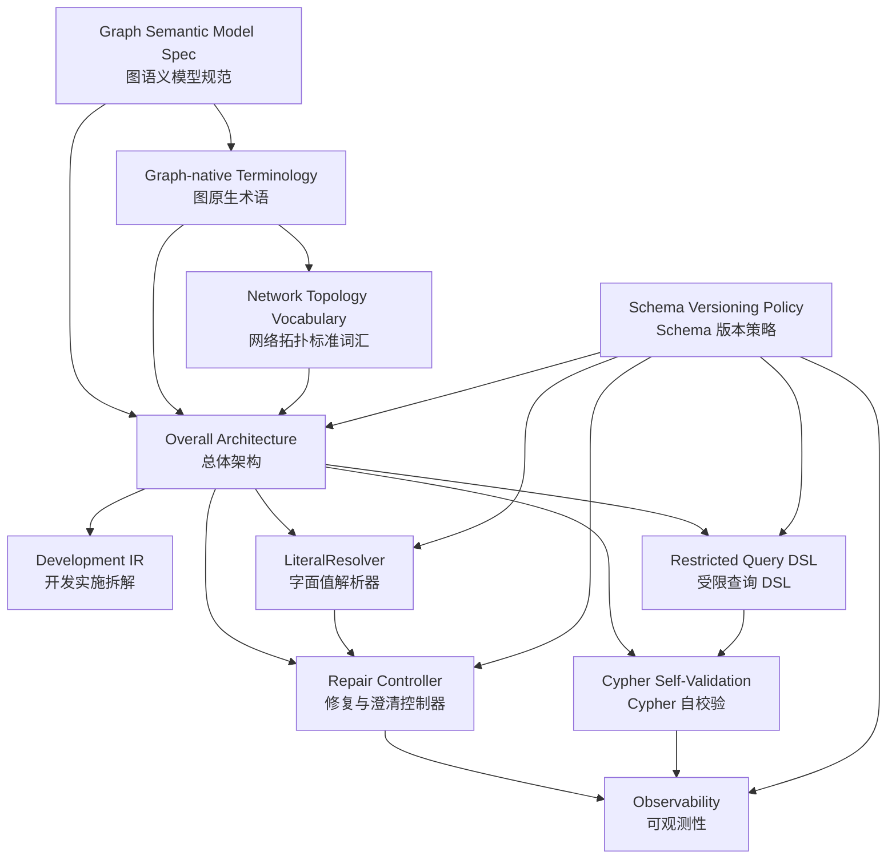

# Graph Cypher Generation Design Index

> 日期：2026-05-27
> 状态：设计文档索引

## 阅读顺序

1. [Graph Semantic Model Specification v1](./2026-05-27-graph-semantic-model-spec-v1.md)：单一权威语义模型定义。
2. [Graph-native Terminology](./2026-05-27-graph-terminology-design.md)：术语 hard cut 和命名规则。
3. [Network Topology Vocabulary](./2026-05-27-network-topology-vocabulary.md)：本文档集中的标准网络拓扑示例词汇。
4. [Overall Architecture](./2026-05-27-overall-architecture-design.md)：端到端生成链路和组件边界。
5. [Development IR](./2026-05-27-development-ir.md)：整体架构到开发实施单元的拆解。
6. [Restricted Query DSL v1](./2026-05-27-restricted-query-dsl-v1-design.md)：NL 理解到 Cypher 编译之间的受限中间表示。
7. [LiteralResolver v1](./2026-05-27-literal-resolver-v1-design.md)：字面值、枚举、ID、名称和时间解析。
8. [Repair and Clarification Controller v1](./2026-05-27-repair-clarification-controller-v1-design.md)：校验失败后的 repair、clarification、unsupported 决策。
9. [Cypher Self-Validation v1](./2026-05-27-cypher-self-validation-v1-design.md)：不连接数据库的 Cypher 静态校验边界。
10. [Observability v1](./2026-05-27-observability-v1-design.md)：trace、stage、指标和排障视图。
11. [Schema Versioning Policy](./2026-05-27-schema-versioning-policy.md)：各类 schema 的演进和兼容策略。

## 依赖关系

## 工程边界

- 当前工程目标数据库为 TuGraph，参考 schema 固定为 `services/testing_agent/docs/reference/schema.json`。
- cypher-generator-agent 默认语义语料来自 `services/cypher_generator_agent/tests/fixtures/tugraph_network_graph_model.yaml`，该文件由 TuGraph schema 转成 Graph Semantic Model v1。
- 当前静态 literal 语料为 `services/cypher_generator_agent/tests/fixtures/tugraph_value_index.json`，只包含 schema 枚举和少量稳定样例 ID，不代表 live value-index 服务。
- cypher-generator-agent 只负责自然语言到 Cypher 的生成和静态自校验。
- cypher-generator-agent 不连接 TuGraph，不执行 `EXPLAIN`、dry-run、probe query 或正式查询。
- DSL 无法表达时不允许 fallback 到 LLM 直接生成 Cypher。
- path_pattern 和 metric 的手写 Cypher 模板必须在模型加载期通过 Cypher Self-Validation。
- 所有示例名称必须来自 Network Topology Vocabulary，避免文档之间出现同义漂移。

## Sprint 0 一致性检查

实现开始前需要准备一份真实的 graph semantic model fixture，并用它校验本文档集中的示例：

- 生成或校验所有 DSL 示例引用的 vertex、edge、property、metric、path_pattern。
- 校验 `SERVICE_USES_TUNNEL`、`PATH_THROUGH`、`HAS_PORT` 等示例 edge 名称只来自 vocabulary。
- 对 `path_patterns[].cypher` 和 `metrics[].full_cypher` 运行 Cypher Self-Validation fixture。
- 用同一份 fixture 生成 LiteralResolver、Repair Controller、Observability 的示例片段，避免手写示例继续漂移。
