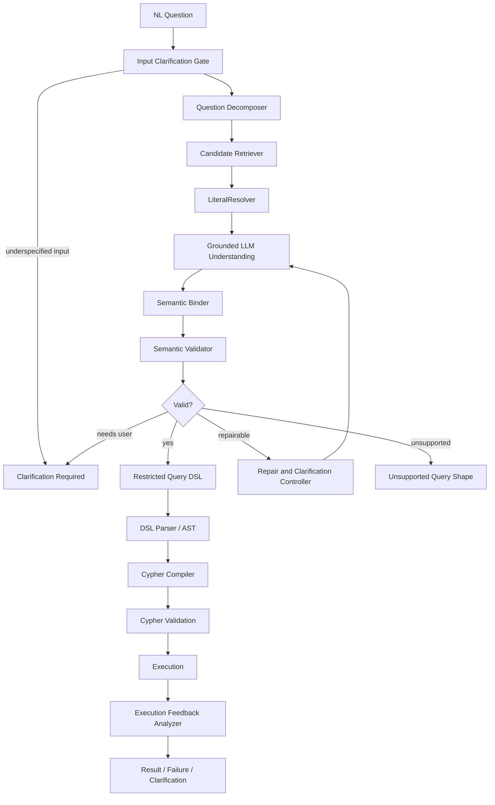

# OSI 驱动的 Cypher 生成总体架构设计

> 日期：2026-05-27
> 状态：设计 v1
> 适用分支：`cypher-generation-osi`

## 1. 目标

本设计定义 cypher-generator-agent 后续如何基于 OSI Open Semantic Interchange 语义层，从自然语言问题生成可校验、可追踪、可编译的 Cypher。

核心目标：

- 不让 LLM 直接自由生成 Cypher。
- 让 LLM 只承担语言拆解、候选判断、结构化补全等非确定性工作。
- 让 OSI 语义层承担对象、字段、关系、指标、枚举值、路径模板的事实来源。
- 让受限 DSL 和编译器承担 Cypher 生成，从而把语法正确性、schema 合法性和产品边界前置。
- 对每次生成保留完整 trace，能定位失败发生在哪一层。

非目标：

- v1 不追求表达任意 Cypher。
- v1 不允许在 DSL 无法表达时回退到 LLM 直接生成 Cypher。
- v1 不承担数据建模工具职责；OSI 模型由外部或上游流程维护。

## 2. OSI 在本系统中的角色

OSI Core Metadata Specification 提供数据语义层的交换格式。当前草案版本为 `0.2.0.dev0`，核心对象包括：

- `semantic_model`：语义模型容器。
- `datasets`：逻辑实体或事实表，对应图场景中的 vertex 类、edge 类、事实节点或逻辑视图。
- `fields`：可过滤、分组、投影或参与指标计算的字段。
- `relationships`：数据集之间的关系，对应可遍历的图边或可编译的 join/edge 约束。
- `metrics`：聚合指标，编译到 Cypher 聚合表达式。
- `ai_context`：面向 LLM 和检索的 instructions、synonyms、examples。
- `custom_extensions`：承载图模型、TuGraph 方言、path pattern registry、value synonym registry 等 OSI 核心未覆盖的信息。

OSI schema 只能保证结构格式。以下语义约束必须由本系统补充校验：

- relationship 的 `from_columns` 和 `to_columns` 数量必须相等。
- field expression 必须存在目标方言或可降级方言。
- metric 引用的字段必须存在且类型适合聚合。
- 图路径、边方向、vertex/edge 类型组合必须合法。
- `ai_context` 中的 synonym 只作为召回信号，不能直接当成绑定事实。

## 3. 端到端流水线



流程图中文解释：

1. 用户输入自然语言问题后，系统先进入 `Input Clarification Gate`。这一层只判断问题本身是否足够完整，例如“那个设备怎么样了”这类缺少指代对象的问题会直接进入 `Clarification Required`，不继续消耗后续语义召回和 LLM 绑定资源。
2. 如果问题可以继续处理，`Question Decomposer` 先做领域无关拆解，把问题拆成目标概念、关系短语、字面值、时间词、语气词、实质词和输出形态。这一步不绑定 OSI 对象，目的是先确认“问题在语言上说了什么”。
3. `Candidate Retriever` 开始引入 OSI 语义层，根据拆解结果召回 dataset、field、metric、relationship、path pattern 等候选，并保留 match type、score 和 evidence。随后 `LiteralResolver` 独立解析字面值，例如枚举值、设备 ID、服务名、时间范围和数值过滤。
4. `Grounded LLM Understanding` 在候选集合约束下让 LLM 做结构化理解。LLM 只能从候选中选择或标记不确定，不能发明语义对象。`Semantic Binder` 再把 LLM 输出规范化为稳定的 semantic id、role、field、operator、value 和路径绑定。
5. `Semantic Validator` 是生成 Cypher 前的语义门禁。它检查类型、relationship 方向、字段归属、覆盖率、歧义、path pattern role、DSL 支持度等问题，然后进入 `Valid?` 分支。
6. 如果校验通过，系统生成 `Restricted Query DSL`，再经 `DSL Parser / AST` 做结构校验和 AST 规范化，最后由 `Cypher Compiler` 模板化编译为目标 TuGraph Cypher。
7. 如果校验发现可自动修复的问题，例如 relationship 方向错误或 metric/dimension 误用，会进入 `Repair and Clarification Controller`，再回灌给 `Grounded LLM Understanding` 重新选择绑定。这个循环有最大次数、状态指纹和震荡检测。
8. 如果问题需要用户选择，例如多个候选接近、字面值无法确定、实质词未覆盖，会进入 `Clarification Required`。如果问题超出 v1 DSL 能力，例如 shortest path、OPTIONAL MATCH 或未注册图算法，则进入 `Unsupported Query Shape`，不会回退到 LLM 直接生成 Cypher。
9. 编译后的 Cypher 还要经过 `Cypher Validation`，包括语法、只读约束、schema-aware 检查和目标方言检查。执行后由 `Execution Feedback Analyzer` 判断空结果、结果过大、返回列不一致、运行时错误或超时，最终返回结果、失败原因或澄清请求。

各层职责：

| 层级 | 输入 | 输出 | 主要职责 |
| --- | --- | --- | --- |
| Input Clarification Gate | 原始问题 + Decomposer 失败信号 | 继续/澄清 | 在问题本身明显缺少指代对象或 Decomposer 无法产出有效结构时，前置反问用户 |
| Question Decomposer | 原始问题 | 领域无关问题结构 | 拆出实质词、概念候选、关系动词、字面值、时间词、语气词、输出形态 |
| Candidate Retriever | 问题结构 + OSI 索引 | 候选集合 | 按 concept、field、metric、relationship、path pattern 召回候选，并携带证据和置信度 |
| LiteralResolver | 字面值 + 期望字段/实体 | 解析值或 alternatives | 精确匹配、同义词、模糊匹配、distinct value lookup、必要时 live lookup |
| Grounded LLM Understanding | 问题结构 + 候选 | 结构化理解 JSON | 在受限候选范围内选择绑定，不允许发明语义对象 |
| Semantic Binder | 结构化理解 | 绑定计划 | 把 LLM 输出转换成稳定 semantic_id、role、field、operator、value |
| Semantic Validator | 绑定计划 | 通过/错误列表 | 校验类型、方向、覆盖、歧义、路径、DSL 支持度 |
| Repair/Clarification Controller | 错误列表 + 历史状态 | repair 输入或用户澄清 | 决定静默修复、反问、拒绝或终止震荡循环 |
| Restricted DSL Builder | 通过校验的绑定计划 | DSL 文档 | 生成受限、可解析、可编译的查询描述 |
| DSL Parser / AST | DSL 文档 | AST | schema 校验、结构规范化、稳定编译输入 |
| Cypher Compiler | AST + OSI graph binding | Cypher | 模板化生成 TuGraph 目标 Cypher |
| Feedback Analyzer | 执行结果 | 成功/异常分类 | 空结果、过大结果、shape mismatch、runtime error、timeout 的后处理 |

## 4. Question Decomposer 结构化输出

第一步不直接引用 OSI 语义对象。它只做语言学拆解，避免把“问题有没有读懂”和“语义有没有映射对”揉在一起。

输出 JSON Schema 形态：

```json
{
  "schema_version": "question_decomposition_v1",
  "intent_type": "lookup | list | count | aggregate | top_n | path | compare | unknown",
  "target_concepts": ["服务", "隧道"],
  "relation_phrases": ["使用", "经过"],
  "literal_candidates": [
    {
      "text": "Gold",
      "kind_hint": "enum_or_name",
      "attached_to": "服务"
    }
  ],
  "filter_phrases": ["Gold 级别限定服务"],
  "time_terms": [],
  "modality_terms": [],
  "substantive_terms": ["Gold", "服务", "隧道", "使用"],
  "stopword_terms": ["麻烦", "帮我", "查一下"],
  "unparsed_terms": [],
  "output_shape": "rows | scalar | grouped_rows | path | unknown"
}
```

词类规则：

| 字段 | 定义 | 示例 | 覆盖硬约束 |
| --- | --- | --- | --- |
| `substantive_terms` | 会改变查询语义的实体、关系、字段、指标、过滤、排序、数量词 | `Gold`、`最近 down 的端口`、`端口最多的 5 台设备` | 必须覆盖 |
| `stopword_terms` | 礼貌、请求、口语引导，不改变查询语义 | `麻烦`、`请`、`我想知道`、`帮我查一下` | 不参与覆盖 |
| `modality_terms` | 期望、推测、可能性或规范性语气 | `应该`、`可能`、`大概` | 生成 warning 或 clarification，不强制进入 Cypher |
| `time_terms` | 时间范围、时间排序、相对时间 | `最近`、`过去 7 天`、`2024 年` | 必须覆盖或澄清 |
| `unparsed_terms` | 不属于以上类别但可能有语义影响的残留词 | `增长` 在模型无增长指标时 | 必须告知用户 |

`unparsed_terms` 不能作为垃圾桶。介词、连词、礼貌词不能进入该字段；只有无法分类且可能影响语义的词才进入。

## 5. 结构化 LLM 输出要求

所有 LLM 调用必须使用结构化输出 schema。违反 schema 的处理策略：

1. 同一输入最多重试 2 次，重试 prompt 只包含 schema violation 和最小必要上下文。
2. Question Decomposer 连续 schema 失败时，先进入 Input Clarification Gate 判断是否属于输入本身不可解析。
3. 如果问题是“那个东西怎么样了”这类缺少指代对象的输入，返回 `clarification_required`，由 Input Clarification Gate 构造澄清问题。
4. 如果输入正常但 LLM 仍连续输出非法结构，返回 `generation_failed`，reason 为 `question_decomposer_schema_invalid` 或对应 stage 的 `llm_structured_output_invalid`。
5. 不允许把非 JSON 文本用正则“猜”成可用结果。

schema 演进策略：

- 每个 LLM 输出必须带 `schema_version`。
- parser 只接受当前版本和显式兼容的旧版本。
- 新增字段必须可选；删除或改名字段需要新增 schema version。
- trace 中必须保留原始输出和 schema 校验错误。

Input Clarification Gate 输出示例：

```json
{
  "generation_status": "clarification_required",
  "source_stage": "input_clarification_gate",
  "reason_code": "underspecified_reference",
  "question_zh": "你说的“那个东西”具体指设备、服务、隧道还是端口？",
  "expected_answer_type": "single_choice",
  "options": [
    {"id": "device", "label": "设备"},
    {"id": "service", "label": "服务"},
    {"id": "tunnel", "label": "隧道"}
  ]
}
```

## 6. 校验与反馈决策矩阵

| 情况 | 处理 |
| --- | --- |
| 类型错误、边方向错误、metric/dimension 误用 | 进入 repair loop，不打扰用户 |
| fuzzy match 且首选高置信 | 可继续，但必须返回用户可见的 `assumption_notice` |
| 多个候选分数接近 | 反问用户，最多列 3 个选项 |
| substantive_terms 未覆盖 | 必须反问或告知缺失，不允许静默生成 |
| time_terms 未覆盖 | 若能映射为明确时间过滤则继续，否则反问 |
| modality_terms 未落地 | 可 warning-only，例如“这里的‘应该’没有被解释为约束” |
| DSL 不支持该查询形态 | 返回 `unsupported_query_shape`，必要时给可改写建议 |
| 编译后 shape 与计划不一致 | 视为 compiler bug，严重告警，不自动重试 |

## 7. 先行子设计

本总体设计依赖以下必须先落地的设计：

- [Sprint 0 Glossary](./2026-05-27-glossary-design.md)
- [Restricted Query DSL v1](./2026-05-27-restricted-query-dsl-v1-design.md)
- [LiteralResolver v1](./2026-05-27-literal-resolver-v1-design.md)
- [Repair and Clarification Controller v1](./2026-05-27-repair-clarification-controller-v1-design.md)
- [Observability v1](./2026-05-27-observability-v1-design.md)

## 8. 产品边界

v1 明确不支持以下能力：

- 任意 Cypher 片段注入。
- DSL 无法表达时让 LLM 绕过 DSL 直接生成 Cypher。
- 写操作、schema mutation、procedure call。
- 未注册图算法，例如 shortest path、connected components、PageRank。
- 未在 OSI 或扩展 registry 中声明的 path pattern。

这些问题进入 `unsupported_query_shape`。如果能拆成 v1 支持的多个查询，Clarification Controller 可以给出改写建议；如果不能，则明确拒绝。

## 9. 成功标准

设计进入实现前应满足：

- OSI 模型可被加载为 semantic registry。
- Sprint 0 术语表已固化到代码命名约定。
- Question Decomposer 能稳定区分 substantive、stopword、modality、time、unparsed。
- LiteralResolver 对枚举值、ID、名称的解析路径独立可测。
- Restricted DSL 能覆盖单跳、变长路径、命名 path pattern、聚合、Top-N、两步聚合的 v1 子集。
- repair loop 有最大轮次、状态指纹、震荡检测和降级策略。
- 每次查询都有完整 trace，能复盘候选、绑定、校验、编译和执行反馈。
