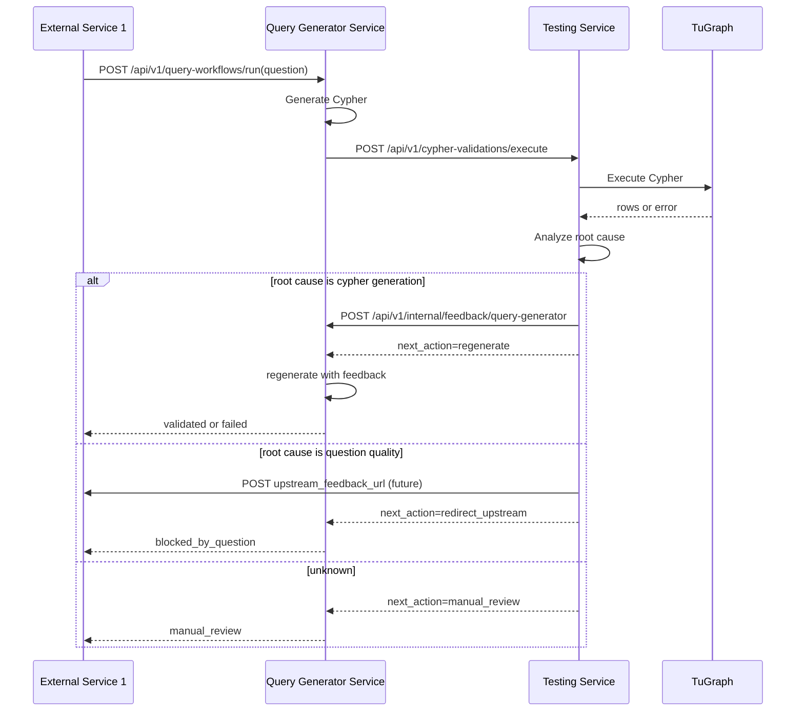

# Workflow Design

## 1. 当前系统背景

当前只开发两个服务：
- 查询语句生成服务
- 测试服务

但它们处在一个更大的系统中，至少还存在一个关键上游：
- 外部服务一：负责向查询语句生成服务提供自然语言问题

虽然外部服务一目前还没有开放，但后期它会通过 REST 接口向查询语句生成服务发送问题。因此当前骨架必须预留这条输入链路，并预留测试服务向它反馈问题质量的能力。

## 2. 重新定义后的角色分工

### 查询语句生成服务
- 输入：外部服务一发送来的自然语言问题
- 输出：Cypher，或经过验证后的工作流结果
- 负责：
  - 接收问题
  - 生成 Cypher
  - 调用测试服务验证
  - 接收“Cypher 生成问题”反馈并重生成
- 不负责：
  - 判断错误到底是生成问题还是提问质量问题

### 测试服务
- 输入：问题、Cypher、上下文信息
- 输出：验证结果、根因分析、反馈路由决定
- 负责：
  - 执行 TuGraph
  - 判断根因属于哪一侧
  - 把反馈路由给正确对象
- 关键判断：
  - 如果是 `Cypher 生成问题`，反馈给查询语句生成服务
  - 如果是 `自然语言问题质量问题`，反馈给外部服务一
  - 如果无法明确归因，进入人工复核

## 3. 关键设计原则

### 原则一：测试服务必须掌握归因权
测试服务不是简单“验收器”，而是“验收 + 归因 + 反馈路由器”。

### 原则二：查询语句生成服务只优化自己能控制的问题
只有当失败根因属于 Cypher 生成时，它才应该收到反馈并重新生成。

### 原则三：问题质量反馈不能错误流入查询生成服务
如果原始问题本身模糊、缺少约束、缺少关键实体，那么继续优化 Cypher 没有意义。此时反馈必须流向上游提问方。

## 4. 数据流

### 数据流 A：上游输入问题
- 外部服务一 -> 查询语句生成服务
- REST：`POST /api/v1/query-workflows/run`

### 数据流 B：待验证 Cypher
- 查询语句生成服务 -> 测试服务
- REST：`POST /api/v1/cypher-validations/execute`

### 数据流 C：生成问题反馈
- 测试服务 -> 查询语句生成服务
- REST：`POST /api/v1/internal/feedback/query-generator`

### 数据流 D：问题质量反馈
- 测试服务 -> 外部服务一
- 后期 REST：由 `upstream_feedback_url` 指定
- 当前：若外部服务一未开放，则写入 testing service 的 mock 反馈池

## 5. 当前接口契约要点

### 查询语句生成服务输入
字段：
- `question`
- `schema_hint`
- `trace_id`
- `max_retries`
- `question_provider`
- `upstream_feedback_url`

说明：
- `question_provider` 用来标记问题来自哪个上游
- `upstream_feedback_url` 用来让测试服务将“问题质量反馈”回给外部服务一

### 测试服务输入
字段：
- `trace_id`
- `question`
- `schema_hint`
- `cypher`
- `attempt`
- `query_generator_feedback_url`
- `upstream_feedback_url`
- `question_provider`

说明：
- 测试服务同时拿到两个反馈路由入口
- 它自己决定该把反馈发给哪一边

### 测试服务输出
字段：
- `success`
- `execution`
- `feedback`
- `next_action`

其中：
- `next_action=accept`：验证通过
- `next_action=regenerate`：归因到查询语句生成服务，应该重生成
- `next_action=redirect_upstream`：归因到外部服务一，应该回到上游改问题
- `next_action=manual_review`：需要人工判断

## 6. 推荐时序

## 7. 当前 mock 策略

因为外部服务一尚未开放，当前采用以下 mock 策略：

- 它给查询语句生成服务的“问题输入”，先由调用者直接请求查询语句生成服务来模拟
- 它接收的“问题质量反馈”，先由 testing service 存进内存 mock 池
- 可通过 `GET /api/v1/mock/upstream-feedback/{trace_id}` 查看这部分反馈

## 8. 后续替换点

1. 把 `QwenGeneratorClient` 替换成真实生成模型接口
2. 把 `GPTAnalysisClient` 替换成真实分析模型接口
3. 把 `TuGraphClient` 替换成真实 TuGraph REST 调用
4. 把 testing service 里的 mock 上游反馈池替换成真实 `upstream_feedback_url` 回调
5. 将反馈与 trace 历史落库，支持审计与统计
