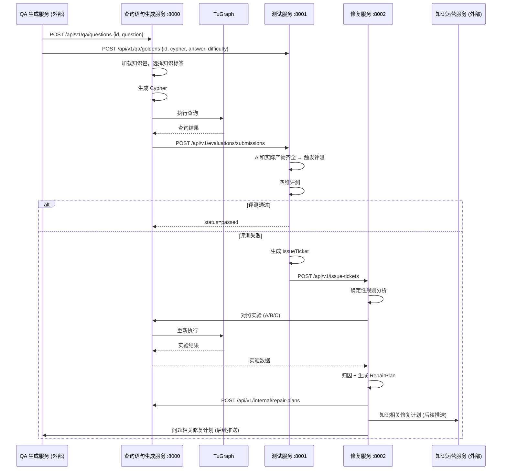

# Workflow Design

## 1. 系统背景

系统按 `id` 这一个主键串联，包含三个内部服务和两个外部服务：

### 内部服务（已实现）
- **查询语句生成服务**（端口 8000）：接收自然语言问题，生成 Cypher，执行 TuGraph 查询
- **测试服务**（端口 8001）：接收标准答案和查询结果，执行四维评测，产出问题单
- **问题修复服务**（端口 8002）：接收问题单，做根因分析和对照实验，产出修复计划

### 外部服务（仅定义接口契约，本轮不实现）
- **QA 生成服务**：向查询语句生成服务和测试服务分别推送 Q 和 A
- **知识运营服务**：接收知识不足类修复计划，后续提供新知识包

## 2. 角色分工

### 查询语句生成服务
- 输入：QA 生成服务发送的 `id + question`
- 输出：将 `id + question + generated_cypher + execution_result + knowledge_tags` 发给测试服务
- 负责：
  - 接收问题并存储
  - 加载知识包并记录知识标签
  - 生成 Cypher（启发式 / LLM）
  - 执行 TuGraph 查询
  - 将结果提交给测试服务
  - 接收来自修复服务的修复计划
- 不负责：
  - 判断最终质量是否合格
  - 判断问题来源归属

### 测试服务
- 输入：
  - QA 生成服务的标准答案 `id + cypher + answer + difficulty`
  - 查询语句生成服务的执行结果 `id + question + generated_cypher + execution + knowledge_context`
- 输出：问题单（发给修复服务）
- 负责：
  - 接收并存储标准答案 A
  - 接收并存储查询结果
  - 当 A 和实际产物都齐全时触发评测
  - 四维评测：`syntax_validity` / `schema_alignment` / `result_correctness` / `question_alignment`
  - 评测通过则标记 `passed`，失败则产出 `IssueTicket`
  - 将问题单发给修复服务
- 不负责：
  - 执行 TuGraph
  - 判断根因归属

### 问题修复服务
- 输入：测试服务发送的 `IssueTicket`
- 输出：`RepairPlan`（分发给相应服务）
- 负责：
  - 接收问题单
  - 第一层：确定性规则分析（语法、模式、知识标签覆盖、问题歧义）
  - 第二层：对照实验辅助判断（A/B/C 三组实验）
  - 可选：LLM 辅助精化修复计划
  - 生成修复计划并分发给目标服务
- 不直接：
  - 改写查询语句生成服务的实时答案
  - 改写 QA 标准答案
  - 改写知识包内容

## 3. 数据流

### 数据流 A：QA 问题输入
- QA 生成服务 → 查询语句生成服务
- REST：`POST /api/v1/qa/questions`
- 请求体：`{ "id": "...", "question": "..." }`

### 数据流 B：Golden 标准答案
- QA 生成服务 → 测试服务
- REST：`POST /api/v1/qa/goldens`
- 请求体：`{ "id": "...", "cypher": "...", "answer": {}, "difficulty": "L3" }`

### 数据流 C：查询执行结果提交
- 查询语句生成服务 → 测试服务
- REST：`POST /api/v1/evaluations/submissions`
- 请求体：`{ "id": "...", "question": "...", "generated_cypher": "...", "execution": {...}, "knowledge_context": {...} }`

### 数据流 D：问题单提交
- 测试服务 → 问题修复服务
- REST：`POST /api/v1/issue-tickets`
- 请求体：`IssueTicket` 完整 JSON

### 数据流 E：修复计划分发
- 问题修复服务 → 查询语句生成服务
  - REST：`POST /api/v1/internal/repair-plans`
- 问题修复服务 → QA 生成服务（外部，当前存储待后续推送）
- 问题修复服务 → 知识运营服务（外部，当前存储待后续推送）

## 4. 时序图



## 5. 状态机

### 查询语句生成服务
```
received_question → generating_cypher → querying_tugraph → submitted_for_evaluation → completed
```

### 测试服务
```
received_golden_only / received_submission_only
  → waiting_for_golden (仅收到 submission)
  → ready_to_evaluate (A + submission 齐全)
  → passed / issue_ticket_created
```

### 问题修复服务
```
received_ticket → analyzing → counterfactual_checking → repair_plan_created → dispatched
```

## 6. 存储方案

每个服务使用本地 SQLite，不做共享数据库：

| 服务 | 数据库 | 主要表 |
|---|---|---|
| 查询语句生成服务 | `data/query_generator_service.db` | `qa_questions`, `generation_runs`, `repair_plan_receipts` |
| 测试服务 | `data/testing_service.db` | `qa_goldens`, `evaluation_submissions`, `issue_tickets` |
| 问题修复服务 | `data/repair_service.db` | `repair_plans`, `dispatch_outbox` |

## 7. 当前 mock 策略

### TuGraph Mock
- 默认 `QUERY_GENERATOR_MOCK_TUGRAPH=true`
- Mock 模式下不连接真实 TuGraph，返回预设响应
- 可通过环境变量切换为真实连接

### LLM Mock
- 默认 `QUERY_GENERATOR_LLM_ENABLED=false`
- 未启用 LLM 时自动使用启发式生成器
- 修复服务同理，未配置 LLM 时仅使用确定性规则分析

### 外部服务
- QA 生成服务和知识运营服务当前只定义接口契约
- QA 生成服务的输入可通过 Web 控制台或 curl 手工模拟
- 知识运营服务的修复计划当前存储在 `dispatch_outbox` 中，后续推送

## 8. 后续演进方向

1. 接入真实的 QA 生成服务，替换手工输入
2. 接入真实的知识运营服务，替换内置知识包
3. 提升对照实验的稳定性（多次采样取多数）
4. 增加评测维度的容错策略（按 difficulty 调整）
5. 将修复计划的反馈闭环到实际的 prompt / 知识包更新
