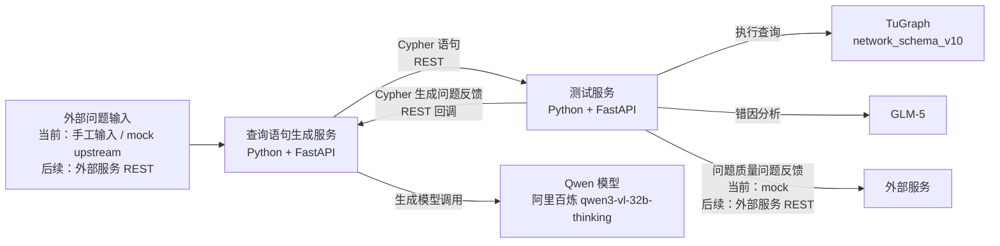

# 查询语句生成服务+测试服务初步架构

> 说明：本文档基于当前仓库中的实际实现整理，用来回答“最初架构图中的每个模块，现在在代码里分别落到了哪里”。
>
> 说明：原始架构图来自需求沟通阶段。由于该图片目前是对话上下文中的附件而非仓库内文件，本文档先以文字说明和 Mermaid 图复现其结构；如果你希望，我下一步可以把原图导出到仓库并嵌入本文档。

## 1. 原始架构意图

最初架构图表达的是一条清晰的双服务链路：

1. 外部侧提供自然语言问题给查询语句生成服务。
2. 查询语句生成服务调用大模型生成 Cypher。
3. 查询语句生成服务把 Cypher 发送给测试服务。
4. 测试服务调用 TuGraph 执行查询。
5. 测试服务调用分析模型进行错因分析。
6. 如果问题出在 Cypher 生成，则反馈回查询语句生成服务。
7. 如果问题出在自然语言问题质量，则反馈给外部服务。

当前实现与这条主链路是一致的，区别主要在于：

- 查询语句生成服务当前实际接的是阿里百炼 `qwen3-vl-32b-thinking`。
- 测试服务当前实际接的是 `glm-5`。
- TuGraph 已经接入真实实例 `network_schema_v10`。
- 外部服务尚未开放，因此这一侧目前由 mock 机制承接。

## 2. 当前落地后的整体架构

## 3. 架构图与当前代码的对应关系

### 3.1 查询语句生成服务

架构图中的模块：

- 绿色框：`查询语句生成服务`

当前代码对应：

- `/Users/mangowmac/Desktop/code/NL2Cypher/services/query_generator_service/app/main.py`
- `/Users/mangowmac/Desktop/code/NL2Cypher/services/query_generator_service/app/service.py`
- `/Users/mangowmac/Desktop/code/NL2Cypher/services/query_generator_service/app/clients.py`
- `/Users/mangowmac/Desktop/code/NL2Cypher/services/query_generator_service/app/ui/index.html`
- `/Users/mangowmac/Desktop/code/NL2Cypher/services/query_generator_service/app/ui/app.js`

当前职责：

- 接收自然语言问题。
- 为模型注入 `network_schema_v10` 的 schema context。
- 调用大模型生成 Cypher。
- 将生成的 Cypher 发送给测试服务。
- 接收来自测试服务的“Cypher 生成问题反馈”。
- 根据反馈决定是否重新生成。

当前实际模型：

- 阿里百炼 `qwen3-vl-32b-thinking`

说明：

- 架构图里写的是“调用 qwen32B”，当前实际是同一类角色的 Qwen 32B 级模型，只是具体型号按现网可用模型做了适配。

### 3.2 测试服务

架构图中的模块：

- 粉色框：`测试服务`

当前代码对应：

- `/Users/mangowmac/Desktop/code/NL2Cypher/services/testing_service/app/main.py`
- `/Users/mangowmac/Desktop/code/NL2Cypher/services/testing_service/app/service.py`
- `/Users/mangowmac/Desktop/code/NL2Cypher/services/testing_service/app/clients.py`
- `/Users/mangowmac/Desktop/code/NL2Cypher/services/testing_service/app/ui/index.html`
- `/Users/mangowmac/Desktop/code/NL2Cypher/services/testing_service/app/ui/app.js`

当前职责：

- 接收查询语句生成服务发来的 Cypher。
- 调用真实 TuGraph 执行查询。
- 调用 `glm-5` 做错因分析。
- 判断问题属于：
  - `cypher_generation_issue`
  - `question_quality_issue`
  - `unknown`
- 决定反馈应该回流给：
  - 查询语句生成服务
  - 外部服务
  - 或人工复核

当前实际分析模型：

- `glm-5`

当前增强能力：

- 支持 `analysis_source` 字段，明确本次分析来自 `llm` 还是 `fallback`。
- 分析 prompt 已经强绑定 `network_schema_v10`，避免再给出 `Movie`、`Film` 之类无关 schema 建议。

### 3.3 TuGraph

架构图中的模块：

- 橙色框：`TuGraph`

当前代码对应：

- `/Users/mangowmac/Desktop/code/NL2Cypher/services/testing_service/app/clients.py`

当前状态：

- 已经接入真实 TuGraph。
- 当前使用的图为：`network_schema_v10`。
- 测试服务会真实执行 Cypher，而不是 mock 执行。

当前真实链路：

- `测试服务 -> TuGraph /login`
- `测试服务 -> TuGraph /cypher`

### 3.4 QA 生成 / 外部服务

架构图中的模块：

- 蓝色框：`QA生成`
- 下方灰字：`外部服务`

当前实现方式：

- `QA 生成` 这部分能力当前没有拆成独立服务，而是作为测试服务内部的“分析与反馈路由能力”实现。
- 当测试服务判断根因是 `question_quality_issue` 时，理论上应把反馈发给外部服务。
- 由于外部服务尚未开放，当前先写入 mock feedback store。

当前代码对应：

- `/Users/mangowmac/Desktop/code/NL2Cypher/services/testing_service/app/clients.py`
- `/Users/mangowmac/Desktop/code/NL2Cypher/services/testing_service/app/service.py`

这意味着：

- 架构上的“问题质量问题反馈给外部服务”已经有路由逻辑。
- 只是目标端当前仍然是 mock，而不是真实外部 REST 服务。

## 4. 黑色箭头与 REST 接口的对应关系

### 4.1 自然语言 -> 查询语句生成服务

架构图箭头：

- `自然语言 -> 查询语句生成服务`

当前接口：

- `POST /api/v1/query-workflows/run`

说明：

- 未来由外部服务通过 REST 调用。
- 当前可以通过查询语句生成服务控制台手工发起。

### 4.2 查询语句生成服务 -> 测试服务

架构图箭头：

- `Cypher语句 -> 测试服务`

当前接口：

- `POST /api/v1/cypher-validations/execute`

说明：

- 查询语句生成服务生成完 Cypher 后，通过这个接口交给测试服务验证。

### 4.3 测试服务 -> 查询语句生成服务

架构图箭头：

- `Cypher 生成问题` 反馈回查询语句生成服务

当前接口：

- `POST /api/v1/internal/feedback/query-generator`

说明：

- 当测试服务判断根因属于 `cypher_generation_issue` 时，会调用这个回调接口。

### 4.4 测试服务 -> 外部服务

架构图箭头：

- `问题质量问题` 反馈给外部服务

当前状态：

- 已实现路由逻辑。
- 真实外部服务尚未接入。
- 当前使用 mock 反馈池承接。

当前查看接口：

- `GET /api/v1/mock/upstream-feedback/{trace_id}`

## 5. 当前实现与最初架构的一致部分

当前已经和最初架构对齐的内容：

- 已有两个独立 Python 服务。
- 查询语句生成服务负责“自然语言 -> Cypher”。
- 测试服务负责“执行查询 + 错因分析 + 路由反馈”。
- 测试服务已连接真实 TuGraph。
- 测试服务已接入 `glm-5`。
- 查询语句生成服务已接入真实生成模型。
- 测试服务可以把“Cypher 生成问题”反馈回查询语句生成服务。
- 测试服务可以把“问题质量问题”路由到外部侧，只是当前仍为 mock。

## 6. 当前实现对原始架构的工程化补充

这些内容不是原图里直接画出来的，但当前代码里已经有了：

### 6.1 双控制台界面

- 查询语句生成服务控制台：便于手工输入问题、查看 Cypher 与闭环结果。
- 测试服务控制台：便于手工输入 Cypher、查看执行结果、分析来源与路由结果。

### 6.2 分析来源标记

测试服务在响应中增加了：

- `analysis_source = llm | fallback | none`

作用：

- 用来判断这次错因分析到底是来自 GLM-5 还是 fallback 规则分析器。

### 6.3 schema-aware 约束

当前两侧都已经围绕 `network_schema_v10` 运行：

- 查询语句生成服务在生成时使用 schema context。
- 测试服务在分析时严格约束合法 label / edge。

### 6.4 fallback 机制

测试服务中，如果大模型分析失败，会自动回退到规则分析：

- 保证验证链路不中断。
- 提高系统在联调阶段的可用性。

## 7. 当前与原始架构尚未完全对齐的部分

### 7.1 外部服务仍未真实接入

当前状态：

- 问题输入可以由控制台手工模拟。
- 问题质量反馈暂时写入 mock store。

后续状态：

- 外部服务开放后，可直接切换为真实 REST 对接。

### 7.2 QA 生成未独立拆服务

原始图中蓝色框 `QA生成` 可以理解成一个独立能力块。

当前实现：

- 这部分能力没有拆成第三个服务。
- 它目前由测试服务内部完成。

这不是架构方向错误，而是当前阶段为了保持系统轻量，先以内聚方式实现。

## 8. 当前代码目录与架构模块的对照表

| 架构模块 | 当前目录 / 文件 | 当前状态 |
|---|---|---|
| 查询语句生成服务 | `services/query_generator_service` | 已实现 |
| 测试服务 | `services/testing_service` | 已实现 |
| TuGraph 接入 | `services/testing_service/app/clients.py` | 已接真实实例 |
| 生成模型接入 | `services/query_generator_service/app/clients.py` | 已接真实模型 |
| QA 分析模型接入 | `services/testing_service/app/clients.py` | 已接 `glm-5` |
| 外部服务输入 | `POST /api/v1/query-workflows/run` | 当前手工模拟，后续可真实接入 |
| 外部服务反馈 | mock feedback store | 当前 mock，后续可真实接入 |

## 9. 一句话总结

当前实现已经把最初架构图中的“两服务主链路”基本落地：

- 查询语句生成服务负责接收自然语言并生成 Cypher。
- 测试服务负责执行 TuGraph 查询、调用 `glm-5` 做错因分析，并把反馈路由给正确的下游。
- 真实已经接入的有：Qwen 生成模型、`glm-5`、TuGraph。
- 暂时仍为 mock 的只有外部服务这一侧。
