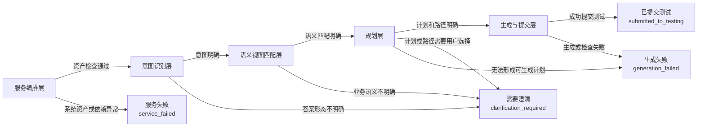
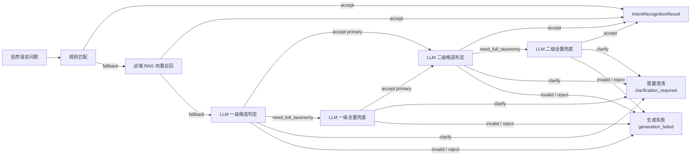
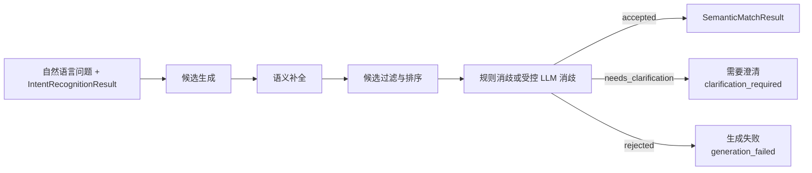
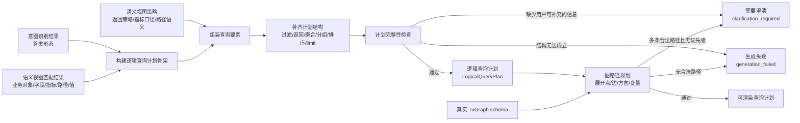
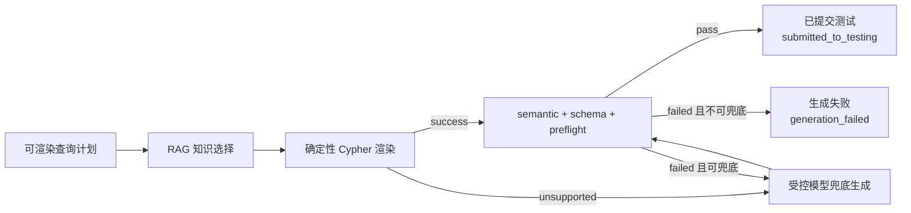

# Cypher 生成服务设计

本文档说明 cypher-generator-agent 的整体设计。当前设计已经切换为：

```text
自然语言问题
  -> 意图识别
  -> 语义视图匹配
  -> LogicalQueryPlan
  -> schema graph path planning
  -> deterministic Cypher renderer
  -> semantic + schema + preflight
  -> submitted_to_testing / clarification_required / generation_failed / service_failed
```

意图识别负责判断用户想要的答案形态；语义视图匹配负责识别业务实体、字段、指标、关系、路径和值；planner 负责把两类结果合成可渲染的逻辑查询计划。CGA 主链路以分层语义编译和受控生成为中心。

## 1. 服务职责

Cypher 生成服务负责把自然语言问题转换成一条只读 Cypher，并输出成功生成、澄清反问、生成失败或服务失败结果。它只负责“生成前理解与生成”，不负责执行 Cypher，不负责判断答案是否正确，也不负责创建知识修复建议。

正式生成入口：

- `POST /api/v1/qa/questions`

辅助诊断入口：

- `GET /api/v1/generator/status`
- `POST /api/v1/intents/recognize`
- `POST /api/v1/semantic/parse`

正式入口由 `CypherGeneratorAgentService` 编排。服务构建时会注入分层生成链路、语义资产对齐检查、testing-agent 客户端、模型客户端、RAG 客户端和可靠投递队列。

## 2. 当前主链路

当前主链路以分层语义编译和受控生成为核心。服务不会让模型直接根据自然语言自由生成 Cypher，而是先把问题编译成受控的 `LogicalQueryPlan`，再由确定性渲染器生成 Cypher；只有确定性渲染器不能覆盖或输出未通过 preflight 时，才进入受控模型兜底。



主链路可以分成五层：

- 服务编排层：生成运行编号，执行语义资产对齐检查；如果系统资产或依赖异常，直接输出 `service_failed`。
- 意图识别层：三阶段识别用户问题的答案形态，输出 `IntentRecognitionResult`；如果答案形态不明确，直接输出 `clarification_required`。
- 语义视图匹配层：基于图语义视图识别实体、字段、指标、关系、路径、过滤值和返回策略，输出 `SemanticMatchResult`；如果业务语义无法唯一确定，直接输出 `clarification_required`。
- 规划层：把 intent 和 semantic match 合成 `LogicalQueryPlan`，并完成 schema graph path planning；如果计划或路径需要用户选择，直接输出 `clarification_required`，如果无法形成可生成计划则输出 `generation_failed`。
- 生成与提交层：优先确定性渲染；必要时受控模型兜底；最终输出 `submitted_to_testing` 或 `generation_failed`。

分层语义编译链路不是辅助步骤，而是生成服务的边界控制中心。它决定当前问题是否能被系统理解、是否能落到语义视图、是否有合法图路径，以及 renderer 或模型可以在什么范围内生成 Cypher。

## 3. 分层链路设计

本节按照第 2 节的五层结构展开说明。每一层都有明确的输入、输出、职责和服务出口。

### 3.1 服务编排层

服务编排层负责接收请求、创建运行上下文，并判断系统是否具备进入后续链路的条件。

输入：

- 原始自然语言问题。
- qa-agent 提交的样本标识、golden cypher 和任务上下文。

输出：

- 进入意图识别层。
- 或直接输出 `service_failed`。

主要职责：

- 生成 `generation_run_id`。
- 执行语义资产对齐检查。
- 检查 testing-agent、RAG 服务、模型客户端和可靠投递队列是否满足当前运行要求。
- 初始化运行中心需要展示的链路 trace。

语义资产对齐检查属于服务编排层。它检查生成系统依赖的资产是否可信。

检查对象包括：

- TuGraph 物理 schema 快照。
- 图语义视图文件，例如 `services/cypher_generator_agent/resources/semantic_views/network_graph_semantic_view.yaml`。
- 意图分类资产，包括 `intent-classification.md`、`taxonomy.yaml`、`rules.yaml`、远端 RAG intent collection 和 `llm_fewshots.yaml`。
- 知识检索资产，包括 RAG service、知识 collection 和知识片段元数据。
- renderer 和 preflight 需要使用的 schema 约束。

检查内容：

- 语义视图只能引用 TuGraph 物理图谱中真实存在的点标签、边类型和属性。
- `relationships` 中的方向必须符合 TuGraph 边约束。
- `path_semantics` 中的路径必须能由合法单跳关系组成。
- `dimensions`、`facts`、`metrics` 引用的 owner、property、aggregation 和 value type 必须可校验。
- `return_policies` 只能引用语义视图中已定义的字段。
- 意图 taxonomy、规则、向量语料和 LLM few-shot 使用同一套一级/二级意图。
- 远端 RAG intent collection 的 taxonomy version、embedding 模型和 collection 名称必须可诊断。

出口规则：

- 资产、依赖、配置、连接异常属于系统问题，直接输出 `service_failed`。
- 如果语义视图、物理图谱和知识资产之间不一致，输出 `service_failed / semantic_contract_unaligned`。
- 如果关键知识或 RAG 依赖不可用，输出 `service_failed / knowledge_context_unavailable`，或者在允许降级的场景中记录不可用信号并继续受控生成。
- 服务编排层不触发 `clarification_required`，因为用户补充信息无法修复系统资产或依赖异常。

这一步的作用类似“开工前验货”。如果语义资产本身不可信，后面的生成结果也不能被信任。

### 3.2 意图识别层

意图识别层只判断用户最终想要什么答案形态。设计细节见 [intent-recognition-stage-design.md](./intent-recognition-stage-design.md)。



输入：

- 原始自然语言问题。
- 可选外部 `intent_result`。

输出：

- `IntentRecognitionResult`。
- 或 `clarification_required`。
- 或 `generation_failed`。

主要职责：

- 识别明细、路径、指标、分组、排名、对比、趋势、占比、集合操作、存在性判断等答案形态。
- 第一阶段用规则处理高确定性表达。
- 第二阶段以远端 RAG intent collection 为主召回源处理同义、口语和省略表达。
- 第三阶段只做受控 LLM 意图判定，输出 intent JSON，不生成 Cypher，不补业务语义。
- 第三阶段采用“前置候选依据优先，全量分类兜底”的渐进式分层判定：先利用规则和 embedding 产生的候选证据；只有候选证据不足以判断时，才给 LLM 更完整的分类体系。
- 一级判定先在候选一级意图中选择；如果候选不足，进入一级全量兜底；如果一级仍无法判断，直接澄清，不进入语义视图匹配层。
- 二级判定只在一级已接受后触发；先在当前一级下的候选二级意图中选择；如果候选不足，再展示当前一级下的完整二级分类。

受控 LLM 渐进式判定的提示词应使用 Markdown/纯文本组织，便于弱模型理解任务、候选、证据和边界。JSON 只作为“模型必须返回的输出格式”，不作为发给模型的主体结构。

提示词组成原则：

- 前置候选依据不是“可选参考信息”，而是第三阶段优先使用的决策输入。
- 服务需要把规则弱命中、embedding top-k、相似样本和冲突风险整理成紧凑中文候选卡片，不能把工程诊断 JSON 原样塞给模型。
- 喂给 LLM 的候选卡片只包含候选编号、一级/二级意图、中文名、简短含义、支持依据和易混风险；原始分数、margin、规则 ID、完整 top-k JSON 和完整召回样本列表只落盘到运行中心。
- 候选优先提示词的输出 `decision` 可以是 `accept`、`need_full_taxonomy` 或 `clarify`。
- `need_full_taxonomy` 不代表澄清或失败，只表示候选证据不足，需要服务重组全量分类提示词再次调用 LLM。
- 全量兜底提示词的输出 `decision` 只能是 `accept` 或 `clarify`。
- 一级全量兜底只展示全部一级意图；二级全量兜底只展示已接受一级下面的完整二级意图。

完整提示词模板和字段定义以 [intent-recognition-stage-design.md](./intent-recognition-stage-design.md) 第 6 节为准。

运行中心应落盘并展示第三阶段 LLM 调用记录：

- `llm_primary_attempts`：一级意图判定调用记录，包含候选优先和全量兜底的提示词、原始返回、`attempt_type` 和触发原因。
- `llm_secondary_attempts`：二级意图判定调用记录，只有一级意图已接受并进入二级判定时才有值。

澄清出口：

- 如果一级候选判定和一级全量兜底后仍无法判断一级意图，直接输出统一的 `clarification_required`。
- 如果二级候选判定和二级全量兜底后仍无法判断二级意图，直接输出统一的 `clarification_required`。
- 如果任一 LLM 输出不合法，候选判定越过候选范围，或二级意图不属于已接受的一级意图，属于生成级失败，不继续进入语义视图匹配层。

### 3.3 语义视图匹配层

语义视图匹配层负责把自然语言中的业务表达落到图语义视图对象。设计细节见 [semantic-view-design.md](./semantic-view-design.md)。



输入：

- 原始自然语言问题。
- `IntentRecognitionResult`，作为弱结构信号。
- 图语义视图 `network_graph_semantic_view.yaml`。
- TuGraph schema 快照。

输出：

- `SemanticMatchResult`。
- 或 `clarification_required`。
- 或 `generation_failed`。

主要职责：

- 匹配业务实体、维度、事实字段、指标、单跳关系、路径语义、默认返回策略和值。
- 判断自然语言中的业务表达是否能落到可验证的语义对象。
- 只把少量候选、字段含义和候选解释交给受控 LLM 消歧，不能把整个语义视图原样灌给模型。

澄清出口：

- 当多个候选都合法但无法可靠选择时，输出 `needs_clarification=true`，由服务层统一转换为 `clarification_required`。
- 典型场景包括“对应网元”无法区分源网元、目的网元和所经网元，或“相关资源”无法区分隧道、端口、网元、链路。

### 3.4 规划层

规划层把意图识别结果和语义视图匹配结果合成 `LogicalQueryPlan`，再把业务路径展开成真实 TuGraph 可渲染的点、边、方向和变量序列。



输入：

- `IntentRecognitionResult`。
- `SemanticMatchResult`。
- 语义视图中的 return policy、metric policy、relationships 和 path semantics。
- TuGraph schema 快照。

输出：

- `LogicalQueryPlan` 和可渲染的图路径计划。
- 或 `clarification_required`。
- 或 `generation_failed`。

主要职责：

planner 生成 `LogicalQueryPlan` 的内部步骤：

1. **构建逻辑查询计划骨架**：以 intent 提供的 `answer_shape` 作为根结构，描述本次计划最终返回表格、路径、标量指标、分组结果、排序结果、对比结果、集合结果或布尔结果。
2. **读取业务语义匹配结果**：从 `SemanticMatchResult` 读取已匹配的实体、字段、指标、路径语义、过滤值、返回策略和 trace。planner 只使用语义视图匹配层已经确认的业务对象。
3. **组装逻辑操作符**：确定主实体、目标实体、参与路径、过滤条件、返回字段、指标、分组维度、排序字段、limit 和输出别名，并组织成 `scan / traverse / filter / aggregate / project / order / limit / exists` 等逻辑操作。
4. **应用语义视图策略**：根据 `return_policies` 补默认返回字段，根据 `metrics / dimensions / facts` 补聚合、分组和排序口径，根据 `path_semantics` 确定业务路径需求。
5. **计划完整性检查**：检查计划是否足够生成。如果排名缺少排序指标、对比缺少第二对象、集合差集缺少另一集合，且这些信息可以由用户补充，则输出 `clarification_required`。如果结构无法成立，则输出 `generation_failed`。
6. **图路径规划**：把业务路径语义展开成 TuGraph 中合法的点、边、方向和变量序列，并校验路径是否符合真实 schema 边约束。

规划层的产物是可供 renderer 消费的受控结构。它至少要明确：

- 答案形态 `answer_shape`、主实体、目标实体。
- 逻辑操作符 `operators`，例如 `scan`、`traverse`、`filter`、`aggregate`、`project`、`order`、`limit`、`exists`。
- 过滤条件、返回字段、指标、分组、排序、limit。
- 业务路径语义和已展开的 schema 路径。
- 每个字段、指标、路径来自哪个语义视图对象。
- 输出别名和 trace 引用。

`answer_shape` 来自意图识别结果，用于说明最终答案形态；`operators` 是 planner 组合出的逻辑查询结构，供 renderer 和 preflight 消费。实现层可以从 `operators` 派生 `renderer_family`，用于选择对应的确定性渲染器。

#### `LogicalQueryPlan` 第一版数据契约

`LogicalQueryPlan` 是 Cypher 生成前的受控查询计划。

它包含：

- 答案形态 `answer_shape`，来自意图识别结果。
- 逻辑操作符 `operators`，由 planner 组合生成。
- 主实体、目标实体和参与路径。
- 返回字段、过滤条件、指标、分组维度、排序和 limit。
- 输出别名。
- intent 来源和 semantic match trace 引用。
- schema graph path planning 结果引用。

第一版数据结构如下：

```jsonc
{
  // 逻辑计划版本，用于后续兼容升级。
  "version": 1,

  // 本次计划的唯一 ID，用于运行中心 trace、renderer 输入和 preflight 诊断关联。
  "plan_id": "logical_plan_001",

  // 用户问题最终答案形态，来自 IntentRecognitionResult。
  // 第一版建议枚举：record_table、path_detail、scalar_metric、grouped_table、
  // ranking_table、comparison_table、ratio_value、set_result、boolean_result。
  "answer_shape": "ranking_table",

  // 原始意图识别结果引用，用于说明 answer_shape 的来源。
  "intent_ref": {
    // 一级意图。
    "primary_intent": "ranking_query",

    // 二级意图。
    "secondary_intent": "metric_ranking_query",

    // 接受该意图的阶段，例如 rule、embedding、llm。
    "source": "embedding"
  },

  // 语义视图匹配结果引用，用于追踪业务对象、字段、指标和值来自哪里。
  "semantic_match_ref": {
    // SemanticMatchResult 的运行时 ID。
    "match_id": "semantic_match_001",

    // 本计划消费的主要语义对象 ID，必须来自语义视图匹配结果。
    "consumed_objects": [
      "service",
      "service.tunnel_path",
      "service_tunnel_path.network_element_count",
      "network_element.location"
    ]
  },

  // planner 生成的逻辑操作符序列。renderer 按顺序读取这些操作符生成 Cypher。
  "operators": [
    {
      // scan 表示从一个业务实体集合开始匹配。
      "op": "scan",

      // 语义视图中的实体 ID。
      "entity": "service",

      // 变量名建议值；renderer 可在无冲突时使用。
      "as": "s"
    },
    {
      // traverse 表示沿一个业务路径语义扩展到目标实体。
      "op": "traverse",

      // 语义视图中的 path_semantics ID。
      "path_semantic": "service.tunnel_path",

      // 路径起点实体 ID，必须已由前序 scan 或 traverse 引入。
      "from": "service",

      // 路径目标实体 ID。
      "to": "network_element",

      // 路径变量名建议值。
      "as": "path_1"
    },
    {
      // filter 表示过滤条件，可由字段取值候选、用户显式条件或语义规则生成。
      "op": "filter",

      // 过滤字段，必须来自 dimensions 或 facts。
      "field": "service.quality_of_service",

      // 过滤操作符。第一版建议支持 =、!=、in、contains、>、>=、<、<=。
      "operator": "=",

      // 标准化后的过滤值。
      "value": "Gold"
    },
    {
      // aggregate 表示指标计算。
      "op": "aggregate",

      // 语义视图中的 metric ID。
      "metric_id": "service_tunnel_path.network_element_count",

      // 输出别名。
      "alias": "cnt"
    },
    {
      // group_by 表示分组维度。
      "op": "group_by",

      // 分组字段，必须来自 dimensions。
      "fields": ["network_element.location"]
    },
    {
      // project 表示最终返回字段或指标别名。
      "op": "project",

      // 返回项可以是 dimensions、facts、metrics alias 或 renderer 已知表达。
      "items": [
        {
          "kind": "dimension",
          "field": "network_element.location",
          "alias": "location"
        },
        {
          "kind": "metric_alias",
          "field": "cnt",
          "alias": "cnt"
        }
      ]
    },
    {
      // order 表示排序。
      "op": "order",

      // 排序字段，可以是语义字段或聚合别名。
      "field": "cnt",

      // 排序方向，asc 或 desc。
      "direction": "desc"
    },
    {
      // limit 表示返回数量限制。
      "op": "limit",

      // 正整数。
      "value": 10
    }
  ],

  // schema graph path planning 的结果引用。
  // 真实点、边、方向、变量序列在 path planning 结果中展开，LogicalQueryPlan 中只保存引用。
  "schema_path_ref": "schema_path_001",

  // renderer 派生提示，用于选择确定性渲染器和控制渲染细节。
  "renderer_hints": {
    // 可选。由 operators 派生得到，例如 projection、path、aggregate、ranking、existence。
    "renderer_family": "ranking",

    // 是否要求 renderer 保留路径变量。
    "requires_path_variable": false
  },

  // trace 引用，用于运行中心展示和 preflight 诊断。
  "trace_refs": [
    "intent:ranking_query.metric_ranking_query",
    "semantic_match:path_semantic=service.tunnel_path",
    "semantic_match:metric=service_tunnel_path.network_element_count",
    "schema_path:schema_path_001"
  ]
}
```

operator 约束：

- `scan` 必须引用 `entities` 中定义的实体。
- `traverse` 必须引用 `path_semantics`，并在 schema graph path planning 中展开为真实点边路径。
- `filter` 的 `field` 必须来自 `dimensions` 或 `facts`，值必须完成标准化。
- `aggregate` 必须引用 `metrics` 中定义的指标。
- `group_by`、`project`、`order` 中的字段必须来自语义视图对象或前序 operator 产生的 alias。
- `exists` 用于存在性判断，第一版可以表达为 `scan / traverse / filter` 后接 `exists` operator。
- renderer 必须拒绝未知 `op`，不能根据自然语言自行补 operator。

为什么需要它：

- 把“理解用户问题”和“生成 Cypher 语法”分开。
- 让确定性 renderer 和模型兜底使用同一份约束。
- 让 preflight 知道什么是允许的，什么是越权的。
- 方便运行中心看到系统到底把问题理解成了什么。

澄清出口：

- 如果缺失信息可以由用户选择或补充，例如排名查询缺少排序指标、对比查询缺少第二个对象、差集查询缺少另一个集合，应输出 `clarification_required`。
- 如果多条图路径都合法但语义视图没有优先级规则，应输出 `clarification_required`，让用户选择业务承载路径、物理连接路径、源端路径、目的端路径或所经路径。

生成失败出口：

- 如果计划结构不完整且无法通过用户选择补足，输出 `generation_failed`。
- 如果业务语义无法落到任何合法 schema graph path，输出 `generation_failed`。

### 3.5 生成与提交层

生成与提交层负责在已形成可渲染计划后生成 Cypher，并输出最终服务状态。



输入：

- `LogicalQueryPlan`。
- schema graph path planning 结果。
- 可选 `SelectedKnowledgeContext`。

输出：

- `submitted_to_testing`。
- 或 `generation_failed`。

主要职责：

- 根据 `LogicalQueryPlan` 和路径规划结果选择必要 RAG 知识。
- 优先使用确定性 renderer 生成只读 Cypher。
- 在 renderer 不覆盖或 preflight 可修复失败时，使用受控模型兜底生成。
- 对 renderer 或模型输出执行基础安全、schema 和语义一致性检查。
- 通过检查后提交 testing-agent。

受控模型兜底 prompt 合约：

- 运行时 prompt 目标控制在 800 到 1500 tokens。超过该范围时，应先压缩计划、路径和知识摘要，而不是继续追加上下文。
- prompt 的权威输入只有压缩后的 `LogicalQueryPlan`、选中的 schema path、授权 schema 和兜底触发原因。
- 内部可以用 JSON 保存结构化数据，但实际发送给模型前必须渲染成中文字段说明和扁平卡片；不能把嵌套 JSON 直接作为 prompt 主体。
- 自然语言问题只作为辅助上下文，不能让模型重新解释业务语义。
- intent 结果不单独喂给模型；答案形态已经进入 `LogicalQueryPlan.answer_shape`。
- `SemanticMatchResult` 不完整喂给模型；只保留 plan 已经用到的实体、路径、过滤条件、返回字段和指标。
- 不喂完整语义视图 YAML、完整 RAG 文档、候选打分 trace、`trace_refs`、被拒绝候选、运行中心展示字段、golden Cypher 或 testing-agent 评测信息。
- 可选知识上下文最多保留 1 到 3 张短卡片，每张只包含 `title`、`use_when` 和 `content_summary`。

为什么不直接喂 JSON：

- 弱模型通常能识别 JSON 形状，但不一定稳定理解字段的业务含义。
- 嵌套 JSON 会把注意力分散到括号、层级和字段名上，反而弱化“必须生成什么 Cypher”。
- 运行时 prompt 应把结构化数据翻译成模型可读的生成指令：实体、路径、过滤、返回、排序、数量限制、授权 schema。
- JSON 适合落盘和程序校验；模型 prompt 适合使用短句、列表和卡片。

运行时 prompt 模板：

```text
你是受控 Cypher 生成器。只能根据给定计划和授权 schema 生成查询。

输出规则：
- 只输出一条只读 Cypher。
- 不要 Markdown、解释、JSON、标题。
- 只能使用授权 label、edge、property。
- 必须覆盖 plan.required_items。
- 如果无法生成，输出 __CANNOT_GENERATE__。

用户问题：
{question}

兜底原因：
{fallback_reason}

字段含义：
- 实体：可以出现在 MATCH 中的业务对象和变量。
- 路径：必须使用的点边连接关系。
- 过滤：必须写入 WHERE 的条件。
- 返回：必须写入 RETURN 的字段和别名。
- 授权范围：唯一允许使用的 label、edge、property。

计划摘要：
{plan_cards}

路径：
{path_cards}

授权 schema：
{authorized_schema_cards}

可选知识：
{knowledge_cards}
```

`plan_cards` 只保留生成 Cypher 必需信息，渲染成如下文本：

```text
答案形态：records，表示返回明细行，不做计数或存在性判断。

实体：
- service 使用变量 s，对应点标签 Service。
- tunnel 使用变量 t，对应点标签 Tunnel。

过滤：
- s.quality_of_service = "Gold"，来自 service.quality_of_service。

必须使用的业务路径：
- service 通过 SERVICE_USES_TUNNEL 指向 tunnel。

返回字段：
- t.name AS tunnel_name。
- t.latency AS tunnel_latency。

排序：无。
数量限制：无。
```

`path_cards` 只保留已选路径，不保留候选路径全集：

```text
已选路径：
- (s:Service)-[:SERVICE_USES_TUNNEL]->(t:Tunnel)

路径约束：
- 起点变量必须是 s。
- 终点变量必须是 t。
- 边方向必须从 Service 指向 Tunnel。
```

`authorized_schema_cards` 只保留本次计划会用到的 schema 子集：

```text
允许的点标签和属性：
- Service：quality_of_service、name。
- Tunnel：name、latency。

允许的边类型：
- SERVICE_USES_TUNNEL：Service -> Tunnel，无边属性。
```

模型输出处理：

- 输出 `__CANNOT_GENERATE__` 时，CGA 直接输出 `generation_failed`，失败原因记为 `cypher_fallback_cannot_generate`。
- 输出非只读语句、多语句、Markdown 包装、未授权 schema 或与 plan 不一致的 Cypher 时，按生成前检查结果输出 `generation_failed`。
- 每次触发兜底都要在 `input_prompt_snapshot.generation.cypher_fallback_llm` 中落盘 prompt、raw output、parsed output、是否采用和拒绝原因。

边界：

- RAG 知识选择不可用属于工程或知识依赖问题，不触发澄清反问。
- renderer 不覆盖属于工程能力问题，不触发澄清反问。
- preflight 不直接触发澄清反问。若 preflight 暴露出的根因确实是规划层歧义，应回溯为规划层的 `clarification_required`；否则按 `generation_failed` 处理。

## 4. 核心数据契约索引

本节只维护核心结构的权威位置，避免在总设计文档中重复展开字段。

| 数据结构 | 权威说明位置 | 作用 |
|---|---|---|
| `IntentRecognitionResult` | [intent-recognition-stage-design.md](./intent-recognition-stage-design.md) 第 3 节 | 描述用户问题的答案形态，供 planner 构建 `answer_shape`。 |
| `SemanticMatchResult` | [semantic-view-design.md](./semantic-view-design.md) 第 12.2 节 | 描述自然语言中的业务表达如何落到语义视图对象。 |
| `LogicalQueryPlan` | 本文档第 3.4 节；[semantic-view-design.md](./semantic-view-design.md) 第 13 节 | 描述 planner 输出的受控逻辑查询计划，供 renderer 和 preflight 使用。 |

跨文档契约边界：

| 契约 | 权威说明位置 | 对齐要求 |
|---|---|---|
| CGA -> testing-agent 成功提交与非成功报告 | [testing-agent-design.md](../../testing_agent/docs/testing-agent-design.md) 第 1.3 和 1.3.1 节 | `input_prompt_snapshot` 使用 `cga_trace_v2`；成功落盘状态为 `generated`；澄清、生成失败、服务失败通过 `CgaGenerationNonSuccessReport` 留存。 |
| 运行中心 CGA 展示字段 | [runtime-center-field-design.md](../../../console/runtime_console/docs/runtime-center-field-design.md) | 先展示自然语言问题、golden Cypher、generated Cypher，再展示 `cga_trace_v2` 分层证据。 |
| Cypher 阶段受控 LLM 兜底 prompt | [cypher-generator-agent-llm-prompt-example.md](./reference/cypher-generator-agent-llm-prompt-example.md) | 运行时 prompt 使用中文字段说明和扁平卡片，不直接把嵌套 JSON 作为 prompt 主体。 |

## 5. Cypher 生成策略

Cypher 生成分两种路径。

第一种是确定性渲染：

- 输入是 `LogicalQueryPlan` 和路径规划结果。
- 输出是一条只读 Cypher。
- 适用于当前已覆盖的明细、路径、统计、分组、排名和存在性查询。

第二种是受控模型兜底生成：

- 当确定性渲染器不覆盖，或 renderer 输出没有通过 preflight 时使用。
- 输入是压缩后的 logical plan、已选 schema path、授权 schema、兜底原因、用户问题和少量知识卡片。
- 模型被明确禁止新增未授权的点标签、边类型和属性。
- 模型输出仍然必须经过解析和 preflight。

因此，模型不是默认自由生成器。它只能在语义视图和逻辑查询计划边界内补足复杂生成能力。

## 6. 生成前检查

生成前检查分三层。

第一层是基础安全检查：

- 不能是空输出。
- 不能有多条语句。
- 括号和字符串必须闭合。
- 不能包含写操作。
- 不能调用未允许的过程。
- 查询必须以允许的只读子句开始。

第二层是 schema 检查：

- Cypher 中出现的点标签、边类型、属性必须来自语义视图和 TuGraph schema。
- 图路径必须符合 schema graph path planning 的边方向和点边约束。
- 匿名节点标签和节点属性字面量也要检查。

第三层是语义一致性检查：

- Cypher 必须覆盖 `LogicalQueryPlan` 中要求的实体、路径、过滤条件、返回字段、分组维度、指标、排序、数量限制和输出别名。
- Cypher 不能返回与用户答案形态不一致的结果，例如把路径查询渲染成单纯计数，或把存在性查询渲染成明细表。

常见生成失败原因：

- `unauthorized_schema_reference`：生成结果引用了未授权的图谱元素。
- `logical_plan_mismatch`：生成结果没有完整覆盖逻辑查询计划。
- `semantic_match_rejected`：语义视图匹配阶段未能形成可规划结果。
- `path_planning_failed`：业务路径无法落到合法 schema graph path。
- 其他解析或基础安全检查失败原因，例如 Markdown 包装、多语句、写操作等。

## 7. 服务输出状态与澄清反问

CGA 顶层服务输出状态分为四类：

```text
submitted_to_testing
clarification_required
generation_failed
service_failed
```

`clarification_required` 与 `submitted_to_testing`、`generation_failed`、`service_failed` 是同级服务输出。它不是某个模块内部失败，也不是生成失败，而是表示“当前单轮问题缺少必要信息或存在业务歧义，需要用户补充后才能安全生成”。

可以触发澄清的阶段：

- 意图识别层：无法判断用户想要的答案形态，例如明细、路径、统计或存在性判断之间无法选择。
- 语义视图匹配层：业务表达无法唯一落到语义视图对象，例如“对应网元”可能是源网元、目的网元或所经网元。
- planner 层：intent 和语义匹配结果合并后发现缺少关键结构信息，例如排名查询没有排序指标、对比查询缺少第二个对象、集合差集缺少另一个集合。
- schema graph path planning 层：业务语义明确，但图路径有多个合法选择，且语义视图没有优先级规则。

不应触发澄清的阶段：

- 语义资产对齐检查：这是系统资产问题，应输出 `service_failed`。
- RAG 知识选择不可用：这是依赖或知识问题，应记录不可用信号或输出失败，不应问用户。
- renderer 不覆盖：这是工程能力问题，应尝试受控模型兜底或输出 `generation_failed`。
- preflight 拒绝：通常是生成越权或计划不一致，应输出 `generation_failed`；只有当根因能明确回溯为 planner 或路径规划歧义时，才转为 `clarification_required`。

统一澄清输出示例：

```jsonc
{
  "generation_status": "clarification_required",
  "id": "qa-001",
  "question": "查询服务 A 对应的网元",
  "generation_run_id": "cypher-run-001",
  "clarification": {
    "source_stage": "semantic_view_matching",
    "reason_code": "ambiguous_path_semantic",
    "question_zh": "你说的“对应网元”是指源网元、目的网元，还是路径经过的网元？",
    "expected_answer_type": "single_choice",
    "options": [
      {
        "id": "service.tunnel_source",
        "label": "源网元",
        "description": "服务使用的隧道起点网元"
      },
      {
        "id": "service.tunnel_destination",
        "label": "目的网元",
        "description": "服务使用的隧道终点网元"
      },
      {
        "id": "service.tunnel_path",
        "label": "所经网元",
        "description": "服务使用的隧道路径经过的网元"
      }
    ]
  },
  "input_prompt_snapshot": "{ 澄清触发前的链路轨迹 }",
  "failure_reason": null
}
```

因为当前系统是单轮对话，`clarification_required` 是本轮最终结果。CGA 不在内部挂起等待用户回复；用户后续补充答案时，应由上游前台或 qa-agent 将原问题和澄清选择合并后作为新的请求重新进入链路。

## 8. 成功提交的数据

生成成功后，服务会提交：

```jsonc
{
  "id": "qa-001",
  "question": "查询 Gold 服务使用的隧道名称和时延",
  "generation_run_id": "cypher-run-001",
  "generation_status": "generated",
  "generated_cypher": "MATCH ... RETURN ...",
  "input_prompt_snapshot": "{ cga_trace_v2 JSON string }"
}
```

说明：

- `generated_cypher` 是最终提交给 testing-agent 的 Cypher。
- `generation_status=generated` 是 testing-agent 和运行中心看到的成功落盘状态；CGA 对调用方的本轮服务输出可以是 `submitted_to_testing`。
- `input_prompt_snapshot` 保存运行中心需要展示的 `cga_trace_v2` 分层链路轨迹，包括自然语言问题、intent 结果、语义视图匹配结果、LogicalQueryPlan、路径规划、RAG 知识选择、renderer 结果、`generation.cypher_fallback_llm` 和 preflight 结果。
- 是否触发 Cypher 阶段模型兜底，以 `input_prompt_snapshot.generation.cypher_fallback_llm` 是否存在为准。
- `attempt_no` 不由 Cypher 生成服务维护，而是由 testing-agent 接收后分配。

## 9. 非成功输出报告

没有可提交评测 Cypher 时，CGA 会向 testing-agent 提交 `CgaGenerationNonSuccessReport`。该报告覆盖三种状态：`clarification_required`、`generation_failed`、`service_failed`。

服务级失败示例：

```jsonc
{
  "id": "qa-001",
  "question": "查询 Gold 服务使用的隧道名称和时延",
  "generation_run_id": "cypher-run-001",
  "generation_status": "service_failed",
  "failure_reason": "semantic_contract_unaligned",
  "input_prompt_snapshot": "{ cga_trace_v2 JSON string }"
}
```

生成级失败示例：

```jsonc
{
  "id": "qa-001",
  "question": "查询 Gold 服务使用的隧道名称和时延",
  "generation_run_id": "cypher-run-001",
  "generation_status": "generation_failed",
  "failure_reason": "semantic_match_rejected",
  "input_prompt_snapshot": "{ cga_trace_v2 JSON string }",
  "parsed_cypher": null,
  "gate_passed": false
}
```

区别：

- 服务级失败表示系统没有进入一次可信的生成流程，或生成流程出现工程依赖异常，例如语义资产未对齐、RAG 依赖不可用、模型调用异常。
- 生成级失败表示正式生成请求已被处理，但流水线未形成可提交 Cypher，或生成结果没有通过解析、语义边界、schema 边界或安全检查。
- 澄清反问不属于生成级失败。只要问题可以通过用户补充或选择继续推进，应输出 `clarification_required`，并在报告顶层和 `input_prompt_snapshot.clarification` 中保存同一份澄清对象。

生成级失败可能停在：

- 意图识别。
- 语义视图匹配。
- LogicalQueryPlan 规划。
- schema graph path planning。
- 确定性 renderer。
- 受控模型兜底。
- preflight。

## 10. 语义资产

当前设计中的核心资产包括：

- `services/testing_agent/docs/reference/schema.json`：TuGraph 物理图谱的本地参考副本。
- `services/cypher_generator_agent/docs/intent-classification.md`：意图分类设计文档。
- `services/cypher_generator_agent/docs/intent-recognition-stage-design.md`：三阶段意图识别设计文档。
- `services/cypher_generator_agent/resources/intent/`：意图 taxonomy、规则、语料源、few-shot 和评测集。
- 远端 RAG intent collection：意图 embedding 召回的运行时主数据源。
- `services/cypher_generator_agent/docs/semantic-view-design.md`：图语义视图建设与匹配设计文档。
- `services/cypher_generator_agent/resources/semantic_views/network_graph_semantic_view.yaml`：目标语义视图资源文件。
- RAG 知识 collection：语义查询相关的 schema 解释、业务规则、few-shot、已验证查询和 Cypher 约束。

图语义视图、真实 schema 快照和远端 RAG intent collection 是当前设计的主权威；仓库不保留旧语义资源作为运行时输入。

## 11. 状态接口

`GET /api/v1/generator/status` 应返回：

- 模型配置状态。
- 知识目录是否可用。
- 知识选择是否配置为 RAG。
- 远端 RAG intent collection 是否配置。
- 语义视图资产是否加载。
- 语义资产对齐报告。
- testing-agent 是否配置。

这个接口用于部署前和运行中诊断。正式生成入口仍会在每次处理问题前执行必要的语义资产对齐检查。

## 12. 运行中心展示要求

运行中心展示 cypher-generator-agent 时，应优先让用户看到：

- 自然语言问题。
- golden cypher。
- generated cypher。
- 如果状态为 `clarification_required`，应在 generated cypher 位置明确显示“需要澄清”，并展示中文澄清问题和可选项。

随后再展示生成链路关键信息：

- 意图识别结果，以及第三阶段 `llm_primary_attempts`、`llm_secondary_attempts`、澄清触发原因或全量兜底触发原因，如果触发。
- 语义视图匹配结果、候选、消歧过程、澄清选项，以及受控 LLM 消歧提示词和返回，如果触发。
- LogicalQueryPlan。
- schema graph path planning 结果。
- RAG 知识选择结果。
- 确定性 renderer 输出或失败原因。
- Cypher 阶段受控模型兜底提示词和返回，如果触发。
- preflight 结果。

这样可以区分当前样本是成功提交、需要澄清、生成失败还是服务失败，也能定位问题到底发生在意图识别、语义视图匹配、planner、路径规划、渲染、模型兜底还是 preflight。

## 13. 可靠投递

投递 testing-agent 失败时，生成服务会把待提交内容保存到本地投递队列。

队列中可能保存三类内容：

- 成功生成的 Cypher 提交。
- `clarification_required` 澄清请求记录。
- `generation_failed` 生成失败报告。
- `service_failed` 服务失败报告。

后台重试只处理当前契约的数据结构。4xx 类不可重试错误会进入死信区，避免无限重试。

## 14. 当前边界

- Cypher 生成服务不执行 Cypher。
- Cypher 生成服务不维护尝试次数。
- Cypher 生成服务不把失败自动归因成知识修复。
- `clarification_required` 是单轮服务的最终输出，不在 CGA 内部挂起等待用户回复。
- 意图识别只判断答案形态，不识别业务对象。
- 语义视图是业务语义权威。
- TuGraph schema 快照是物理图谱结构权威。
- RAG 知识、few-shot 和提示词只能补充上下文，不能创建新的图谱结构权威。
- 受控 LLM 可以参与意图兜底、语义视图消歧和 Cypher 兜底生成，但每个位置的输入、输出和权限不同。
- 正式构建的服务只通过分层生成链路生成或报告失败；自然语言直接模型生成 Cypher 不属于主链路。
