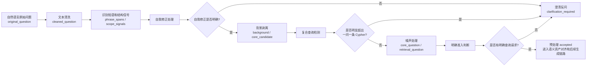

# 自然语言问题预处理设计

本文档说明 cypher-generator-agent 中自然语言问题预处理层的设计边界、最小处理流程和输出 JSON 格式。

自然语言问题预处理层位于正式生成链路的最前面，用于在语义资产对齐、意图识别和语义视图匹配之前，先判断用户输入是否具备进入“一问一条 Cypher”生成链路的条件。它只负责清理真实用户表达、处理明确自我修正、剥离背景噪声、识别明显复合或多步查询，并在无法安全继续时输出结构化澄清反馈。

预处理层只做三件事：

- 清理真实用户输入中的寒暄、背景、自我修正和噪声。
- 判断输入是否有明确查询请求。
- 判断输入是否明显超出“一问一条 Cypher”的范围。

预处理层不做意图识别，不做语义视图匹配，不提取查询结构字段。

总体流程如下：



示例原始问题：

```text
你好，，现在就是我们遇到了一些咨询类  的问题，所以需要查询一下金牌服务 哦不对是银牌服务所使用的隧道和他的源网元，然后你需要 给我返 回隧道的IETF标准和源网元的IP，谢谢啦！
```

## 1. 文本清洗

输入：`original_question`。

输入数据：

```json
{
  "original_question": "你好，，现在就是我们遇到了一些咨询类  的问题，所以需要查询一下金牌服务 哦不对是银牌服务所使用的隧道和他的源网元，然后你需要 给我返 回隧道的IETF标准和源网元的IP，谢谢啦！"
}
```

处理：清理重复标点、多余空格、缺失的轻量标点和被空格打断的常见词。
标点识别使用 Unicode / regex / zhon 等通用能力识别字符类别，再按本地 YAML 中的重复标点压缩和轻量标点补齐策略处理。

清洗规则模块：

| 规则 | 说明 | 示例 |
| --- | --- | --- |
| `trim` | 删除首尾空白。 | `" 查询服务 "` -> `"查询服务"` |
| `collapse_whitespace` | 合并连续空白、换行和制表符。 | `"咨询类  的问题"` -> `"咨询类 的问题"` |
| `remove_safe_chinese_inner_spaces` | 删除中文字符之间明显多余的空格。 | `"咨询类 的问题"` -> `"咨询类的问题"` |
| `compress_duplicate_punctuation` | 压缩重复标点。 | `"你好，，"` -> `"你好，"` |
| `repair_split_words_by_whitelist` | 按白名单修复被空格打断的常见词。 | `"返 回"` -> `"返回"` |
| `insert_light_punctuation_before_boundary_phrase` | 在高确定性的边界短语前补轻量标点；这里只补标点，不判断自我修正。 | `"金牌服务 哦不对"` -> `"金牌服务，哦不对"` |

在示例原始问题中，本步骤会触发以下清洗：

```text
你好，， -> 你好，
咨询类  的问题 -> 咨询类的问题
金牌服务 哦不对 -> 金牌服务，哦不对
你需要 给我 -> 你需要给我
返 回 -> 返回
```

文本清洗 YAML 配置类别：

| 配置类别 | 说明 | 示例 |
| --- | --- | --- |
| `unicode_detection` | 通用标点识别来源和 Unicode 字符类别。 | `Po` 识别逗号、句号、顿号等其他标点 |
| `whitespace_policy.collapse_whitespace` | 合并连续空白、换行和制表符。 | `"咨询类  的问题"` -> `"咨询类 的问题"` |
| `whitespace_policy.remove_safe_chinese_inner_spaces` | 删除中文字符之间明显多余的空格。 | `"咨询类 的问题"` -> `"咨询类的问题"` |
| `punctuation_policy.chinese_punctuation_keep` | 中文常见标点保留集合，同时参与重复压缩。 | `"，"`、`"。"`、`"、"` |
| `punctuation_policy.collapse_rules` | 重复标点压缩规则。 | `"？？？"` -> `"？"` |
| `punctuation_policy.light_punctuation_insertion.before_phrases` | 缺失轻量标点补齐规则；配置的是补标点触发短语，不是自我修正规则。 | `"金牌服务 哦不对"` -> `"金牌服务，哦不对"` |
| `split_word_repairs` | 断词修复白名单。 | `"返 回"` -> `"返回"` |

输出：

```json
{
  "clean_text": {
    "cleaned_question": "你好，现在就是我们遇到了一些咨询类的问题，所以需要查询一下金牌服务，哦不对是银牌服务所使用的隧道和他的源网元，然后你需要给我返回隧道的IETF标准和源网元的IP，谢谢啦！",
    "changed": true,
    "normalizations": [
      {"rule": "collapse_whitespace", "from": "  ", "to": " ", "reason": "extra_space"},
      {"rule": "compress_duplicate_punctuation", "from": "，，", "to": "，", "reason": "duplicate_punctuation"},
      {"rule": "insert_light_punctuation_before_boundary_phrase", "from": "查询一下金牌服务 哦不对", "to": "查询一下金牌服务，哦不对", "reason": "missing_light_punctuation"},
      {"rule": "repair_split_words_by_whitelist", "from": "返 回", "to": "返回", "reason": "split_common_word"},
      {"rule": "remove_safe_chinese_inner_spaces", "from": "类 的", "to": "类的", "reason": "extra_space"},
      {"rule": "remove_safe_chinese_inner_spaces", "from": "要 给", "to": "要给", "reason": "extra_space"}
    ]
  }
}
```

交接到下一步：

```json
{
  "phrase_detection_input": {
    "cleaned_question": "你好，现在就是我们遇到了一些咨询类的问题，所以需要查询一下金牌服务，哦不对是银牌服务所使用的隧道和他的源网元，然后你需要给我返回隧道的IETF标准和源网元的IP，谢谢啦！"
  }
}
```

## 2. 识别短语和结构信号

输入：`clean_text.cleaned_question`。

输入数据：

```json
{
  "cleaned_question": "你好，现在就是我们遇到了一些咨询类的问题，所以需要查询一下金牌服务，哦不对是银牌服务所使用的隧道和他的源网元，然后你需要给我返回隧道的IETF标准和源网元的IP，谢谢啦！"
}
```

处理：识别寒暄、背景边界、自我修正词、查询动作词、复合连接词、礼貌语和指代标记等预处理证据。这里的结构信号只用于准入判断，不表示已经完成意图识别。

输出：

```json
{
  "phrase_detection": {
    "phrase_spans": [
      {"text": "你好", "kind": "greeting", "action": "safe_to_strip", "start": 0, "end": 2, "rule_id": "greeting_hello"},
      {"text": "现在就是", "kind": "filler", "action": "safe_to_strip", "start": 3, "end": 7, "rule_id": "filler_now_just"},
      {"text": "所以", "kind": "background_transition", "action": "boundary_signal", "start": 21, "end": 23, "rule_id": "background_so"},
      {"text": "查询一下", "kind": "query_intro", "action": "query_signal", "start": 25, "end": 29, "rule_id": "query_intro_query_once"},
      {"text": "哦不对", "kind": "self_correction_marker", "action": "correction_signal", "start": 34, "end": 37, "rule_id": "correction_marker_oops_wrong"},
      {"text": "他的", "kind": "reference_marker", "action": "reference_signal", "start": 49, "end": 51, "rule_id": "reference_marker_his"},
      {"text": "然后", "kind": "sequence_connector", "action": "connector_signal", "start": 55, "end": 57, "rule_id": "connector_then"},
      {"text": "你需要给我返回", "kind": "return_intro", "action": "expression_wrapper", "start": 57, "end": 64, "rule_id": "return_intro_you_need_give_me_return"},
      {"text": "谢谢啦", "kind": "politeness", "action": "safe_to_strip", "start": 81, "end": 84, "rule_id": "politeness_thanks_particle"}
    ],
    "scope_signals": {
      "has_query_signal": true,
      "has_self_correction": true,
      "has_background_boundary": true,
      "has_sequence_connector": true,
      "has_return_intro": true,
      "has_reference_marker": true,
      "has_cross_turn_reference": false
    },
    "reference_candidates": [
      {
        "marker_text": "他的",
        "marker_kind": "reference_marker",
        "marker_start": 49,
        "marker_end": 51,
        "local_window_before": "查询一下金牌服务，哦不对是银牌服务所使用的隧道和",
        "local_window_after": "源网元，然后你需要给我返回隧道的IETF标准和源",
        "candidate_policy": "defer_to_reference_resolution"
      }
    ]
  }
}
```

交接到下一步：

```json
{
  "self_correction_input": {
    "cleaned_question": "你好，现在就是我们遇到了一些咨询类的问题，所以需要查询一下金牌服务，哦不对是银牌服务所使用的隧道和他的源网元，然后你需要给我返回隧道的IETF标准和源网元的IP，谢谢啦！",
    "self_correction_spans": [
      {"text": "哦不对", "kind": "self_correction_marker", "action": "correction_signal", "start": 34, "end": 37, "rule_id": "correction_marker_oops_wrong"}
    ],
    "scope_signals": {
      "has_self_correction": true
    }
  }
}
```

## 3. 自我修正处理

输入：`phrase_detection` 的输出，主要使用 `cleaned_question` 和 `self_correction_marker` 类型的 `phrase_spans`。

输入数据：

```json
{
  "cleaned_question": "你好，现在就是我们遇到了一些咨询类的问题，所以需要查询一下金牌服务，哦不对是银牌服务所使用的隧道和他的源网元，然后你需要给我返回隧道的IETF标准和源网元的IP，谢谢啦！",
  "self_correction_spans": [
    {"text": "哦不对", "kind": "self_correction_marker", "action": "correction_signal", "start": 34, "end": 37, "rule_id": "correction_marker_oops_wrong"}
  ],
  "scope_signals": {
    "has_self_correction": true
  }
}
```

判断：用户先说“金牌服务”，随后用“哦不对”修正为“银牌服务”。

原因：修正词前后距离合理，修正后文本仍然包含完整查询主干。

输出：

```json
{
  "self_correction": {
    "applied": true,
    "marker": "哦不对",
    "abandoned_text": "金牌服务",
    "corrected_text": "银牌服务",
    "result_question": "你好，现在就是我们遇到了一些咨询类的问题，所以需要查询一下银牌服务所使用的隧道和他的源网元，然后你需要给我返回隧道的IETF标准和源网元的IP，谢谢啦！"
  }
}
```

## 4. 背景剥离

输入：`self_correction.result_question`。

判断：`所以需要查询一下` 是背景和核心查询之间的边界。

原因：边界后存在明确查询文本，边界前是背景说明。

输出：

```json
{
  "background_strip": {
    "applied": true,
    "boundary_marker": "所以需要查询一下",
    "background": "你好，现在就是我们遇到了一些咨询类的问题",
    "core_candidate": "银牌服务所使用的隧道和他的源网元，然后你需要给我返回隧道的IETF标准和源网元的IP，谢谢啦！"
  }
}
```

## 5. 复合查询检测

输入：`core_candidate`。

判断：这是一个查询，不是两个独立查询。

原因：

- “然后”后面不是新的查询目标，而是返回内容说明。
- 查询主干围绕同一个对象展开。
- “所使用的隧道和他的源网元”属于同一条关系表达。
- “返回隧道的IETF标准和源网元的IP”属于同一查询下的返回内容。

输出：

```json
{
  "compound_detection": {
    "is_compound": false,
    "reason": "连接词后是返回内容说明，不是新的独立查询目标。"
  }
}
```

## 6. 噪声处理

输入：`core_candidate`。

处理：删除礼貌语、表达包装和尾部噪声，保留核心查询文本。对于 `IP` 这类可能关联数据库字段的表达，只保留用户原文，不在预处理层规范化为字段名或字段同义词。

输出：

```json
{
  "noise_handling": {
    "removed_spans": [
      {"text": "然后你需要给我", "reason": "expression_wrapper"},
      {"text": "谢谢啦", "reason": "politeness"}
    ],
    "text_normalizations": [
      {"from": "他的源网元", "to": "其源网元", "reason": "pronoun_style_normalization"}
    ],
    "core_question": "银牌服务所使用的隧道和其源网元，返回隧道的IETF标准和源网元的IP",
    "retrieval_question": "银牌服务所使用的隧道和其源网元，返回隧道的IETF标准和源网元的IP"
  }
}
```

## 7. 明确准入判断

输入：前面各步骤的输出。

判断：可以进入后续 Cypher 生成链路。

原因：清理后存在明确核心查询文本，没有未解决的自我修正歧义；虽然出现“然后”，但它连接的是返回内容说明，不是依赖式多步查询或并列复合查询。

输出：

```json
{
  "clarity_gate": {
    "accepted": true,
    "reason": "清理后存在明确核心查询文本，且没有检测到依赖式多步或并列复合查询。"
  }
}
```

## 最终输出 JSON

预处理成功时：

```json
{
  "accepted": true,
  "original_question": "你好，，现在就是我们遇到了一些咨询类  的问题，所以需要查询一下金牌服务 哦不对是银牌服务所使用的隧道和他的源网元，然后你需要 给我返 回隧道的IETF标准和源网元的IP，谢谢啦！",
  "cleaned_question": "你好，现在就是我们遇到了一些咨询类的问题，所以需要查询一下金牌服务，哦不对是银牌服务所使用的隧道和他的源网元，然后你需要给我返回隧道的IETF标准和源网元的IP，谢谢啦！",
  "core_question": "银牌服务所使用的隧道和其源网元，返回隧道的IETF标准和源网元的IP",
  "retrieval_question": "银牌服务所使用的隧道和其源网元，返回隧道的IETF标准和源网元的IP",
  "background": "你好，现在就是我们遇到了一些咨询类的问题",
  "self_correction": {
    "applied": true,
    "marker": "哦不对",
    "abandoned_text": "金牌服务",
    "corrected_text": "银牌服务"
  },
  "removed_spans": [
    {"text": "你好", "reason": "greeting"},
    {"text": "现在就是我们遇到了一些咨询类的问题", "reason": "background"},
    {"text": "需要查询一下", "reason": "query_intro"},
    {"text": "然后你需要给我", "reason": "expression_wrapper"},
    {"text": "谢谢啦", "reason": "politeness"}
  ],
  "retained_spans": [
    {"text": "银牌服务所使用的隧道和其源网元", "reason": "core_query"},
    {"text": "返回隧道的IETF标准和源网元的IP", "reason": "core_query"}
  ],
  "diagnostics": {
    "clean_text": {
      "changed": true,
      "normalizations": [
        {"rule": "collapse_whitespace", "from": "  ", "to": " ", "reason": "extra_space"},
        {"rule": "compress_duplicate_punctuation", "from": "，，", "to": "，", "reason": "duplicate_punctuation"},
        {"rule": "insert_light_punctuation_before_boundary_phrase", "from": "查询一下金牌服务 哦不对", "to": "查询一下金牌服务，哦不对", "reason": "missing_light_punctuation"},
        {"rule": "repair_split_words_by_whitelist", "from": "返 回", "to": "返回", "reason": "split_common_word"},
        {"rule": "remove_safe_chinese_inner_spaces", "from": "类 的", "to": "类的", "reason": "extra_space"},
        {"rule": "remove_safe_chinese_inner_spaces", "from": "要 给", "to": "要给", "reason": "extra_space"}
      ]
    },
    "phrase_detection": {
      "scope_signals": {
        "has_query_signal": true,
        "has_self_correction": true,
        "has_background_boundary": true,
        "has_sequence_connector": true,
        "has_return_intro": true,
        "has_reference_marker": true,
        "has_cross_turn_reference": false
      },
      "reference_candidates": [
        {
          "marker_text": "他的",
          "marker_kind": "reference_marker",
          "marker_start": 49,
          "marker_end": 51,
          "local_window_before": "查询一下金牌服务，哦不对是银牌服务所使用的隧道和",
          "local_window_after": "源网元，然后你需要给我返回隧道的IETF标准和源",
          "candidate_policy": "defer_to_reference_resolution"
        }
      ]
    },
    "background_strip": {
      "applied": true,
      "boundary_marker": "所以需要查询一下"
    },
    "compound_detection": {
      "is_compound": false,
      "reason": "连接词后是返回内容说明，不是新的独立查询目标。"
    },
    "noise_handling": {
      "text_normalizations": [
        {"from": "他的源网元", "to": "其源网元", "reason": "pronoun_style_normalization"}
      ]
    },
    "clarity_gate": {
      "accepted": true,
      "reason": "清理后存在明确核心查询文本，且没有检测到依赖式多步或并列复合查询。"
    }
  },
  "clarification": null
}
```

预处理需要澄清时：

```json
{
  "accepted": false,
  "original_question": "Gold 服务最近有点慢，帮我看看",
  "cleaned_question": "Gold 服务最近有点慢，帮我看看",
  "core_question": null,
  "retrieval_question": null,
  "background": "Gold 服务最近有点慢",
  "self_correction": null,
  "removed_spans": [],
  "retained_spans": [],
  "diagnostics": {
    "clarity_gate": {
      "accepted": false,
      "reason": "输入包含业务对象和背景状态，但缺少明确查询目标。"
    }
  },
  "clarification": {
    "source_stage": "question_preprocessing",
    "reason_code": "query_intent_missing",
    "question_zh": "请补充你想查询的具体对象、指标或关系。",
    "expected_answer_type": "free_text",
    "options": [],
    "suggested_rewrites": [
      "查询 Gold 服务的状态",
      "查询 Gold 服务使用的隧道",
      "查询 Gold 服务的时延"
    ]
  }
}
```
