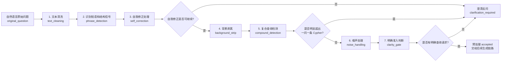

# 自然语言问题预处理设计

本文档定义 cypher-generator-agent 中自然语言问题预处理层的流程、每一步的输入输出标准、YAML 资源边界和 Python 模块设计。后续实现必须逐项对齐本文档；不允许用空实现、mock 输出或只返回固定样例的方式通过测试。

自然语言问题预处理层位于正式生成链路最前面，但在当前阶段作为独立模块实现和测试，暂不接入整体 Cypher 生成流程。它只负责清理真实用户表达、处理明确自我修正、剥离背景噪声、识别明显复合或多步查询，并在无法安全继续时输出结构化澄清反馈。

预处理层不做意图识别，不做语义视图匹配，不提取业务查询结构，不做图谱 label、edge、property 映射。

## 总体流程



示例原始问题：

```text
你好，，现在就是我们遇到了一些咨询类  的问题，所以需要查询一下金牌服务 哦不对是银牌服务所使用的隧道和他的源网元，然后你需要 给我返 回隧道的IETF标准和源网元的IP，谢谢啦！
```

## 通用约定

### 文本版本

| 字段 | 含义 | 产生阶段 |
| --- | --- | --- |
| `original_question` | 用户原始输入，不做任何修改。 | 外部输入 |
| `cleaned_question` | 文本清洗后的问题。 | 1. 文本清洗 |
| `question_after_correction` | 自我修正处理后的问题；没有修正时等于 `cleaned_question`。 | 3. 自我修正处理 |
| `core_candidate` | 背景剥离后的候选核心问题。 | 4. 背景剥离 |
| `core_question` | 去除表达噪声后的核心查询问题。 | 6. 噪声处理 |
| `retrieval_question` | 给后续语义资产检索使用的查询文本。默认必须等于 `core_question`，除非后续 YAML 明确允许保留检索专用证据。 | 6. 噪声处理 |

### Span 标准

所有后续阶段产生的 span 必须使用同一结构：

```json
{
  "text": "哦不对",
  "kind": "self_correction_marker",
  "start": 34,
  "end": 37,
  "rule_id": "correction_marker_oops_wrong"
}
```

约定：

- `start` / `end` 使用 0-based 字符偏移。
- `end` 是 exclusive。
- 每个 span 必须说明自己的坐标基准字段，例如 `offset_basis: "cleaned_question"` 或 `offset_basis: "core_candidate"`。
- `rule_id` 必须来自对应 YAML；如果该步骤没有 YAML，则必须来自代码中稳定定义的规则常量。

### 澄清出口标准

第 3、5、7 步可以中断流程并进入澄清。澄清对象统一为：

```json
{
  "source_stage": "self_correction",
  "reason_code": "self_correction_missing_corrected_text",
  "user_message": "我看到你提到了“哦不对”，但不确定你想改成什么。请直接补充你最终想查询的对象。",
  "expected_answer_type": "free_text",
  "options": [],
  "suggested_rewrites": [
    "查询银牌服务使用的隧道及其源网元，返回隧道的IETF标准和源网元的IP"
  ]
}
```

每个 `reason_code` 必须稳定、可测试、可枚举，不允许只返回自由文本原因。

### 独立实现边界

每一步都必须能单独调用、单独测试。整体预处理可以有编排器，但编排器只串联这 7 步，不接入 Cypher 生成、语义资产对齐或意图识别。

推荐文件布局：

```text
services/cypher_generator_agent/app/question_preprocessing/
  text_cleaning.py
  phrase_detection.py
  self_correction.py
  background_strip.py
  compound_detection.py
  noise_handling.py
  clarity_gate.py
  pipeline.py

services/cypher_generator_agent/resources/question_preprocessing/
  text_cleaning.yaml
  phrase_signals.yaml
  self_correction.yaml
  background_strip.yaml
  compound_detection.yaml
  noise_handling.yaml
  clarity_gate.yaml
```

## 1. 文本清洗

### YAML

资源文件：[text_cleaning.yaml](/Users/mangowmac/Desktop/code/NL2Cypher/services/cypher_generator_agent/resources/question_preprocessing/text_cleaning.yaml)

只维护表层文本清洗规则：

- 重复标点压缩。
- 多余空格清理。
- 缺失轻量标点补齐。
- 被空格打断的高确定性常见词修复。

不维护业务词，不维护自我修正规则。

### Python

模块：[text_cleaning.py](/Users/mangowmac/Desktop/code/NL2Cypher/services/cypher_generator_agent/app/question_preprocessing/text_cleaning.py)

建议接口：

```python
def clean_text(original_question: str) -> TextCleaningResult:
    ...
```

### 输入

```json
{
  "original_question": "你好，，现在就是我们遇到了一些咨询类  的问题，所以需要查询一下金牌服务 哦不对是银牌服务所使用的隧道和他的源网元，然后你需要 给我返 回隧道的IETF标准和源网元的IP，谢谢啦！"
}
```

### 输出

```json
{
  "text_cleaning": {
    "original_question": "你好，，现在就是我们遇到了一些咨询类  的问题，所以需要查询一下金牌服务 哦不对是银牌服务所使用的隧道和他的源网元，然后你需要 给我返 回隧道的IETF标准和源网元的IP，谢谢啦！",
    "cleaned_question": "你好，现在就是我们遇到了一些咨询类的问题，所以需要查询一下金牌服务，哦不对是银牌服务所使用的隧道和他的源网元，然后你需要给我返回隧道的IETF标准和源网元的IP，谢谢啦！",
    "changed": true,
    "normalizations": [
      {"rule": "collapse_whitespace", "from": "  ", "to": " ", "reason": "extra_space"},
      {"rule": "compress_duplicate_punctuation", "from": "，，", "to": "，", "reason": "duplicate_punctuation"},
      {"rule": "insert_light_punctuation_before_boundary_phrase", "from": "查询一下金牌服务 哦不对", "to": "查询一下金牌服务，哦不对", "reason": "missing_light_punctuation"},
      {"rule": "repair_split_words_by_whitelist", "from": "返 回", "to": "返回", "reason": "split_common_word"},
      {"rule": "remove_safe_chinese_inner_spaces", "from": "类 的", "to": "类的", "reason": "extra_space"},
      {"rule": "remove_safe_chinese_inner_spaces", "from": "要 给", "to": "要给", "reason": "extra_space"}
    ]
  }
}
```

### 交接

下一步输入 `text_cleaning.cleaned_question`。

## 2. 识别短语和结构信号

### YAML

资源文件：[phrase_signals.yaml](/Users/mangowmac/Desktop/code/NL2Cypher/services/cypher_generator_agent/resources/question_preprocessing/phrase_signals.yaml)

只维护语言功能短语：

- 寒暄。
- 口语填充。
- 背景边界。
- 查询动作信号。
- 自我修正 marker。
- 连接词。
- 返回引导词。
- 礼貌语。
- 句内指代和跨轮指代。

不维护业务实体、字段、图谱结构。

### Python

模块：[phrase_detection.py](/Users/mangowmac/Desktop/code/NL2Cypher/services/cypher_generator_agent/app/question_preprocessing/phrase_detection.py)

建议接口：

```python
def detect_phrase_signals(cleaned_question: str) -> PhraseDetectionResult:
    ...
```

### 输入

```json
{
  "cleaned_question": "你好，现在就是我们遇到了一些咨询类的问题，所以需要查询一下金牌服务，哦不对是银牌服务所使用的隧道和他的源网元，然后你需要给我返回隧道的IETF标准和源网元的IP，谢谢啦！"
}
```

### 输出

```json
{
  "phrase_detection": {
    "cleaned_question": "你好，现在就是我们遇到了一些咨询类的问题，所以需要查询一下金牌服务，哦不对是银牌服务所使用的隧道和他的源网元，然后你需要给我返回隧道的IETF标准和源网元的IP，谢谢啦！",
    "phrase_spans": [
      {"text": "你好", "kind": "greeting", "action": "safe_to_strip", "start": 0, "end": 2, "offset_basis": "cleaned_question", "rule_id": "greeting_hello"},
      {"text": "现在就是", "kind": "filler", "action": "safe_to_strip", "start": 3, "end": 7, "offset_basis": "cleaned_question", "rule_id": "filler_now_just"},
      {"text": "所以", "kind": "background_transition", "action": "boundary_signal", "start": 21, "end": 23, "offset_basis": "cleaned_question", "rule_id": "background_so"},
      {"text": "查询一下", "kind": "query_intro", "action": "query_signal", "start": 25, "end": 29, "offset_basis": "cleaned_question", "rule_id": "query_intro_query_once"},
      {"text": "哦不对", "kind": "self_correction_marker", "action": "correction_signal", "start": 34, "end": 37, "offset_basis": "cleaned_question", "rule_id": "correction_marker_oops_wrong"},
      {"text": "他的", "kind": "reference_marker", "action": "reference_signal", "start": 49, "end": 51, "offset_basis": "cleaned_question", "rule_id": "reference_marker_his"},
      {"text": "然后", "kind": "sequence_connector", "action": "connector_signal", "start": 55, "end": 57, "offset_basis": "cleaned_question", "rule_id": "connector_then"},
      {"text": "你需要给我返回", "kind": "return_intro", "action": "expression_wrapper", "start": 57, "end": 64, "offset_basis": "cleaned_question", "rule_id": "return_intro_you_need_give_me_return"},
      {"text": "谢谢啦", "kind": "politeness", "action": "safe_to_strip", "start": 81, "end": 84, "offset_basis": "cleaned_question", "rule_id": "politeness_thanks_particle"}
    ],
    "scope_signals": {
      "has_query_signal": true,
      "has_self_correction": true,
      "has_background_boundary": true,
      "has_sequence_connector": true,
      "has_return_intro": true,
      "has_reference_marker": true,
      "has_cross_turn_reference": false
    },
    "reference_candidates": [
      {
        "marker_text": "他的",
        "marker_kind": "reference_marker",
        "marker_start": 49,
        "marker_end": 51,
        "offset_basis": "cleaned_question",
        "local_window_before": "查询一下金牌服务，哦不对是银牌服务所使用的隧道和",
        "local_window_after": "源网元，然后你需要给我返回隧道的IETF标准和源",
        "candidate_policy": "defer_to_reference_resolution"
      }
    ]
  }
}
```

### 交接

下一步输入：

```json
{
  "cleaned_question": "...",
  "phrase_spans": ["kind 为 self_correction_marker 的 spans"],
  "scope_signals": {
    "has_self_correction": true
  }
}
```

## 3. 自我修正处理

### YAML

资源文件：[self_correction.yaml](/Users/mangowmac/Desktop/code/NL2Cypher/services/cypher_generator_agent/resources/question_preprocessing/self_correction.yaml)

只维护自然语言修正现象：

- 强修正：`哦不对`、`啊不对`、`我说错了`。
- 显式替换：`改成`、`改为`、`换成`。
- 纠正引导：`更正一下`、`应该是`。
- 对比否定：`不是 A，而是 B`、`不要 A，要 B`。
- 弱修正或歧义表达：`不对`、`不是`、`算了`。

YAML 必须定义 marker 分组、左右窗口、停止边界、自动应用条件和澄清条件。

对齐要求：凡是 `self_correction.yaml` 中需要由 `self_correction_marker` 触发的 `id/text`，必须同步存在于 `phrase_signals.yaml` 的 `self_correction_markers` 中。否则第 2 步不会产出对应 span，第 3 步也不能触发该规则。只在第 3 步局部窗口内使用的辅助 cue，例如 `而是`，可以只存在于 `self_correction.yaml`。

### Python

模块：`services/cypher_generator_agent/app/question_preprocessing/self_correction.py`

建议接口：

```python
def apply_self_correction(
    cleaned_question: str,
    phrase_spans: tuple[PhraseSpan, ...],
    scope_signals: dict[str, bool],
) -> SelfCorrectionResult:
    ...
```

实现方式：

- 不重新做全文短语扫描。
- 只消费第 2 步识别出的 `self_correction_marker`。
- 根据 marker 的 `start/end` 回到 `cleaned_question` 提取左右窗口。
- 根据 `self_correction.yaml` 判断 marker 分组、左右边界和是否可自动应用。
- 自动修正只允许替换明确局部片段，不允许猜业务语义。

### 输入

```json
{
  "cleaned_question": "你好，现在就是我们遇到了一些咨询类的问题，所以需要查询一下金牌服务，哦不对是银牌服务所使用的隧道和他的源网元，然后你需要给我返回隧道的IETF标准和源网元的IP，谢谢啦！",
  "phrase_spans": [
    {"text": "哦不对", "kind": "self_correction_marker", "action": "correction_signal", "start": 34, "end": 37, "offset_basis": "cleaned_question", "rule_id": "correction_marker_oops_wrong"}
  ],
  "scope_signals": {
    "has_self_correction": true
  }
}
```

### 输出：自动修正

```json
{
  "self_correction": {
    "status": "applied",
    "applied": true,
    "input_question": "你好，现在就是我们遇到了一些咨询类的问题，所以需要查询一下金牌服务，哦不对是银牌服务所使用的隧道和他的源网元，然后你需要给我返回隧道的IETF标准和源网元的IP，谢谢啦！",
    "question_after_correction": "你好，现在就是我们遇到了一些咨询类的问题，所以需要查询一下银牌服务所使用的隧道和他的源网元，然后你需要给我返回隧道的IETF标准和源网元的IP，谢谢啦！",
    "corrections": [
      {
        "marker": {"text": "哦不对", "kind": "self_correction_marker", "start": 34, "end": 37, "offset_basis": "cleaned_question", "rule_id": "correction_marker_oops_wrong"},
        "marker_group": "strong_restatement",
        "abandoned_span": {"text": "金牌服务", "kind": "abandoned_text", "start": 30, "end": 34, "offset_basis": "cleaned_question", "rule_id": "left_nearest_candidate"},
        "corrected_span": {"text": "银牌服务", "kind": "corrected_text", "start": 38, "end": 42, "offset_basis": "cleaned_question", "rule_id": "right_nearest_candidate"},
        "confidence": "high",
        "reason": "强修正 marker 左右候选唯一，且未跨越强边界。"
      }
    ],
    "clarification": null
  }
}
```

### 输出：无修正

```json
{
  "self_correction": {
    "status": "no_correction",
    "applied": false,
    "input_question": "查询银牌服务使用的隧道",
    "question_after_correction": "查询银牌服务使用的隧道",
    "corrections": [],
    "clarification": null
  }
}
```

### 输出：需要澄清

```json
{
  "self_correction": {
    "status": "clarification_required",
    "applied": false,
    "input_question": "查询金牌服务，哦不对",
    "question_after_correction": null,
    "corrections": [],
    "clarification": {
      "source_stage": "self_correction",
      "reason_code": "self_correction_missing_corrected_text",
      "user_message": "我看到你提到了“哦不对”，但没有找到你想改成什么。请直接补充最终想查询的对象。",
      "expected_answer_type": "free_text",
      "options": [],
      "suggested_rewrites": [
        "查询银牌服务使用的隧道"
      ]
    }
  }
}
```

### 交接

如果 `status` 是 `applied` 或 `no_correction`，下一步输入 `self_correction.question_after_correction`。如果是 `clarification_required`，流程停止。

## 4. 背景剥离

### YAML

资源文件：`services/cypher_generator_agent/resources/question_preprocessing/background_strip.yaml`

维护背景剥离所需的通用语言信号：

- 背景到查询的边界短语，例如 `所以需要查询一下`、`因此需要查询`。
- 查询引导包装，例如 `需要查询一下`、`想查一下`。
- 寒暄和口语填充的安全剥离规则。

不维护业务词，不判断查询意图类别。

### Python

模块：`services/cypher_generator_agent/app/question_preprocessing/background_strip.py`

建议接口：

```python
def strip_background(question_after_correction: str) -> BackgroundStripResult:
    ...
```

### 输入

```json
{
  "question_after_correction": "你好，现在就是我们遇到了一些咨询类的问题，所以需要查询一下银牌服务所使用的隧道和他的源网元，然后你需要给我返回隧道的IETF标准和源网元的IP，谢谢啦！"
}
```

### 输出

```json
{
  "background_strip": {
    "status": "applied",
    "input_question": "你好，现在就是我们遇到了一些咨询类的问题，所以需要查询一下银牌服务所使用的隧道和他的源网元，然后你需要给我返回隧道的IETF标准和源网元的IP，谢谢啦！",
    "core_candidate": "银牌服务所使用的隧道和他的源网元，然后你需要给我返回隧道的IETF标准和源网元的IP，谢谢啦！",
    "background_text": "你好，现在就是我们遇到了一些咨询类的问题",
    "boundary_span": {"text": "所以需要查询一下", "kind": "background_query_boundary", "start": 21, "end": 29, "offset_basis": "question_after_correction", "rule_id": "background_boundary_so_need_query"},
    "removed_spans": [
      {"text": "你好", "kind": "greeting", "start": 0, "end": 2, "offset_basis": "question_after_correction", "rule_id": "greeting_hello"},
      {"text": "现在就是我们遇到了一些咨询类的问题", "kind": "background", "start": 3, "end": 21, "offset_basis": "question_after_correction", "rule_id": "background_before_query_boundary"},
      {"text": "所以需要查询一下", "kind": "query_intro_wrapper", "start": 21, "end": 29, "offset_basis": "question_after_correction", "rule_id": "background_boundary_so_need_query"}
    ],
    "clarification": null
  }
}
```

无背景时：

```json
{
  "background_strip": {
    "status": "no_background",
    "input_question": "查询银牌服务使用的隧道",
    "core_candidate": "查询银牌服务使用的隧道",
    "background_text": null,
    "boundary_span": null,
    "removed_spans": [],
    "clarification": null
  }
}
```

### 交接

下一步输入 `background_strip.core_candidate`。

## 5. 复合查询检测

### YAML

资源文件：`services/cypher_generator_agent/resources/question_preprocessing/compound_detection.yaml`

维护一问一条 Cypher 的准入判断信号：

- 并列复合查询信号，例如 `分别查询`、`同时查询`、`另外查`。
- 依赖式多步查询信号，例如 `先查...再根据...`。
- 可接受的同一查询内连接信号，例如返回字段并列、同一主对象下的关系链扩展。

不提取查询结构，不生成 Cypher。

### Python

模块：`services/cypher_generator_agent/app/question_preprocessing/compound_detection.py`

建议接口：

```python
def detect_compound_query(core_candidate: str) -> CompoundDetectionResult:
    ...
```

### 输入

```json
{
  "core_candidate": "银牌服务所使用的隧道和他的源网元，然后你需要给我返回隧道的IETF标准和源网元的IP，谢谢啦！"
}
```

### 输出：可继续

```json
{
  "compound_detection": {
    "status": "single_query",
    "can_continue": true,
    "is_compound": false,
    "compound_type": "none",
    "input_question": "银牌服务所使用的隧道和他的源网元，然后你需要给我返回隧道的IETF标准和源网元的IP，谢谢啦！",
    "reason": "连接词后是返回内容说明，不是新的独立查询目标。",
    "evidence_spans": [
      {"text": "然后", "kind": "sequence_connector", "start": 14, "end": 16, "offset_basis": "core_candidate", "rule_id": "connector_then"},
      {"text": "你需要给我返回", "kind": "return_intro", "start": 16, "end": 23, "offset_basis": "core_candidate", "rule_id": "return_intro_you_need_give_me_return"}
    ],
    "clarification": null
  }
}
```

### 输出：需要澄清

```json
{
  "compound_detection": {
    "status": "clarification_required",
    "can_continue": false,
    "is_compound": true,
    "compound_type": "dependent_multi_step_query",
    "input_question": "先查询银牌服务使用的隧道，再根据这些隧道查询故障告警",
    "reason": "检测到依赖式多步查询，可能不是一条 Cypher 可以安全完成的问题。",
    "evidence_spans": [
      {"text": "先", "kind": "multi_step_first", "start": 0, "end": 1, "offset_basis": "core_candidate", "rule_id": "multi_step_first_then"},
      {"text": "再根据", "kind": "multi_step_dependency", "start": 12, "end": 15, "offset_basis": "core_candidate", "rule_id": "multi_step_then_by_result"}
    ],
    "clarification": {
      "source_stage": "compound_detection",
      "reason_code": "dependent_multi_step_query",
      "user_message": "这个问题看起来包含依赖式多步查询。请先选择你要查询的第一件事，或把问题拆成两个独立问题。",
      "expected_answer_type": "free_text",
      "options": [],
      "suggested_rewrites": [
        "查询银牌服务使用的隧道",
        "查询指定隧道关联的故障告警"
      ]
    }
  }
}
```

### 交接

如果 `can_continue` 为 `true`，下一步输入原始 `core_candidate`。如果为 `false`，流程停止。

## 6. 噪声处理

### YAML

资源文件：`services/cypher_generator_agent/resources/question_preprocessing/noise_handling.yaml`

维护可安全删除或轻量规范化的表达：

- 礼貌语。
- 表达包装，例如 `然后你需要给我`。
- 尾部语气词。
- 非业务的代词风格规范化，例如 `他的源网元` -> `其源网元`。

不允许做业务同义词映射，不允许把 `IP` 改成数据库字段名，不允许补全用户没有明确表达的属性。

### Python

模块：`services/cypher_generator_agent/app/question_preprocessing/noise_handling.py`

建议接口：

```python
def handle_noise(core_candidate: str) -> NoiseHandlingResult:
    ...
```

### 输入

```json
{
  "core_candidate": "银牌服务所使用的隧道和他的源网元，然后你需要给我返回隧道的IETF标准和源网元的IP，谢谢啦！"
}
```

### 输出

```json
{
  "noise_handling": {
    "status": "applied",
    "input_question": "银牌服务所使用的隧道和他的源网元，然后你需要给我返回隧道的IETF标准和源网元的IP，谢谢啦！",
    "core_question": "银牌服务所使用的隧道和其源网元，返回隧道的IETF标准和源网元的IP",
    "retrieval_question": "银牌服务所使用的隧道和其源网元，返回隧道的IETF标准和源网元的IP",
    "removed_spans": [
      {"text": "然后你需要给我", "kind": "expression_wrapper", "start": 14, "end": 23, "offset_basis": "core_candidate", "rule_id": "wrapper_then_you_need_give_me"},
      {"text": "谢谢啦", "kind": "politeness", "start": 40, "end": 43, "offset_basis": "core_candidate", "rule_id": "politeness_thanks_particle"}
    ],
    "text_normalizations": [
      {"rule": "pronoun_style_normalization", "from": "他的源网元", "to": "其源网元", "reason": "non_business_style_normalization"}
    ]
  }
}
```

### `core_question` 和 `retrieval_question` 标准

- `core_question` 是后续链路要理解的核心自然语言问题。
- `retrieval_question` 是后续语义资产检索要使用的文本。
- 当前阶段默认二者相同。
- 允许不同的前提：只能保留用户已经说过的文本证据，不能新增业务同义词、字段名或图谱概念。

### 交接

下一步输入 `noise_handling.core_question` 和 `noise_handling.retrieval_question`。

## 7. 明确准入判断

### YAML

资源文件：`services/cypher_generator_agent/resources/question_preprocessing/clarity_gate.yaml`

维护准入规则和 reason code：

- 是否存在明确查询信号。
- 核心问题是否为空。
- 是否存在未解决的自我修正歧义。
- 是否存在需要拆分的复合查询。
- 是否是纯背景、纯寒暄或无上下文追问。

### Python

模块：`services/cypher_generator_agent/app/question_preprocessing/clarity_gate.py`

建议接口：

```python
def judge_clarity(
    core_question: str | None,
    retrieval_question: str | None,
    diagnostics: dict[str, object],
) -> ClarityGateResult:
    ...
```

### 输入

```json
{
  "core_question": "银牌服务所使用的隧道和其源网元，返回隧道的IETF标准和源网元的IP",
  "retrieval_question": "银牌服务所使用的隧道和其源网元，返回隧道的IETF标准和源网元的IP",
  "diagnostics": {
    "self_correction.status": "applied",
    "compound_detection.can_continue": true,
    "phrase_detection.scope_signals.has_query_signal": true
  }
}
```

### 输出：准入

```json
{
  "clarity_gate": {
    "accepted": true,
    "reason_code": "accepted",
    "reason": "清理后存在明确核心查询文本，且没有检测到未解决的自我修正歧义、依赖式多步查询或并列复合查询。",
    "clarification": null
  }
}
```

### 输出：澄清

```json
{
  "clarity_gate": {
    "accepted": false,
    "reason_code": "query_intent_missing",
    "reason": "输入包含业务对象和背景状态，但缺少明确查询目标。",
    "clarification": {
      "source_stage": "clarity_gate",
      "reason_code": "query_intent_missing",
      "user_message": "请补充你想查询的具体对象、指标或关系。",
      "expected_answer_type": "free_text",
      "options": [],
      "suggested_rewrites": [
        "查询 Gold 服务的状态",
        "查询 Gold 服务使用的隧道",
        "查询 Gold 服务的时延"
      ]
    }
  }
}
```

## 独立编排输出

模块：`services/cypher_generator_agent/app/question_preprocessing/pipeline.py`

建议接口：

```python
def preprocess_question(original_question: str) -> QuestionPreprocessingResult:
    ...
```

预处理成功时：

```json
{
  "accepted": true,
  "original_question": "你好，，现在就是我们遇到了一些咨询类  的问题，所以需要查询一下金牌服务 哦不对是银牌服务所使用的隧道和他的源网元，然后你需要 给我返 回隧道的IETF标准和源网元的IP，谢谢啦！",
  "cleaned_question": "你好，现在就是我们遇到了一些咨询类的问题，所以需要查询一下金牌服务，哦不对是银牌服务所使用的隧道和他的源网元，然后你需要给我返回隧道的IETF标准和源网元的IP，谢谢啦！",
  "question_after_correction": "你好，现在就是我们遇到了一些咨询类的问题，所以需要查询一下银牌服务所使用的隧道和他的源网元，然后你需要给我返回隧道的IETF标准和源网元的IP，谢谢啦！",
  "core_candidate": "银牌服务所使用的隧道和他的源网元，然后你需要给我返回隧道的IETF标准和源网元的IP，谢谢啦！",
  "core_question": "银牌服务所使用的隧道和其源网元，返回隧道的IETF标准和源网元的IP",
  "retrieval_question": "银牌服务所使用的隧道和其源网元，返回隧道的IETF标准和源网元的IP",
  "clarification": null,
  "diagnostics": {
    "text_cleaning": {},
    "phrase_detection": {},
    "self_correction": {},
    "background_strip": {},
    "compound_detection": {},
    "noise_handling": {},
    "clarity_gate": {}
  }
}
```

需要澄清时：

```json
{
  "accepted": false,
  "original_question": "Gold 服务最近有点慢，帮我看看",
  "cleaned_question": "Gold 服务最近有点慢，帮我看看",
  "question_after_correction": "Gold 服务最近有点慢，帮我看看",
  "core_candidate": null,
  "core_question": null,
  "retrieval_question": null,
  "clarification": {
    "source_stage": "clarity_gate",
    "reason_code": "query_intent_missing",
    "user_message": "请补充你想查询的具体对象、指标或关系。",
    "expected_answer_type": "free_text",
    "options": [],
    "suggested_rewrites": [
      "查询 Gold 服务的状态",
      "查询 Gold 服务使用的隧道",
      "查询 Gold 服务的时延"
    ]
  },
  "diagnostics": {
    "text_cleaning": {},
    "phrase_detection": {},
    "self_correction": {},
    "background_strip": null,
    "compound_detection": null,
    "noise_handling": null,
    "clarity_gate": {}
  }
}
```

## 实现验收标准

每一步开发完成后必须满足：

1. 真实读取对应 YAML；没有 YAML 的规则必须在代码里有稳定规则 ID。
2. 输入输出字段逐项匹配本文档。
3. 至少包含一个正向样例、一个无操作样例、一个边界或澄清样例。
4. 测试必须调用真实函数，不允许 mock 该步骤核心逻辑。
5. 不允许固定返回示例 JSON。
6. 不允许接入 Cypher 生成链路、语义资产对齐、意图识别或 LLM。

整体开发完成后进行三轮代码检视：

1. 契约检视：逐字段比对本文档的输入输出、状态枚举、reason code 和 span 坐标基准。
2. 行为检视：用多组真实自然语言问题逐步运行 7 个模块，检查每步输出是否真实来自规则和 YAML。
3. 边界检视：确认没有业务语义映射、没有空实现、没有 mock 实现、没有固定样例输出、没有接入主 Cypher 生成流程。
