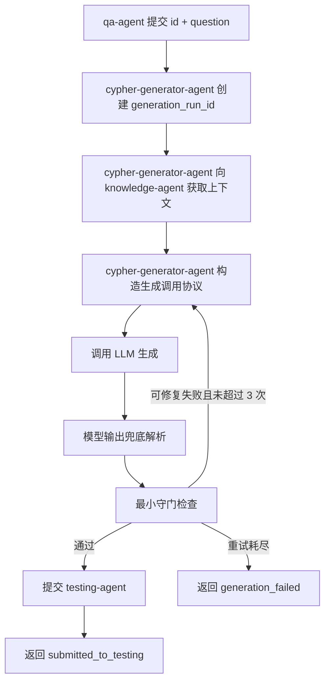

# cypher-generator-agent 架构设计

## 1. 术语与核心数据结构

本章先定义 cypher-generator-agent 文档中反复出现的数据结构。后续流程与责任边界都以这些对象为基础。

### 1.1 QA 样本与 `id`

`id` 是一条 QA 样本在闭环中的主键。它由 qa-agent 提供，贯穿 cypher-generator-agent、testing-agent 和 repair-agent。

cypher-generator-agent 接收同一个 `id` 时，只把它作为问题标识透传给 testing-agent。

### 1.2 `QAQuestionRequest`

`QAQuestionRequest` 表示 qa-agent 向 cypher-generator-agent 提交的一次生成请求。

它包含：

| 字段 | 含义 |
| --- | --- |
| `id` | QA 样本主键，用于和后续 testing-agent 评测记录对齐 |
| `question` | 原始自然语言问题，是本次 Cypher 生成目标 |

它的意义是：告诉 cypher-generator-agent“这道题是什么，以及需要围绕哪个问题生成 Cypher”。

### 1.3 `ko_context`

`ko_context` 表示 knowledge-agent 返回给 cypher-generator-agent 的 Cypher 生成知识背景。

它是 LLM 生成 Cypher 时需要参考的背景材料。自然语言问题通常只描述“想查什么”，但不会稳定说明：

- 图谱里有哪些节点 label、关系类型和属性。
- 业务词汇应该映射到哪些图谱结构。
- 当前系统允许或推荐使用哪些查询模式。
- 类似问题过去应该如何写 Cypher。
- 有哪些查询约束、命名习惯或业务规则需要遵守。

cypher-generator-agent 需要 `ko_context`，是因为只把 `question` 喂给 LLM 时，模型只能依赖通用语言能力猜测图谱结构，容易生成不存在的 label、relation、property，或者生成不符合当前业务语义的查询。`ko_context` 为模型提供生成 Cypher 的知识背景，让模型在当前图谱和业务语境内生成查询。

它的意义是：为 LLM 生成提供 schema、业务规则、few-shot 和查询约束。cypher-generator-agent 不维护这些知识，也不判断这些知识是否业务正确；cypher-generator-agent 只消费这些知识，并在外层补充生成任务和输出格式要求。

### 1.4 cypher-generator-agent 生成调用协议

cypher-generator-agent 生成调用协议表示 cypher-generator-agent 在 `ko_context` 外层构造的高优先级任务说明。它是 cypher-generator-agent 发起 LLM 调用时的运行时协议，不是 knowledge-agent 知识内容的一部分。

cypher-generator-agent 需要这个协议，是因为 `ko_context` 的职责是提供 Cypher 生成所需的知识背景，而不是保证 LLM 的最终输出形态。knowledge-agent 上下文可能包含 schema、业务规则、示例、解释性文字，甚至可能包含历史 prompt 中遗留的输出格式要求。cypher-generator-agent 如果直接把 knowledge-agent 上下文原样喂给 LLM，就会出现几个问题：

- LLM 可能跟随 knowledge-agent 上下文中的解释性文字，输出分析过程而不是 Cypher。
- LLM 可能跟随历史示例格式，输出 JSON、Markdown 代码块或多段说明。
- LLM 可能不清楚当前调用的下游消费者是 testing-agent，因此不知道结果必须是一条可提交评测的查询。
- 当 knowledge-agent 上下文中的输出要求和 cypher-generator-agent 当前运行要求冲突时，模型缺少明确的优先级依据。
- 自我修复重试时，模型需要知道上一次失败的是输出形态、只读安全还是基础语法形态，而这些反馈不属于 knowledge-agent 知识。

因此，cypher-generator-agent 生成调用协议承担的是“运行时任务编排”职责：把用户问题、knowledge-agent 知识背景、输出格式、优先级和可选重试反馈组织成一次稳定的 LLM 调用。它不新增 schema，不改写业务规则，不替代 knowledge-agent；它只规定这次调用中模型应该如何使用上下文、应该输出什么、以及发生冲突时听谁的。

这个协议是 cypher-generator-agent 内部固定、完备、版本化的系统协议，不属于业务修复闭环中的可修复知识。后续业务迭代的对象是 knowledge-agent 维护的知识包，也就是 `ko_context` 的来源内容；如果发现 cypher-generator-agent 生成调用协议、兜底恢复或最小守门本身不合理，那是 cypher-generator-agent 工程实现缺陷，需要通过工程变更处理，而不是由 repair-agent 生成补丁或由 knowledge-agent 在业务知识包中修复。

它包含：

| 部分 | 含义 |
| --- | --- |
| 任务说明 | 告诉 LLM 当前任务是生成一条只读 Cypher |
| 用户问题 | 原始 `question`，明确本次生成目标 |
| knowledge-agent 上下文 | `ko_context`，提供 schema、业务规则和示例 |
| 输出格式 | 要求模型只输出一条 Cypher，不输出 Markdown、JSON、解释或代码块 |
| 优先级 | 当 knowledge-agent 上下文中的输出格式和 cypher-generator-agent 协议冲突时，以 cypher-generator-agent 协议为准；当业务知识与查询语义有关时，仍以 knowledge-agent 上下文为准 |
| 重试反馈 | 可选字段，仅在自我修复重试时出现，描述上一次输出的语法或格式问题 |

它的意义是：把“知识背景”和“生成任务”分开。knowledge-agent 负责告诉模型当前图谱和业务语境是什么；cypher-generator-agent 负责告诉模型本次运行要产出一条什么形态的 Cypher。这样可以减少后续从 `raw_output` 中兜底解析 Cypher 的成本，也能让模型在重试时针对具体格式或语法问题重新生成。

### 1.5 `generation_run_id` 与 `generation_attempt_index`

`generation_run_id` 是 cypher-generator-agent 为一次生成执行创建的运行标识。

`generation_attempt_index` 是 cypher-generator-agent 在同一次请求内部进行自我修复时使用的生成轮次，从 1 开始，最大为 3。

它们的边界是：

- `generation_run_id` 标识 cypher-generator-agent 的一次执行。
- `generation_attempt_index` 标识这次执行内部的第几轮 LLM 生成。
- 它们都不是 testing-agent 的 `attempt_no`。

`attempt_no` 由 testing-agent 在接收 submission 后分配和维护，用于评测历史、IssueTicket 和改进评估。

### 1.6 模型输出对象

cypher-generator-agent 会区分三个生成结果概念：

| 字段 | 含义 |
| --- | --- |
| `raw_output` | LLM 原始输出 |
| `candidate_cypher` | 从 `raw_output` 直接得到或兜底恢复出的候选 Cypher |
| `generated_cypher` | 通过 cypher-generator-agent 最小守门、可以提交给 testing-agent 的 Cypher |

这三个对象必须分开，是因为它们代表不同的责任阶段：

- `raw_output` 是模型事实。它回答“模型到底返回了什么”，不能被解析、清洗或守门结果覆盖。
- `candidate_cypher` 是 cypher-generator-agent 兜底解析后的候选结果。它回答“cypher-generator-agent 从模型输出中恢复出了什么”，但还不能代表可提交结果。
- `generated_cypher` 是通过最小守门后的正式生成结果。它回答“cypher-generator-agent 最终允许提交给 testing-agent 的是什么”。

如果不区分这三层，后续失败分析会混在一起。例如，testing-agent 执行失败时，需要知道失败是模型直接生成了错误 Cypher，还是 cypher-generator-agent 从 Markdown/JSON/解释性文本中兜底恢复时引入了偏差，还是 guardrail 放行了不该放行的候选查询。只有保留三层对象，才能追溯每一步的责任边界，并避免把 cypher-generator-agent 工程链路问题误判成 knowledge-agent 知识缺口。

这三个对象也影响重试策略。`raw_output` 为空时，应按 `CGS_EMPTY_MODEL_OUTPUT` 重试；`raw_output` 有内容但无法恢复 Cypher 时，应按 `CGS_OUTPUT_CONTRACT_VIOLATION` 重试；`candidate_cypher` 存在但未通过守门时，应根据具体 guardrail 错误重试；只有 `generated_cypher` 才能提交 testing-agent。

它的意义是：把“模型说了什么”“cypher-generator-agent 从中恢复出什么”“最终能提交什么”分开，让生成证据、兜底解析、最小守门和后续失败分析各自有清楚的事实来源。repair-agent 可以消费这些证据来判断失败是否应归入 knowledge-agent 知识包缺口；如果证据指向 cypher-generator-agent 协议、兜底恢复或最小守门缺陷，则不进入 repair-agent 知识修复建议，而应作为 cypher-generator-agent 工程问题处理。

### 1.7 cypher-generator-agent -> testing-agent 契约

cypher-generator-agent 通过 `EvaluationSubmissionRequest` 向 testing-agent 提交生成结果和生成证据。

它包含：

| 字段 | 含义 |
| --- | --- |
| `id` | QA 样本主键，用于 testing-agent 与 golden answer 对齐 |
| `question` | 原始自然语言问题，供评测和 issue ticket 使用 |
| `generation_run_id` | cypher-generator-agent 本次执行标识，供问题追踪和证据串联 |
| `generated_cypher` | cypher-generator-agent 认为可提交评测的 Cypher |
| `parse_summary` | 说明 `generated_cypher` 是如何从模型输出得到的，例如直接输出、JSON 字段解析、fence 代码块提取或兜底恢复。它不参与 testing-agent 主评测打分，用于失败分析时区分“模型本身生成错了”和“cypher-generator-agent 解析/兜底恢复引入了偏差”；如果问题来自 cypher-generator-agent 解析/兜底恢复，不应转成 knowledge-agent 知识修复建议 |
| `guardrail_summary` | cypher-generator-agent 最小守门结果。它只说明 cypher-generator-agent 是否放行了基础格式、只读安全和明显语法形态，不代表 Cypher 业务正确，也不参与 testing-agent 主评测打分；如果问题来自 cypher-generator-agent 守门规则本身，不应转成 knowledge-agent 知识修复建议 |
| `raw_output_snapshot` | LLM 原始输出快照。它用于回放模型真实返回内容，判断最终 `generated_cypher` 是否忠实来自模型输出，或是否被解析/清洗步骤改变 |
| `input_prompt_snapshot` | 最终 LLM 输入快照。它主要供 repair-agent 分析 knowledge-agent 知识包、few-shot 和上下文是否诱发失败，testing-agent 不用它计算四维评测分数；其中 cypher-generator-agent 生成调用协议是固定系统包装，不作为 repair-agent 修复目标 |

它的意义是：告诉 testing-agent“cypher-generator-agent 这次生成了什么，以及这次生成过程留下了哪些证据”。

`attempt_no` 不属于 cypher-generator-agent 的职责。cypher-generator-agent 是单纯的生成服务，不记录“这是第几次评测尝试”。testing-agent 在接收 submission 后，根据同一 `id` 的历史记录分配并维护 `attempt_no`。

### 1.8 `GenerationFailure`

`GenerationFailure` 表示 cypher-generator-agent 未能生成一条通过最小守门的 Cypher。

它包含：

| 字段 | 含义 |
| --- | --- |
| `code` | cypher-generator-agent 错误码，例如 `CGS_MALFORMED_CYPHER` 或 `CGS_GENERATION_RETRY_EXHAUSTED` |
| `message` | 简短错误说明 |
| `last_retryable_code` | 重试耗尽时，最后一次可修复错误码 |
| `failure_reason_summary` | 简要失败原因，只描述 cypher-generator-agent 可观察到的输出形态、语法或调用失败 |

它的意义是：让 qa-agent 知道 cypher-generator-agent 失败在什么阶段，以及失败是否来自可修复的模型输出问题。

## 2. 定位

`cypher-generator-agent`（cypher-generator-agent）是 Text2Cypher 闭环中的 Cypher 生成执行器。

它的任务不是维护知识，也不是评测答案，而是在收到一个问题后，消费 knowledge-agent 提供的上下文，构造一次稳定的生成调用，让大模型尽可能直接产出一条可用的只读 Cypher，并把生成证据提交给 testing-agent。

一句话边界：

```text
cypher-generator-agent 负责“生成一条可提交评测的 Cypher”；
testing-agent 判断“这条 Cypher 是否可执行、是否答对”。
```

cypher-generator-agent 的目标输出标准是：

- 生成结果必须是一条 Cypher 查询
- cypher-generator-agent 只检查输出形态、基础 Cypher 语法形态和只读安全
- cypher-generator-agent 不评判 Cypher 是否业务正确，也不判断 schema、返回结果或问题语义是否对齐

cypher-generator-agent 不是运行中心，不承载运行结果查询、跨服务健康聚合、历史 attempt 展示或修复计划回执。这些能力应归属 Runtime Console、testing-agent、repair-agent 或 knowledge-agent。

---

## 3. 生成保障框架

本章先说明 cypher-generator-agent 如何理解“可提交评测”。这里的“可提交评测”不是业务正确，而是生成结果已经满足 cypher-generator-agent 能检查的最低条件。

### 3.1 cypher-generator-agent 负责的生成保障

| 维度 | cypher-generator-agent 是否负责 | 判断依据 | 输出 |
| --- | --- | --- | --- |
| 输出契约 | 是 | 模型输出是否能直接或兜底恢复为一条 Cypher | `parse_summary`、错误码 |
| 基础语法形态 | 是 | 单条语句、括号闭合、字符串闭合等轻量规则 | `guardrail_summary`、错误码 |
| 只读安全 | 是 | 是否包含写操作或不支持的起始子句 | `guardrail_summary`、错误码 |
| schema 对齐 | 否 | label、relation、property 是否符合图谱结构 | testing-agent 评测 |
| 业务正确性 | 否 | Cypher 是否回答了自然语言问题 | testing-agent 评测 |
| 结果正确性 | 否 | 执行结果是否等价于 golden answer | testing-agent 评测 |

这张表的意义是：把 cypher-generator-agent 能判断的内容和 testing-agent 才能判断的内容分开。cypher-generator-agent 不因为 Cypher 看起来业务合理就放宽语法和只读安全，也不因为 Cypher 业务可能错误就拒绝提交评测。

### 3.2 对象流转关系

一次 cypher-generator-agent 请求中的核心对象按以下顺序流转：

```text
QAQuestionRequest
  -> ko_context
  -> cypher-generator-agent 生成调用协议
  -> llm_prompt
  -> raw_output
  -> candidate_cypher
  -> generated_cypher
  -> EvaluationSubmissionRequest
```

每一步的边界是：

| 对象 | 意义 |
| --- | --- |
| `QAQuestionRequest` | qa-agent 提供的问题输入 |
| `ko_context` | knowledge-agent 提供的生成知识上下文 |
| `cypher-generator-agent 生成调用协议` | cypher-generator-agent 为本次 LLM 调用增加的任务和输出格式约束 |
| `llm_prompt` | 实际喂给 LLM 的最终输入 |
| `raw_output` | LLM 原始回答 |
| `candidate_cypher` | 从模型输出中直接得到或兜底恢复出的候选 Cypher |
| `generated_cypher` | 通过最小守门、可以提交 testing-agent 的 Cypher |
| `EvaluationSubmissionRequest` | cypher-generator-agent 提交给 testing-agent 的生成结果和生成证据 |

这条链路的意义是：让读者能区分“模型原始输出”“cypher-generator-agent 恢复出的候选查询”和“最终提交评测的 Cypher”。只有通过最小守门后的 `candidate_cypher` 才能成为 `generated_cypher`。

---

## 4. 责任边界

### 4.1 cypher-generator-agent 负责什么

cypher-generator-agent 只负责生成阶段：

1. 接收生成请求
2. 向 knowledge-agent 获取当前问题的生成上下文
3. 基于 cypher-generator-agent 生成调用协议构造最终 LLM 输入
4. 调用 LLM 生成 Cypher
5. 对模型输出做兜底解析
6. 执行最小守门检查
7. 在最多 3 次生成尝试内做自我修复重试
8. 将成功生成结果和必要生成证据提交给 testing-agent
9. 在失败时返回结构化失败状态和错误码

### 4.2 cypher-generator-agent 不负责什么

cypher-generator-agent 明确不承担以下职责：

- 不维护 schema、业务规则、few-shot、系统知识
- 不判断 knowledge-agent 上下文是否业务正确
- 不执行 TuGraph 查询
- 不做 dry-run、EXPLAIN 或数据库侧语法检查
- 不评测结果是否回答了问题
- 不生成 Issue Ticket
- 不生成知识修复建议
- 不把 cypher-generator-agent 生成调用协议、兜底恢复或最小守门放入 repair-agent 业务修复闭环
- 不修改 knowledge-agent
- 不长期保存 question、generation run、prompt snapshot、repair receipt
- 不分配 `attempt_no`

### 4.3 与其他服务的边界

| 服务 | 职责 |
| --- | --- |
| qa-agent | 提供稳定的问题标识和自然语言问题 |
| knowledge-agent | 维护并返回生成所需的知识上下文，包括 schema、业务规则、示例、查询约束 |
| cypher-generator-agent | 构造生成调用、调用 LLM、做输出形态和语法级最低保障、提交生成证据 |
| testing-agent | 分配 `attempt_no`、持久化生成证据、执行 TuGraph、评测结果、生成失败证据 |
| repair-agent | 基于 testing-agent 的失败证据分析 knowledge-agent 知识包修复方向；不为 cypher-generator-agent 协议、兜底恢复或最小守门生成修复建议 |

---

## 5. 对外接口

### 5.1 生成入口

`POST /api/v1/qa/questions`

这是 cypher-generator-agent 的正式外部入口。请求体只保留问题生成所需的最小输入。

```json
{
  "id": "qa-001",
  "question": "查询所有协议版本对应的隧道名称"
}
```

字段含义：

| 字段 | 类型 | 含义 |
| --- | --- | --- |
| `id` | string | 问题的稳定标识。cypher-generator-agent 只透传该标识，不用它分配尝试编号 |
| `question` | string | 用户自然语言问题。cypher-generator-agent 会把它同时传给 knowledge-agent 和 LLM 调用协议 |

成功响应：

```json
{
  "id": "qa-001",
  "generation_run_id": "cgs-run-7b6d9d",
  "generation_status": "submitted_to_testing",
  "generated_cypher": "MATCH (p:Protocol)-[:HAS_TUNNEL]->(t:Tunnel) RETURN p.version, t.name",
  "parse_summary": "direct_cypher",
  "guardrail_summary": "accepted",
  "submission_ref": {
    "testing_submission_id": "eval-submission-1001"
  }
}
```

字段含义：

| 字段 | 类型 | 含义 |
| --- | --- | --- |
| `id` | string | 原始问题标识 |
| `generation_run_id` | string | cypher-generator-agent 为本次生成调用创建的运行标识，只标识一次 cypher-generator-agent 执行 |
| `generation_status` | string | 本次 cypher-generator-agent 执行状态。成功提交 testing-agent 后为 `submitted_to_testing` |
| `generated_cypher` | string | 通过最小守门的 Cypher |
| `parse_summary` | string | 模型输出如何被转成 Cypher，例如 `direct_cypher` 或 `fallback_recovered`。这是生成证据，不是 testing-agent 评分指标 |
| `guardrail_summary` | string | 最小守门结果。通过时为 `accepted`。它只表示 cypher-generator-agent 放行了基础格式与安全约束，不表示评测通过 |
| `submission_ref.testing_submission_id` | string | testing-agent 返回的提交标识。后续评测追踪以 testing-agent 为准 |

失败响应：

```json
{
  "id": "qa-001",
  "generation_run_id": "cgs-run-7b6d9d",
  "generation_status": "generation_failed",
  "generated_cypher": "",
  "error": {
    "code": "CGS_GENERATION_RETRY_EXHAUSTED",
    "message": "Generation failed after 3 attempts.",
    "last_retryable_code": "CGS_MALFORMED_CYPHER",
    "failure_reason_summary": "The last generated query has unbalanced parentheses."
  }
}
```

字段含义：

| 字段 | 类型 | 含义 |
| --- | --- | --- |
| `generation_status` | string | 失败时统一为 `generation_failed` |
| `generated_cypher` | string | 失败时为空。cypher-generator-agent 不返回未通过守门的 Cypher 作为可用结果 |
| `error.code` | string | 顶层错误码，用于 qa-agent 判断失败类别 |
| `error.message` | string | 面向系统集成的简短错误说明 |
| `error.last_retryable_code` | string/null | 如果失败来自多次生成重试，这里记录最后一次可修复错误 |
| `error.failure_reason_summary` | string | 简要原因分析，不承载业务评测结论 |

### 5.2 健康与状态接口

`GET /health`

用于服务存活检查，只返回 cypher-generator-agent 自身状态。

```json
{
  "status": "ok",
  "service": "query_generator_service"
}
```

`GET /api/v1/generator/status`

用于排查生成器配置是否完整，不返回历史生成记录。

```json
{
  "llm_enabled": true,
  "llm_provider": "openai-compatible",
  "llm_model": "qwen-plus",
  "active_mode": "llm",
  "prompt_source": "http://knowledge-ops"
}
```

### 5.3 不再作为正式接口的能力

以下能力不属于目标架构中的 cypher-generator-agent 正式接口：

| 接口或能力 | 目标处理方式 |
| --- | --- |
| `GET /api/v1/questions/{id}` | 查询生成历史应迁移到 testing-agent 或 Runtime Console 自己的数据源 |
| `GET /api/v1/questions/{id}/prompt` | prompt snapshot 应随生成证据提交给 testing-agent，由 testing-agent 保存 |
| `POST /api/v1/internal/repair-plans` | 修复计划回执不应由 cypher-generator-agent 存储，repair-agent 和 knowledge-agent 自行完成修复闭环 |
| `GET /api/v1/tugraph/connection-test` | cypher-generator-agent 不连接 TuGraph，该接口只应保留兼容响应或移除 |

---

## 6. 主流程

### 6.1 总览



cypher-generator-agent 内部最多进行 3 次生成尝试。这里的尝试是 cypher-generator-agent 内部为了得到可用 Cypher 的生成重试，不等同于 testing-agent 的 `attempt_no`。

每一步的意义：

| 步骤 | 输入 | 输出 | 意义 |
| --- | --- | --- | --- |
| 接收请求 | `QAQuestionRequest` | `generation_run_id` | 建立一次生成执行上下文 |
| 获取 knowledge-agent 上下文 | `id`、`question` | `ko_context` | 获取 schema、业务规则、few-shot 和查询约束 |
| 构造生成调用协议 | `question`、`ko_context`、可选 `retry_feedback` | `llm_prompt` | 明确 LLM 的任务、上下文、输出格式和优先级 |
| 调用 LLM | `llm_prompt` | `raw_output` | 让模型生成原始回答 |
| 兜底解析 | `raw_output` | `candidate_cypher`、`parse_summary` | 把模型输出转成候选 Cypher |
| 最小守门 | `candidate_cypher` | `generated_cypher` 或错误码 | 检查输出形态、基础语法形态和只读安全 |
| 自我修复重试 | 上次错误码和失败摘要 | 新一轮 `llm_prompt` | 对可修复的模型输出问题重新生成 |
| 提交 testing-agent | `generated_cypher` 和生成证据 | `submission_ref` | 将生成结果交给 testing-agent 执行和评测 |

---

## 7. 分步数据流

### Step 1: 接收生成请求

意义：

建立一次 cypher-generator-agent 生成执行上下文。cypher-generator-agent 在这一刻只确认“有一个问题需要生成 Cypher”，不读取历史、不分配 `attempt_no`。

输入：

```json
{
  "id": "qa-001",
  "question": "查询所有协议版本对应的隧道名称"
}
```

输出：

```json
{
  "id": "qa-001",
  "question": "查询所有协议版本对应的隧道名称",
  "generation_run_id": "cgs-run-7b6d9d",
  "generation_attempt_index": 1
}
```

字段含义：

| 字段 | 含义 |
| --- | --- |
| `generation_run_id` | cypher-generator-agent 本次执行的唯一标识 |
| `generation_attempt_index` | cypher-generator-agent 内部生成轮次，从 1 开始，最大为 3 |

### Step 2: 获取 knowledge-agent 上下文

意义：

cypher-generator-agent 不维护知识。所有 schema、业务规则、示例和领域约束都来自 knowledge-agent。

cypher-generator-agent 调用 knowledge-agent：

```json
{
  "id": "qa-001",
  "question": "查询所有协议版本对应的隧道名称"
}
```

knowledge-agent 返回的正式内容可以是纯文本 prompt，也可以在未来演进为结构化响应。cypher-generator-agent 在内部统一规范化为 `ko_context`：

```json
{
  "ko_context": "你需要根据以下图谱结构生成 Cypher...\nSchema: ...\nExamples: ..."
}
```

字段含义：

| 字段 | 含义 |
| --- | --- |
| `ko_context` | knowledge-agent 维护的黑盒知识产物。若 knowledge-agent 返回纯文本，cypher-generator-agent 会把整段文本作为该字段；cypher-generator-agent 把它当作上下文材料，不把它当作最终完整 prompt |

失败输出：

```json
{
  "generation_status": "generation_failed",
  "error": {
    "code": "CGS_KO_CONTEXT_UNAVAILABLE",
    "message": "knowledge-agent context is unavailable.",
    "failure_reason_summary": "knowledge-agent request timed out."
  }
}
```

说明：

`CGS_KO_CONTEXT_UNAVAILABLE` 不是 LLM 可修复错误，不进入生成重试。

### Step 3: 构造 cypher-generator-agent 生成调用协议

意义：

knowledge-agent 返回的是黑盒上下文，cypher-generator-agent 不能假设它已经稳定表达了“模型应该如何输出”。因此 cypher-generator-agent 需要在 knowledge-agent 上下文外层构造优先级更高的生成调用协议。

这个协议不是知识加工，也不重复维护 knowledge-agent 的 schema 或业务规则。它只规定 LLM 这次调用的任务边界和输出格式。

输入：

```json
{
  "question": "查询所有协议版本对应的隧道名称",
  "ko_context": "你需要根据以下图谱结构生成 Cypher...\nSchema: ...\nExamples: ...",
  "retry_feedback": null
}
```

输出：

```json
{
  "llm_prompt": "【任务说明】...\n【用户问题】...\n【knowledge-agent 上下文】...\n【输出格式】...\n【优先级】..."
}
```

协议结构：

```text
【任务说明】
你是 cypher-generator-agent 的 Cypher 生成器。你的任务是基于用户问题和 knowledge-agent 上下文生成一条只读 Cypher 查询。

【用户问题】
{question}

【knowledge-agent 上下文】
{ko_context}

【输出格式】
只输出一条 Cypher 查询本体。
不要输出 Markdown、代码块、JSON、解释、标题或自然语言说明。
查询应以 MATCH 或 WITH 开头；只有在 cypher-generator-agent 明确允许只读 procedure 白名单时，才可以使用 CALL。
查询必须是单条语句。

【优先级】
如果 knowledge-agent 上下文中的输出格式要求与本协议冲突，以本协议为准。
如果 knowledge-agent 上下文中的业务知识与用户问题有关，按 knowledge-agent 上下文理解业务语义。
cypher-generator-agent 只要求输出可用的只读 Cypher，不要求你解释推理过程。
```

字段含义：

| 字段 | 含义 |
| --- | --- |
| `question` | 用户问题，帮助模型明确当前生成目标 |
| `ko_context` | knowledge-agent 提供的知识上下文，负责业务和 schema 信息 |
| `retry_feedback` | 第二次或第三次生成时附加的上次失败原因，只描述语法或输出形态问题 |
| `llm_prompt` | 最终喂给 LLM 的完整输入 |

### Step 4: 调用 LLM

意义：

cypher-generator-agent 把生成调用协议交给模型，要求模型直接返回 Cypher。

输入：

```json
{
  "generation_run_id": "cgs-run-7b6d9d",
  "generation_attempt_index": 1,
  "llm_prompt": "【任务说明】...\n【用户问题】...\n【knowledge-agent 上下文】..."
}
```

输出：

```json
{
  "raw_output": "MATCH (p:Protocol)-[:HAS_TUNNEL]->(t:Tunnel) RETURN p.version, t.name"
}
```

字段含义：

| 字段 | 含义 |
| --- | --- |
| `raw_output` | LLM 原始输出。理想情况下它本身就是 Cypher |

失败输出：

```json
{
  "generation_status": "generation_failed",
  "error": {
    "code": "CGS_MODEL_INVOCATION_FAILED",
    "message": "Model invocation failed.",
    "failure_reason_summary": "LLM request failed before output was produced."
  }
}
```

说明：

模型调用失败不是模型输出可修复错误，不进入 3 次生成重试。

### Step 5: 模型输出兜底解析

意义：

协议要求模型直接输出 Cypher，所以正常路径不需要“提取”。这一层只是保险措施，用于兼容模型偶发输出 Markdown fence、JSON 或附带说明的情况。

输入：

```json
{
  "raw_output": "```cypher\nMATCH (p:Protocol) RETURN p.version\n```"
}
```

输出：

```json
{
  "candidate_cypher": "MATCH (p:Protocol) RETURN p.version",
  "parse_summary": "fallback_recovered"
}
```

`parse_summary` 取值：

| 值 | 含义 |
| --- | --- |
| `direct_cypher` | `raw_output` 本身就是以 `MATCH`、`WITH` 或 `CALL` 开头的 Cypher |
| `fallback_recovered` | 通过兜底策略从 fence、JSON `cypher` 字段或首个查询行恢复出 Cypher |
| `empty_output` | 模型没有返回内容 |
| `contract_violation` | 模型有输出，但无法恢复成单条 Cypher |

失败到错误码的映射：

| 条件 | 错误码 |
| --- | --- |
| `raw_output` 为空 | `CGS_EMPTY_MODEL_OUTPUT` |
| 无法从输出中恢复 Cypher | `CGS_OUTPUT_CONTRACT_VIOLATION` |

这两个错误属于可修复错误，可以进入下一轮生成重试。

### Step 6: 最小守门检查

意义：

cypher-generator-agent 只关心生成结果是否“可用”。这里的可用指基础语法形态和只读安全，不代表业务正确。

输入：

```json
{
  "candidate_cypher": "MATCH (p:Protocol)-[:HAS_TUNNEL]->(t:Tunnel) RETURN p.version, t.name"
}
```

检查内容：

| 检查项 | 通过条件 | 失败错误码 |
| --- | --- | --- |
| 非空 | Cypher 去空白后不为空 | `CGS_EMPTY_MODEL_OUTPUT` |
| 单条语句 | 不包含多条独立语句 | `CGS_MALFORMED_CYPHER` |
| 支持的起始子句 | 以 `MATCH`、`WITH` 开头；`CALL` 只有命中只读白名单时允许 | `CGS_UNSAFE_OR_UNSUPPORTED_CYPHER` |
| 只读安全 | 不包含 `CREATE`、`MERGE`、`DELETE`、`SET`、`REMOVE`、`DROP` 等写操作 | `CGS_UNSAFE_OR_UNSUPPORTED_CYPHER` |
| 括号闭合 | `()`、`[]`、`{}` 基础配对完整 | `CGS_MALFORMED_CYPHER` |
| 字符串闭合 | 单引号和双引号没有明显未闭合 | `CGS_MALFORMED_CYPHER` |

单条语句初版规则：

1. 允许一个尾随分号，例如 `MATCH (n) RETURN n;`。
2. 不允许字符串和注释外出现多个分号。
3. 单引号、双引号内的分号不作为语句分隔符。
4. `// ...` 和 `/* ... */` 注释中的分号不作为语句分隔符。
5. 如果去掉尾随分号后仍检测到语句分隔符，则判定为多语句。

`CALL` 初版规则：

cypher-generator-agent 将 `CALL` 视为高风险起始子句。第一版只允许命中只读 procedure 白名单的 `CALL` 查询；如果没有配置白名单，则 `CALL` 默认拒绝为 `CGS_UNSAFE_OR_UNSUPPORTED_CYPHER`。

这条规则的意义是：避免 cypher-generator-agent 在不了解 TuGraph procedure 副作用的情况下放行可能写入、修改或管理数据库的过程调用。需要数据库侧 procedure 能力时，应先在 testing-agent 或配置层明确只读白名单。

成功输出：

```json
{
  "generated_cypher": "MATCH (p:Protocol)-[:HAS_TUNNEL]->(t:Tunnel) RETURN p.version, t.name",
  "guardrail_summary": "accepted"
}
```

失败输出：

```json
{
  "guardrail_summary": "rejected",
  "error": {
    "code": "CGS_MALFORMED_CYPHER",
    "failure_reason_summary": "The generated query has unbalanced parentheses."
  }
}
```

说明：

cypher-generator-agent 不在这里检查 label 是否存在、关系是否正确、属性是否正确、返回字段是否符合预期。这些属于 testing-agent 的评测范围。

### Step 7: 自我修复重试

意义：

如果模型已经产出了内容，但内容没有通过输出协议或最小守门，cypher-generator-agent 可以把失败原因反馈给模型，让模型重新生成。这样可以提高“至少可用”的成功率。

最大次数：

```json
{
  "max_generation_attempts": 3
}
```

可重试错误码：

| 错误码 | 是否重试 | 原因 |
| --- | --- | --- |
| `CGS_EMPTY_MODEL_OUTPUT` | 是 | 模型可能下一次给出非空输出 |
| `CGS_OUTPUT_CONTRACT_VIOLATION` | 是 | 模型可能下一次遵守直接输出 Cypher 的协议 |
| `CGS_UNSAFE_OR_UNSUPPORTED_CYPHER` | 是 | 模型可能下一次改成只读且支持的查询 |
| `CGS_MALFORMED_CYPHER` | 是 | 模型可能下一次修复语法形态 |
| `CGS_KO_CONTEXT_UNAVAILABLE` | 否 | knowledge-agent 调用失败不是模型生成问题 |
| `CGS_MODEL_INVOCATION_FAILED` | 否 | LLM 调用失败，不是已有输出可修复问题 |

重试输入：

```json
{
  "question": "查询所有协议版本对应的隧道名称",
  "ko_context": "你需要根据以下图谱结构生成 Cypher...",
  "retry_feedback": {
    "previous_error_code": "CGS_MALFORMED_CYPHER",
    "previous_failure_reason_summary": "The generated query has unbalanced parentheses.",
    "instruction": "Regenerate one complete read-only Cypher query. Output only the Cypher."
  }
}
```

重试耗尽输出：

```json
{
  "generation_status": "generation_failed",
  "error": {
    "code": "CGS_GENERATION_RETRY_EXHAUSTED",
    "message": "Generation failed after 3 attempts.",
    "last_retryable_code": "CGS_MALFORMED_CYPHER",
    "failure_reason_summary": "The last generated query has unbalanced parentheses."
  }
}
```

### Step 8: 提交 testing-agent

意义：

cypher-generator-agent 自己不存储生成证据。只要 Cypher 通过最小守门，cypher-generator-agent 就把生成结果和证据提交给 testing-agent，由 testing-agent 负责持久化、分配 `attempt_no` 和后续评测。

cypher-generator-agent 提交：

```json
{
  "id": "qa-001",
  "question": "查询所有协议版本对应的隧道名称",
  "generation_run_id": "cgs-run-7b6d9d",
  "generated_cypher": "MATCH (p:Protocol)-[:HAS_TUNNEL]->(t:Tunnel) RETURN p.version, t.name",
  "parse_summary": "direct_cypher",
  "guardrail_summary": "accepted",
  "raw_output_snapshot": "MATCH (p:Protocol)-[:HAS_TUNNEL]->(t:Tunnel) RETURN p.version, t.name",
  "input_prompt_snapshot": "【任务说明】...\n【用户问题】...\n【knowledge-agent 上下文】..."
}
```

字段含义：

| 字段 | 含义 |
| --- | --- |
| `id` | 问题标识，用于 testing-agent 与 golden answer 对齐 |
| `question` | 原始自然语言问题，供评测和 issue ticket 使用 |
| `generation_run_id` | cypher-generator-agent 本次执行标识，供问题追踪和证据串联 |
| `generated_cypher` | cypher-generator-agent 认为可提交评测的 Cypher |
| `parse_summary` | 说明 `generated_cypher` 是如何从模型输出得到的。这个字段的作用是保留生成链路证据，帮助区分模型输出问题和 cypher-generator-agent 结构化解析/兜底恢复问题；如果问题来自 cypher-generator-agent 解析链路，应作为工程缺陷处理，而不是 knowledge-agent 知识修复建议；它不参与 testing-agent 主评测打分 |
| `guardrail_summary` | cypher-generator-agent 最小守门结果。这个字段的作用是说明 cypher-generator-agent 是否放行了基础格式、只读安全和明显语法形态；如果问题来自守门规则不足，应作为工程缺陷处理，而不是 knowledge-agent 知识修复建议；它不代表业务正确，也不参与 testing-agent 主评测打分 |
| `raw_output_snapshot` | LLM 原始输出快照。这个字段的作用是让失败分析可以回放模型真实回答，并与最终 `generated_cypher` 对照 |
| `input_prompt_snapshot` | 最终 LLM 输入快照。这个字段的作用是支持 repair-agent 分析 knowledge-agent 知识包、few-shot 和上下文是否诱发失败；cypher-generator-agent 生成调用协议部分是固定系统协议，不作为业务修复目标；testing-agent 只保存和转交，不据此评分 |

testing-agent 返回：

```json
{
  "testing_submission_id": "eval-submission-1001",
  "attempt_no": 4,
  "state": "received_submission_only"
}
```

字段含义：

| 字段 | 含义 |
| --- | --- |
| `testing_submission_id` | testing-agent 内部提交标识 |
| `attempt_no` | testing-agent 为该问题分配的尝试编号 |
| `state` | testing-agent 当前评测状态 |

cypher-generator-agent 对 qa-agent 返回：

```json
{
  "id": "qa-001",
  "generation_run_id": "cgs-run-7b6d9d",
  "generation_status": "submitted_to_testing",
  "generated_cypher": "MATCH (p:Protocol)-[:HAS_TUNNEL]->(t:Tunnel) RETURN p.version, t.name",
  "parse_summary": "direct_cypher",
  "guardrail_summary": "accepted",
  "submission_ref": {
    "testing_submission_id": "eval-submission-1001"
  }
}
```

---

## 8. 错误码

cypher-generator-agent 错误码只表达 cypher-generator-agent 架构内可观察、可处理的失败类别，不把每个细节都提升为顶层错误。

| 错误码 | 含义 | 是否可由生成重试修复 |
| --- | --- | --- |
| `CGS_KO_CONTEXT_UNAVAILABLE` | 无法从 knowledge-agent 获取上下文，或上下文为空到无法构造生成调用 | 否 |
| `CGS_MODEL_INVOCATION_FAILED` | LLM 调用失败，未得到模型输出 | 否 |
| `CGS_EMPTY_MODEL_OUTPUT` | LLM 返回空内容 | 是 |
| `CGS_OUTPUT_CONTRACT_VIOLATION` | LLM 输出不符合直接 Cypher 协议，且兜底解析无法恢复 | 是 |
| `CGS_UNSAFE_OR_UNSUPPORTED_CYPHER` | 输出包含写操作，或不是 cypher-generator-agent 支持的只读查询形态 | 是 |
| `CGS_MALFORMED_CYPHER` | 输出像 Cypher，但基础语法形态明显损坏 | 是 |
| `CGS_GENERATION_RETRY_EXHAUSTED` | 3 次生成后仍未得到通过守门的 Cypher | 否 |

细节原因放在 `failure_reason_summary` 中，例如“括号未闭合”、“包含 DELETE”、“输出包含自然语言解释”。这些细节不再扩展成更多顶层错误码。

---

## 9. 状态机

cypher-generator-agent 对外状态应保持克制，只表达“生成阶段是否完成”。内部阶段可以用于日志和排障，但不应重新变成外部历史查询能力。

目标对外状态：

| 状态 | 含义 |
| --- | --- |
| `submitted_to_testing` | cypher-generator-agent 已生成一条通过最小守门的 Cypher，并成功提交 testing-agent |
| `generation_failed` | cypher-generator-agent 未能产出可提交评测的 Cypher，或生成链路在提交前失败 |
| `submission_failed` | cypher-generator-agent 已生成通过最小守门的 Cypher，但提交 testing-agent 失败 |

内部阶段：

| 阶段 | 输入 | 输出 | 意义 |
| --- | --- | --- | --- |
| `received` | `QAQuestionRequest` | `generation_run_id` | 建立本次生成执行上下文 |
| `ko_context_ready` | `id`、`question` | `ko_context` | 获取 knowledge-agent 维护的生成上下文 |
| `prompt_built` | `question`、`ko_context`、可选 `retry_feedback` | `llm_prompt` | 构造最终 LLM 输入 |
| `model_generated` | `llm_prompt` | `raw_output` | 获得模型原始输出 |
| `parsed` | `raw_output` | `candidate_cypher`、`parse_summary` | 得到候选 Cypher |
| `guardrail_accepted` | `candidate_cypher` | `generated_cypher`、`guardrail_summary` | 确认可提交评测 |
| `submitted` | `EvaluationSubmissionRequest` | `submission_ref` | testing-agent 已接收生成结果 |

这些内部阶段的意义是：帮助实现和日志定位问题。它们不表示业务评测状态，也不替代 testing-agent 的 `EvaluationState`。

## 10. 错误处理原则

### 10.1 knowledge-agent 上下文不可用

如果 knowledge-agent 请求失败，或返回内容为空到无法构造 `ko_context`，cypher-generator-agent 返回 `CGS_KO_CONTEXT_UNAVAILABLE`。

这类失败不进入 LLM 自我修复重试，因为模型没有可用上下文，重新调用模型不能修复 knowledge-agent 侧不可用问题。

### 10.2 模型调用失败

如果 LLM 请求失败、超时或没有产生可读取响应，cypher-generator-agent 返回 `CGS_MODEL_INVOCATION_FAILED`。

这类失败也不进入输出修复重试，因为 cypher-generator-agent 没有拿到 `raw_output`，无法给模型提供具体的格式或语法反馈。

### 10.3 模型输出不可用

如果 LLM 已经返回内容，但内容为空、违反输出协议、包含不安全操作或基础语法形态损坏，cypher-generator-agent 可以进入自我修复重试。

可重试错误只描述 cypher-generator-agent 能观察到的问题：

```text
empty output
contract violation
unsafe or unsupported cypher
malformed cypher
```

重试反馈不能加入 schema 判断、业务正确性判断或结果评测结论。那些信息不属于 cypher-generator-agent 的判断范围。

### 10.4 重试耗尽

如果最多 3 次生成后仍未得到通过最小守门的 Cypher，cypher-generator-agent 返回 `CGS_GENERATION_RETRY_EXHAUSTED`。

返回中应保留最后一次可修复错误码和简要原因，帮助 qa-agent 或运行中心知道失败停在生成阶段，而不是 testing-agent 评测阶段。

### 10.5 testing-agent 提交失败

如果 cypher-generator-agent 已经生成 `generated_cypher`，但提交 testing-agent 失败，这不是 Cypher 生成失败。

这类失败应单独表达为 `submission_failed`，并保留可重试提交所需的生成证据。它和 `generation_failed` 的区别是：

```text
generation_failed: 没有生成出可提交评测的 Cypher
submission_failed: 已经生成出 Cypher，但下游提交失败
```

提交失败的初版重试规则：

| 条件 | 是否重试 | 说明 |
| --- | --- | --- |
| 网络连接失败 | 是 | 使用同一份 `EvaluationSubmissionRequest` 重试提交，不重新生成 Cypher |
| 请求超时 | 是 | 使用同一份 payload 重试，避免重复调用 LLM |
| testing-agent 5xx | 是 | 视为下游临时不可用 |
| testing-agent 409 | 否 | 视为 submission 冲突，需要人工或上游处理 |
| testing-agent 4xx，非 409 | 否 | 视为契约错误或请求非法，不应盲目重试 |

初版提交重试次数为 3 次，包括第一次提交。3 次后仍失败，cypher-generator-agent 返回 `submission_failed`。

这条规则的意义是：提交失败只重试下游提交，不重试 LLM 生成。否则同一个 `id` 可能因为下游短暂故障产生多条不同 Cypher，反而破坏后续追溯。

---

## 11. 存储与追溯边界

目标架构中 cypher-generator-agent 不保存长期状态。

### 11.1 cypher-generator-agent 可以保留的临时数据

cypher-generator-agent 在一次请求生命周期内可以持有：

- `generation_run_id`
- `generation_attempt_index`
- `ko_context`
- `llm_prompt`
- `raw_output`
- `candidate_cypher`
- `guardrail_result`

这些数据只用于完成当前请求。

### 11.2 cypher-generator-agent 不应保存的数据

cypher-generator-agent 不应长期保存：

- question 记录
- generation run 历史
- attempt 历史
- prompt snapshot
- raw output snapshot
- repair plan receipt

这些内容如果需要追踪，应由 testing-agent 或 qa-agent 所在任务系统保存。

### 11.3 迁移原则

| 当前 cypher-generator-agent 存储内容 | 目标归属 |
| --- | --- |
| `questions/` | 任务源或 testing-agent |
| `generation_runs/` | testing-agent 的 submission / evaluation evidence |
| `generation_attempts/` | testing-agent，且 `attempt_no` 由 testing-agent 分配 |
| `repair_plan_receipts/` | repair-agent 或 knowledge-agent |
| `input_prompt_snapshot` | 作为生成证据提交给 testing-agent |
| `raw_output_snapshot` | 作为生成证据提交给 testing-agent |

---

## 12. 后续演进清单

本节只记录和 cypher-generator-agent 收束相关的后续工作。已经在本文档中确定的事项，不再作为开放设计问题处理。

### 12.1 已在本文档中完成的澄清

| 事项 | 当前状态 | 后续动作 |
| --- | --- | --- |
| 明确 cypher-generator-agent 不评判业务正确性 | 已在 [2. 定位](#2-定位) 和 [3. 生成保障框架](#3-生成保障框架) 中说明 | 后续实现不要引入 schema、结果或业务语义评测 |
| 明确 cypher-generator-agent 不做 TuGraph dry-run | 已在责任边界中说明 | TuGraph 执行和数据库侧检查归 testing-agent |
| 明确 `attempt_no` 归属 testing-agent | 已在术语、契约和存储边界中说明 | cypher-generator-agent 只保留内部 `generation_attempt_index` |
| 明确 knowledge-agent 上下文不是最终 prompt | 已在 `ko_context` 和生成调用协议中说明 | cypher-generator-agent 只包装任务和输出格式，不维护 knowledge-agent 知识 |

### 12.2 文档已确定，可以按文档重构实现

| 事项 | 文档依据 | 实现目标 |
| --- | --- | --- |
| 引入 cypher-generator-agent 生成调用协议 | [1.4](#14-cgs-生成调用协议)、[Step 3](#step-3-构造-cgs-生成调用协议) | 用 `question + ko_context + 输出格式 + 优先级` 构造最终 LLM 输入 |
| 将模型输出处理改为兜底解析 | [1.6](#16-模型输出对象)、[Step 5](#step-5-模型输出兜底解析) | 将旧的“提取 Cypher”命名和语义收束为 `fallback_parse_model_output` |
| 实现最小守门 | [3.1](#31-cgs-负责的生成保障)、[Step 6](#step-6-最小守门检查) | 只检查输出契约、基础语法形态和只读安全 |
| 实现最多 3 次自我修复 | [Step 7](#step-7-自我修复重试)、[10. 错误处理原则](#10-错误处理原则) | 仅对可修复的模型输出错误重试 |
| 去除 cypher-generator-agent 长期存储 | [11. 存储与追溯边界](#11-存储与追溯边界) | 生成证据提交 testing-agent，由 testing-agent 成为追溯入口 |

### 12.3 已补齐初版规则，仍需实现验证

| 事项 | 初版规则 | 后续动作 |
| --- | --- | --- |
| `CALL` 只读安全规则 | `CALL` 只有命中只读 procedure 白名单时允许；没有白名单时默认拒绝 | 实现时需要提供配置项或明确禁用 `CALL` |
| 单条语句判断细则 | 允许一个尾随分号；忽略字符串和注释内分号；字符串/注释外多个分号判定为多语句 | 实现轻量 lexer，并用用例覆盖尾随分号、字符串分号、注释分号、多语句 |
| testing-agent 提交失败重试 | 提交最多 3 次；只重试网络失败、超时和 5xx；不重试 4xx/409；不重新生成 Cypher | 实现提交重试，并将 3 次后失败表达为 `submission_failed` |

这些规则已经足够进入代码设计，但还需要在实现时用测试锁定边界。特别是单条语句判断不应使用简单字符串 `split(";")`，否则会误伤字符串字面量和注释内容。

## 13. 结论

cypher-generator-agent 的核心设计应该保持克制：

```text
它负责把 id + question 变成一条通过最小语法与只读守门的 Cypher；
它不负责判断这条 Cypher 是否答对问题。
```

因此，cypher-generator-agent 的输出不是“正确答案”，而是“可交给 testing-agent 验证的生成结果”。知识由 knowledge-agent 维护，评测由 testing-agent 完成，repair-agent 只面向 knowledge-agent 知识包生成修复建议；cypher-generator-agent 固定生成协议、兜底恢复和最小守门的缺陷属于工程问题，不进入业务知识修复闭环。
